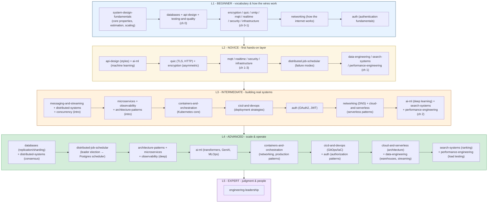

# TechDocs

Hands-on technical deep-dives that pair theory with runnable code and diagrams. Each topic is
its own **module** (a folder) with a `README.md` index and chapter-style docs you read in order
— prev/next links at the top and bottom of every page.

This repo is built as a **learning journey**: it starts from the basics an engineer needs on day
one and climbs all the way to the judgment, architecture, and leadership skills people usually
spend 10+ years accumulating. You can read a single module for a specific topic, or follow the
curated path below from **basic → intermediate → advanced → senior/EM**.

---

## How to read this repo

Every module follows the same shape, so once you learn one, you know them all:

- Open a module's **`README.md`** — it's "chapter 0": the big picture, a contents table, and a
  difficulty tag for each chapter.
- Follow the **Next >** links through the chapters in order.
- Each chapter ends with **takeaways** — the distilled "remember this" list.
- Diagrams use [Mermaid](https://mermaid.js.org/) (renders on GitHub / most Markdown viewers).
  If yours doesn't, paste the ```mermaid block into the [Mermaid Live Editor](https://mermaid.live).

Every chapter is tagged with one of five levels in its module's contents table —
**L1 Beginner**, **L2 Novice**, **L3 Intermediate**, **L4 Advanced**, or **L5 Expert**. Use
the tags to calibrate — it's fine to read an L1 chapter in an otherwise-L4 module and skip
the rest until you're ready.

Missing a topic you'd expect to see? Check [TODO.md](./TODO.md) before assuming it's an
oversight — it's the running list of gaps we already know about.

---

## The 5-level learning path (where to start)



### Stage 1 — L1 Beginner (you're new, or shoring up fundamentals)
Start here regardless of experience — these are the mental models everything else builds on.

1. **[system-design-fundamentals/](./system-design-fundamentals/README.md)** — the vocabulary:
   scalability, latency, availability, estimation, and scaling. **Read this first.**
2. **[databases/](./databases/README.md)** ch 0-1 — SQL vs NoSQL, the bottleneck of most systems.
3. **[api-design/](./api-design/README.md)** ch 0 and **[testing-and-quality/](./testing-and-quality/README.md)**
   ch 0-1 — the map of API styles, and the testing pyramid.
4. The wire-level basics — **[quic/](./quic/README.md)**, **[encryption/](./encryption/README.md)**,
   **[smtp/](./smtp/README.md)**, **[mqtt/](./mqtt/README.md)**, **[realtime/](./realtime/README.md)**,
   **[security/](./security/README.md)**, **[infrastructure/](./infrastructure/README.md)** — each
   module's L1-tagged intro chapters, before the protocol internals get hard.
5. **[networking/](./networking/README.md)** ch 1 — how the internet actually works: IP, routing,
   NAT, the life of an HTTP request.
6. **[auth/](./auth/README.md)** ch 1 — authentication fundamentals: passwords, hashing,
   sessions vs tokens.

### Stage 2 — L2 Novice (first hands-on layer)
1. **[api-design/](./api-design/README.md)** ch 1 — REST vs gRPC vs GraphQL, choosing a style.
2. **[ai-ml/](./ai-ml/README.md)** ch 2 — machine learning fundamentals.
3. **[quic/](./quic/README.md)** ch 2-3 and **[encryption/](./encryption/README.md)**
   (asymmetric, symmetric-vs-asymmetric) — the protocols get real.
4. **[mqtt/](./mqtt/README.md)**, **[realtime/](./realtime/README.md)**, **[security/](./security/README.md)**,
   **[infrastructure/](./infrastructure/README.md)** — the L2-tagged chapters: protocol internals,
   firewalls, load balancers, rate limiting.
5. **[distributed-job-schedular/](./distributed-job-schedular/README.md)** ch 1 — the three
   canonical scheduler failure modes.
6. **[data-engineering/](./data-engineering/README.md)**, **[search-systems/](./search-systems/README.md)**,
   **[performance-engineering/](./performance-engineering/README.md)** ch 1 — data pipelines,
   why SQL fails at search, and latency budgets.

### Stage 3 — L3 Intermediate (you build features; now build systems)
1. **[messaging-and-streaming/](./messaging-and-streaming/README.md)** — queues vs streams.
2. **[distributed-systems/](./distributed-systems/README.md)** and **[concurrency/](./concurrency/README.md)** —
   the fallacies, failure handling, and threads vs async vs processes.
3. **[microservices/](./microservices/README.md)**, **[observability-and-reliability/](./observability-and-reliability/README.md)**,
   **[architecture-patterns/](./architecture-patterns/README.md)** — monolith vs micro, the three
   pillars, and clean/hexagonal architecture.
4. **[containers-and-orchestration/](./containers-and-orchestration/README.md)** ch 2 — Kubernetes
   core objects.
5. **[cicd-and-devops/](./cicd-and-devops/README.md)** ch 2 — deployment strategies (blue/green,
   canary, rolling).
6. **[auth/](./auth/README.md)** ch 2-3 — OAuth 2.0, OIDC, JWT deep-dive.
7. **[networking/](./networking/README.md)** ch 2 and **[cloud-and-serverless/](./cloud-and-serverless/README.md)**
   ch 2 — DNS deep-dive, serverless patterns.
8. **[ai-ml/](./ai-ml/README.md)** ch 3, **[search-systems/](./search-systems/README.md)** ch 2,
   **[performance-engineering/](./performance-engineering/README.md)** ch 2 — deep learning,
   Elasticsearch/OpenSearch, profiling & flame graphs.

### Stage 4 — L4 Advanced (you scale and operate systems)
1. **[databases/](./databases/README.md)** ch 4-5 — replication, sharding, data modeling.
2. **[distributed-systems/](./distributed-systems/README.md)** — consensus (Raft, quorums),
   time & idempotency.
3. **[distributed-job-schedular/](./distributed-job-schedular/README.md)** ch 2-6 — leader
   election, heartbeats, deduplication, priority queues, and a Postgres-backed scheduler.
4. **[microservices/](./microservices/README.md)** and **[observability-and-reliability/](./observability-and-reliability/README.md)** —
   service boundaries, sagas & the outbox pattern, SLOs & incidents.
5. **[architecture-patterns/](./architecture-patterns/README.md)** — ADRs, security by design,
   deployment & cost.
6. **[ai-ml/](./ai-ml/README.md)** ch 4-6 — transformers & LLMs, RAG/agents, and MLOps.
7. **[containers-and-orchestration/](./containers-and-orchestration/README.md)** ch 3-4 — K8s
   networking, storage, and production patterns (probes, HPA, Helm, service mesh).
8. **[cicd-and-devops/](./cicd-and-devops/README.md)** ch 3 and **[auth/](./auth/README.md)** ch 4 —
   GitOps/IaC, authorization patterns (RBAC, ABAC, ReBAC, zero trust).
9. **[cloud-and-serverless/](./cloud-and-serverless/README.md)** ch 3 and **[data-engineering/](./data-engineering/README.md)** —
   multi-region, disaster recovery, warehouses & streaming at scale.
10. **[search-systems/](./search-systems/README.md)** ch 3 and **[performance-engineering/](./performance-engineering/README.md)**
    ch 3 — ranking & autocomplete, load testing and capacity planning.
11. **[networking/](./networking/README.md)** ch 3 and **[encryption/](./encryption/README.md)**
    (algorithms) — CDNs & edge computing, AES/RSA/ECC/DH in practice.

### Stage 5 — L5 Expert (judgment & people)
1. **[engineering-leadership/](./engineering-leadership/README.md)** — the career ladder,
   leading without authority, the EM transition, and the collected 10+-year wisdom. Pairs with
   the "trade-offs" and "wisdom" capstone chapters throughout the repo.

---

## All modules

### Core curriculum (career progression)

| Module | Level | What it covers |
|--------|-------|----------------|
| [system-design-fundamentals/](./system-design-fundamentals/README.md) | L1 – L4 | Scalability, latency, availability, CAP/PACELC, estimation, scaling, the design framework, trade-offs |
| [databases/](./databases/README.md) | L1 – L4 | SQL vs NoSQL, indexing, transactions/ACID, replication & sharding, data modeling |
| [api-design/](./api-design/README.md) | L1 – L4 | REST/gRPC/GraphQL, good REST design, versioning, pagination & evolution |
| [testing-and-quality/](./testing-and-quality/README.md) | L1 – L4 | The testing pyramid, kinds of tests, TDD, coverage, quality gates & reviews |
| [concurrency/](./concurrency/README.md) | L3 – L4 | Concurrency vs parallelism, threads/async/processes, race conditions, locks, safe patterns |
| [distributed-systems/](./distributed-systems/README.md) | L3 – L4 | The fallacies, consensus (Raft/quorums), time & idempotency, failure handling |
| [distributed-job-schedular/](./distributed-job-schedular/README.md) | L2 – L4 | Leader election, heartbeats, job deduplication, priority queues, Postgres scheduler |
| [messaging-and-streaming/](./messaging-and-streaming/README.md) | L1 – L4 | Sync vs async, queues vs streams (Kafka/RabbitMQ), delivery guarantees, DLQs |
| [microservices/](./microservices/README.md) | L3 – L4 | Monolith vs microservices, boundaries & communication, sagas & outbox |
| [observability-and-reliability/](./observability-and-reliability/README.md) | L3 – L4 | Metrics/logs/traces, SLIs/SLOs/error budgets, incidents & postmortems |
| [architecture-patterns/](./architecture-patterns/README.md) | L3 – L4 | Clean/hexagonal architecture, ADRs, security by design, deployment & cost |
| [ai-ml/](./ai-ml/README.md) | L1 – L4 | AI vs ML vs DL vs GenAI, machine learning, deep learning, transformers & LLMs, RAG/agents, MLOps |
| [containers-and-orchestration/](./containers-and-orchestration/README.md) | L1 – L4 | Docker, Kubernetes core, K8s networking & storage, production patterns, service mesh |
| [cicd-and-devops/](./cicd-and-devops/README.md) | L1 – L4 | CI/CD pipelines, deployment strategies (blue/green, canary), GitOps & Infrastructure as Code |
| [auth/](./auth/README.md) | L1 – L4 | Authentication, OAuth 2.0/OIDC, JWT, authorization patterns (RBAC/ABAC/ReBAC), zero trust |
| [cloud-and-serverless/](./cloud-and-serverless/README.md) | L1 – L4 | Cloud-native, 12-factor app, serverless patterns, multi-region, DR, cost optimization |
| [data-engineering/](./data-engineering/README.md) | L2 – L4 | Data pipelines (ETL/ELT), warehouses & lakehouses, streaming at scale, CDC |
| [search-systems/](./search-systems/README.md) | L2 – L4 | Inverted indexes, Elasticsearch/OpenSearch, BM25 ranking, autocomplete & facets |
| [performance-engineering/](./performance-engineering/README.md) | L2 – L4 | Latency budgets & percentiles, profiling/flame graphs, load testing & capacity |
| [engineering-leadership/](./engineering-leadership/README.md) | L5 | Career ladder, technical leadership, the EM transition, career-long wisdom |

### Deep-dive references (networking, protocols, crypto)

| Module | Level | What it covers |
|--------|-------|----------------|
| [networking/](./networking/README.md) | L1 – L4 | How the internet works (IP, routing, NAT), DNS deep-dive, CDNs & edge computing, BGP |
| [encryption/](./encryption/README.md) | L1 – L4 | Symmetric/asymmetric encryption, keys, hybrid, digital signatures, real algorithms (AES, RSA, ECC, DH) |
| [quic/](./quic/README.md) | L1 – L3 | The networking stack: TCP vs UDP, TLS 1.2/1.3, HTTP/1-2-3, and QUIC |
| [mqtt/](./mqtt/README.md) | L1 – L3 | MQTT pub/sub protocol (topics, QoS, sessions, LWT) and how to use it effectively |
| [realtime/](./realtime/README.md) | L1 – L4 | WebSocket, WebRTC, WS-vs-WebRTC, and STUN/TURN/ICE NAT traversal |
| [security/](./security/README.md) | L1 – L3 | TOR (onion routing), forward secrecy, and firewalls |
| [smtp/](./smtp/README.md) | L1 – L2 | SMTP email delivery, SPF/DKIM/DMARC, and SMTP vs IMAP/POP3 |
| [infrastructure/](./infrastructure/README.md) | L1 – L3 | L4 load balancers, bastion vs LB vs gateway, rate limiting, API gateway, caching & Redis cluster |

Gaps in the table above — topics that don't exist yet at any level — are tracked in
[TODO.md](./TODO.md).

---

## Repo layout

```
TechDocs/
├── README.md                        <- you are here (repo index + learning path)
│
│   # Core curriculum (L1 beginner -> L5 expert)
├── system-design-fundamentals/      <- START HERE: the mental models
├── databases/                       <- SQL/NoSQL, indexing, transactions, sharding, modeling
├── api-design/                      <- REST/gRPC/GraphQL, good design, versioning
├── testing-and-quality/             <- testing pyramid, TDD, coverage, quality gates
├── concurrency/                     <- threads/async/processes, races, locks, safe patterns
├── distributed-systems/             <- fallacies, consensus, idempotency, failure handling
├── distributed-job-schedular/       <- leader election, heartbeats, deduplication, priority queues
├── messaging-and-streaming/         <- async, queues vs streams, delivery guarantees
├── microservices/                   <- monolith vs micro, boundaries, sagas
├── observability-and-reliability/   <- metrics/logs/traces, SLOs, incidents
├── architecture-patterns/           <- clean architecture, ADRs, security, deployment, cost
├── ai-ml/                           <- AI/ML/DL/GenAI, transformers, RAG, MLOps
├── containers-and-orchestration/    <- Docker, Kubernetes, service mesh, production patterns
├── cicd-and-devops/                 <- CI/CD pipelines, deployment strategies, GitOps, IaC
├── auth/                            <- authentication, OAuth2/OIDC, JWT, authorization patterns
├── cloud-and-serverless/            <- cloud-native, serverless, multi-region, cost optimization
├── data-engineering/                <- data pipelines, warehouses, lakehouses, streaming at scale
├── search-systems/                  <- inverted indexes, Elasticsearch, ranking, autocomplete
├── performance-engineering/         <- latency budgets, profiling, load testing, capacity
├── engineering-leadership/          <- career ladder, tech leadership, EM, wisdom
│
│   # Deep-dive references
├── networking/                      <- how the internet works, DNS, CDNs, edge computing
├── encryption/                      <- how encryption works
├── quic/                            <- transport & HTTP evolution
├── mqtt/                            <- IoT pub/sub messaging
├── realtime/                        <- WebSocket, WebRTC, STUN/TURN/ICE
├── security/                        <- TOR, forward secrecy, firewalls
├── smtp/                            <- email delivery
└── infrastructure/                  <- LBs, gateways, bastions, rate limits, caching
```

---

## Not sure where to start?

- **"I'm early-career / a student"** → read
  [system-design-fundamentals](./system-design-fundamentals/README.md) cover to cover, then
  [databases](./databases/README.md) ch 1-3. That's the foundation the whole industry stands on.
- **"I have a system design interview"** → fundamentals (all), plus the design framework and
  trade-offs chapters, then skim databases, distributed-systems, and microservices.
- **"I'm becoming a senior / tech lead"** → distributed-systems, microservices,
  observability-and-reliability, and architecture-patterns — then
  [engineering-leadership](./engineering-leadership/README.md).
- **"I'm moving into management"** → jump to
  [engineering-leadership](./engineering-leadership/README.md), especially the EM-transition and
  wisdom chapters.
- **"I want to understand AI / build with LLMs"** → read [ai-ml](./ai-ml/README.md) start to
  finish — it goes from "what is AI?" through ML/DL to transformers, RAG, agents, and MLOps.
- **"I want to help fill the gaps"** → see [TODO.md](./TODO.md) for the topics this repo
  doesn't cover yet, organized by level.

> The fastest way to grow: read a module, then **build something small that uses it.** Theory
> sticks when it survives contact with a keyboard.

---

## Running the code

Examples are mostly Python. Install any needed library with `uv` against the Walmart index:

```bash
uv pip install <package> \
  --index-url https://pypi.ci.artifacts.walmart.com/artifactory/api/pypi/external-pypi/simple \
  --allow-insecure-host pypi.ci.artifacts.walmart.com
```

## Diagrams

Docs use [Mermaid](https://mermaid.js.org/) diagrams — they render on GitHub and in most
Markdown viewers. If yours doesn't, paste the fenced ```mermaid block into the
[Mermaid Live Editor](https://mermaid.live).
