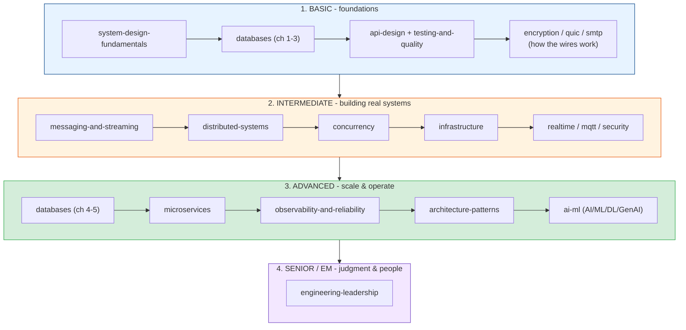

# TechDocs

Hands-on technical deep-dives that pair theory with runnable code and diagrams. Each topic is
its own **module** (a folder) with a `README.md` index and chapter-style docs you read in order
— prev/next links at the top and bottom of every page.

This repo is built as a **learning journey**: it starts from the basics an engineer needs on day
one and climbs all the way to the judgment, architecture, and leadership skills people usually
spend 10+ years accumulating. You can read a single module for a specific topic, or follow the
curated path below from **basic → intermediate → advanced → senior/EM**.

---

## How to read this repo

Every module follows the same shape, so once you learn one, you know them all:

- Open a module's **`README.md`** — it's "chapter 0": the big picture, a contents table, and a
  difficulty tag for each chapter.
- Follow the **Next >** links through the chapters in order.
- Each chapter ends with **takeaways** — the distilled "remember this" list.
- Diagrams use [Mermaid](https://mermaid.js.org/) (renders on GitHub / most Markdown viewers).
  If yours doesn't, paste the ```mermaid block into the [Mermaid Live Editor](https://mermaid.live).

Every chapter is tagged **Basic**, **Intermediate**, **Advanced**, or **Senior+** in its
module's contents table. Use the tags to calibrate — it's fine to read a Basic chapter in an
Advanced module and skip the rest until you're ready.

---

## The learning path (where to start)



### Stage 1 — Basic (you're new, or shoring up fundamentals)
Start here regardless of experience — these are the mental models everything else builds on.

1. **[system-design-fundamentals/](./system-design-fundamentals/README.md)** — the vocabulary:
   scalability, latency, availability, CAP, estimation, and the design framework. **Read this
   first.**
2. **[databases/](./databases/README.md)** chapters 1-3 — SQL vs NoSQL, indexing, transactions.
   The bottleneck of most systems.
3. **[api-design/](./api-design/README.md)** — REST/gRPC/GraphQL, good API design, versioning.
   The contracts everything talks through.
4. **[testing-and-quality/](./testing-and-quality/README.md)** — the testing pyramid, TDD,
   coverage. How to change code without fear.
5. The networking basics — **[quic/](./quic/README.md)** (TCP/UDP, TLS, HTTP),
   **[encryption/](./encryption/README.md)**, **[smtp/](./smtp/README.md)** — how the wires
   actually work.

### Stage 2 — Intermediate (you build features; now build systems)
1. **[messaging-and-streaming/](./messaging-and-streaming/README.md)** — sync vs async, queues
   vs streams, delivery guarantees.
2. **[distributed-systems/](./distributed-systems/README.md)** — the fallacies, consensus,
   idempotency, and the failure-handling toolkit you'll use in every service.
3. **[concurrency/](./concurrency/README.md)** — threads vs async vs processes, race conditions,
   locks, and how to avoid the whole minefield.
4. **[infrastructure/](./infrastructure/README.md)** — load balancers, gateways, rate limiting,
   caching & Redis.
5. Protocol deep-dives as needed — **[realtime/](./realtime/README.md)** (WebSocket/WebRTC),
   **[mqtt/](./mqtt/README.md)**, **[security/](./security/README.md)**.

### Stage 3 — Advanced (you scale and operate systems)
1. **[databases/](./databases/README.md)** chapters 4-5 — replication, sharding, data modeling.
2. **[microservices/](./microservices/README.md)** — when (and when *not*) to split, boundaries,
   sagas & the outbox pattern.
3. **[observability-and-reliability/](./observability-and-reliability/README.md)** — metrics/
   logs/traces, SLOs & error budgets, incidents & postmortems.
4. **[architecture-patterns/](./architecture-patterns/README.md)** — clean architecture, ADRs,
   security by design, deployment & cost.
5. **[ai-ml/](./ai-ml/README.md)** — AI vs ML vs DL vs GenAI, machine learning, deep learning,
   transformers & LLMs, RAG/agents, and MLOps. The fast-moving field every engineer now needs.

### Stage 4 — Senior / Staff / Engineering Manager (judgment & people)
1. **[engineering-leadership/](./engineering-leadership/README.md)** — the career ladder,
   leading without authority, the EM transition, and the collected 10+-year wisdom. Pairs with
   the "trade-offs" and "wisdom" capstone chapters throughout the repo.

---

## All modules

### Core curriculum (career progression)

| Module | Level | What it covers |
|--------|-------|----------------|
| [system-design-fundamentals/](./system-design-fundamentals/README.md) | Basic → Advanced | Scalability, latency, availability, CAP/PACELC, estimation, scaling, the design framework, trade-offs |
| [databases/](./databases/README.md) | Basic → Advanced | SQL vs NoSQL, indexing, transactions/ACID, replication & sharding, data modeling |
| [api-design/](./api-design/README.md) | Basic → Advanced | REST/gRPC/GraphQL, good REST design, versioning, pagination & evolution |
| [testing-and-quality/](./testing-and-quality/README.md) | Basic → Advanced | The testing pyramid, kinds of tests, TDD, coverage, quality gates & reviews |
| [concurrency/](./concurrency/README.md) | Intermediate → Advanced | Concurrency vs parallelism, threads/async/processes, race conditions, locks, safe patterns |
| [distributed-systems/](./distributed-systems/README.md) | Intermediate → Advanced | The fallacies, consensus (Raft/quorums), time & idempotency, failure handling |
| [messaging-and-streaming/](./messaging-and-streaming/README.md) | Basic → Advanced | Sync vs async, queues vs streams (Kafka/RabbitMQ), delivery guarantees, DLQs |
| [microservices/](./microservices/README.md) | Intermediate → Advanced | Monolith vs microservices, boundaries & communication, sagas & outbox |
| [observability-and-reliability/](./observability-and-reliability/README.md) | Intermediate → Advanced | Metrics/logs/traces, SLIs/SLOs/error budgets, incidents & postmortems |
| [architecture-patterns/](./architecture-patterns/README.md) | Intermediate → Advanced | Clean/hexagonal architecture, ADRs, security by design, deployment & cost |
| [ai-ml/](./ai-ml/README.md) | Basic → Advanced | AI vs ML vs DL vs GenAI, machine learning, deep learning, transformers & LLMs, RAG/agents, MLOps |
| [engineering-leadership/](./engineering-leadership/README.md) | Senior → EM | Career ladder, technical leadership, the EM transition, career-long wisdom |

### Deep-dive references (networking, protocols, crypto)

| Module | What it covers |
|--------|----------------|
| [encryption/](./encryption/README.md) | Symmetric/asymmetric encryption, keys, hybrid, digital signatures, real algorithms (AES, RSA, ECC, DH) |
| [quic/](./quic/README.md) | The networking stack: TCP vs UDP, TLS 1.2/1.3, HTTP/1-2-3, and QUIC |
| [mqtt/](./mqtt/README.md) | MQTT pub/sub protocol (topics, QoS, sessions, LWT) and how to use it effectively |
| [realtime/](./realtime/README.md) | WebSocket, WebRTC, WS-vs-WebRTC, and STUN/TURN/ICE NAT traversal |
| [security/](./security/README.md) | TOR (onion routing), forward secrecy, and firewalls |
| [smtp/](./smtp/README.md) | SMTP email delivery, SPF/DKIM/DMARC, and SMTP vs IMAP/POP3 |
| [infrastructure/](./infrastructure/README.md) | L4 load balancers, bastion vs LB vs gateway, rate limiting, API gateway, caching & Redis cluster |

---

## Repo layout

```
TechDocs/
├── README.md                        <- you are here (repo index + learning path)
│
│   # Core curriculum (basic -> senior -> EM)
├── system-design-fundamentals/      <- START HERE: the mental models
├── databases/                       <- SQL/NoSQL, indexing, transactions, sharding, modeling
├── api-design/                      <- REST/gRPC/GraphQL, good design, versioning
├── testing-and-quality/             <- testing pyramid, TDD, coverage, quality gates
├── concurrency/                     <- threads/async/processes, races, locks, safe patterns
├── distributed-systems/             <- fallacies, consensus, idempotency, failure handling
├── messaging-and-streaming/         <- async, queues vs streams, delivery guarantees
├── microservices/                   <- monolith vs micro, boundaries, sagas
├── observability-and-reliability/   <- metrics/logs/traces, SLOs, incidents
├── architecture-patterns/           <- clean architecture, ADRs, security, deployment, cost
├── ai-ml/                           <- AI/ML/DL/GenAI, transformers, RAG, MLOps
├── engineering-leadership/          <- career ladder, tech leadership, EM, wisdom
│
│   # Deep-dive references
├── encryption/                      <- how encryption works
├── quic/                            <- transport & HTTP evolution
├── mqtt/                            <- IoT pub/sub messaging
├── realtime/                        <- WebSocket, WebRTC, STUN/TURN/ICE
├── security/                        <- TOR, forward secrecy, firewalls
├── smtp/                            <- email delivery
└── infrastructure/                  <- LBs, gateways, bastions, rate limits, caching
```

---

## Not sure where to start?

- **"I'm early-career / a student"** → read
  [system-design-fundamentals](./system-design-fundamentals/README.md) cover to cover, then
  [databases](./databases/README.md) ch 1-3. That's the foundation the whole industry stands on.
- **"I have a system design interview"** → fundamentals (all), plus the design framework and
  trade-offs chapters, then skim databases, distributed-systems, and microservices.
- **"I'm becoming a senior / tech lead"** → distributed-systems, microservices,
  observability-and-reliability, and architecture-patterns — then
  [engineering-leadership](./engineering-leadership/README.md).
- **"I'm moving into management"** → jump to
  [engineering-leadership](./engineering-leadership/README.md), especially the EM-transition and
  wisdom chapters.
- **"I want to understand AI / build with LLMs"** → read [ai-ml](./ai-ml/README.md) start to
  finish — it goes from "what is AI?" through ML/DL to transformers, RAG, agents, and MLOps.

> The fastest way to grow: read a module, then **build something small that uses it.** Theory
> sticks when it survives contact with a keyboard.

---

## Running the code

Examples are mostly Python. Install any needed library with `uv` against the Walmart index:

```bash
uv pip install <package> \
  --index-url https://pypi.ci.artifacts.walmart.com/artifactory/api/pypi/external-pypi/simple \
  --allow-insecure-host pypi.ci.artifacts.walmart.com
```

## Diagrams

Docs use [Mermaid](https://mermaid.js.org/) diagrams — they render on GitHub and in most
Markdown viewers. If yours doesn't, paste the fenced ```mermaid block into the
[Mermaid Live Editor](https://mermaid.live).
