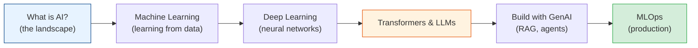

# AI, Machine Learning, Deep Learning & Generative AI

The fastest-moving area in software — and the one most engineers now need at least a working
grasp of. This module takes you from "what even *is* AI?" through classical machine learning,
deep learning and neural networks, up to the transformers and large language models behind
today's Generative AI — and finally how to actually run this stuff in production (MLOps).

No PhD required. This is the practicing engineer's mental model: enough theory to reason
correctly, enough practice to build and ship.

## Contents

| # | Topic | File | Level |
|---|-------|------|-------|
| 0 | The map (this file) | *(here)* | L1 · Beginner |
| 1 | What is AI? (AI vs ML vs DL vs GenAI) | [what-is-ai.md](./what-is-ai.md) | L1 · Beginner |
| 2 | Machine Learning fundamentals | [machine-learning.md](./machine-learning.md) | L2 · Novice |
| 3 | Deep Learning & neural networks | [deep-learning.md](./deep-learning.md) | L3 · Intermediate |
| 4 | Transformers & Large Language Models | [transformers-and-llms.md](./transformers-and-llms.md) | L4 · Advanced |
| 5 | Generative AI in practice (prompting, RAG, agents) | [generative-ai-in-practice.md](./generative-ai-in-practice.md) | L4 · Advanced |
| 6 | MLOps: shipping AI to production | [mlops.md](./mlops.md) | L4 · Advanced |

---

## How to read this module

- **Start with chapter 1** no matter your background — it untangles the buzzwords (AI, ML, DL,
  GenAI) that people use interchangeably and wrongly.
- **Chapters 2-3** are the foundation: how machines actually "learn" from data, and how neural
  networks scaled that idea. Read these before the LLM hype.
- **Chapters 4-5** are the modern GenAI stack — how LLMs work and how you *build* with them
  (prompting, RAG, fine-tuning, agents). This is what most engineers need *today*.
- **Chapter 6** is the part the tutorials skip: getting a model to production and keeping it
  working — which is 90% of the real job.

## The one truth

> **AI is not magic — it's statistics, linear algebra, and a lot of data, wrapped in
> engineering.** A model that predicts is just a function fitted to examples. Understanding that
> demystifies everything from spam filters to ChatGPT — and, crucially, tells you where they
> will fail.

Start with [what-is-ai.md](./what-is-ai.md). **Next >**
