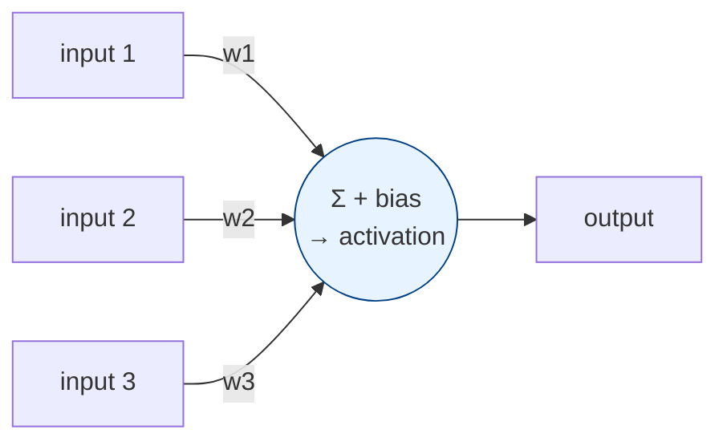
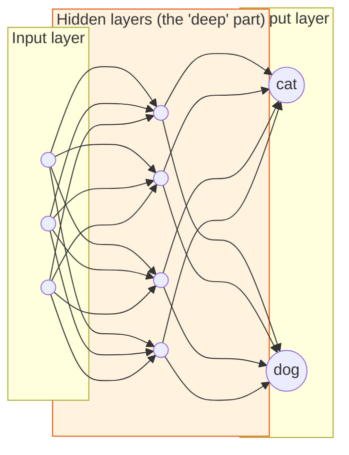
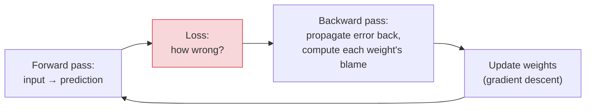
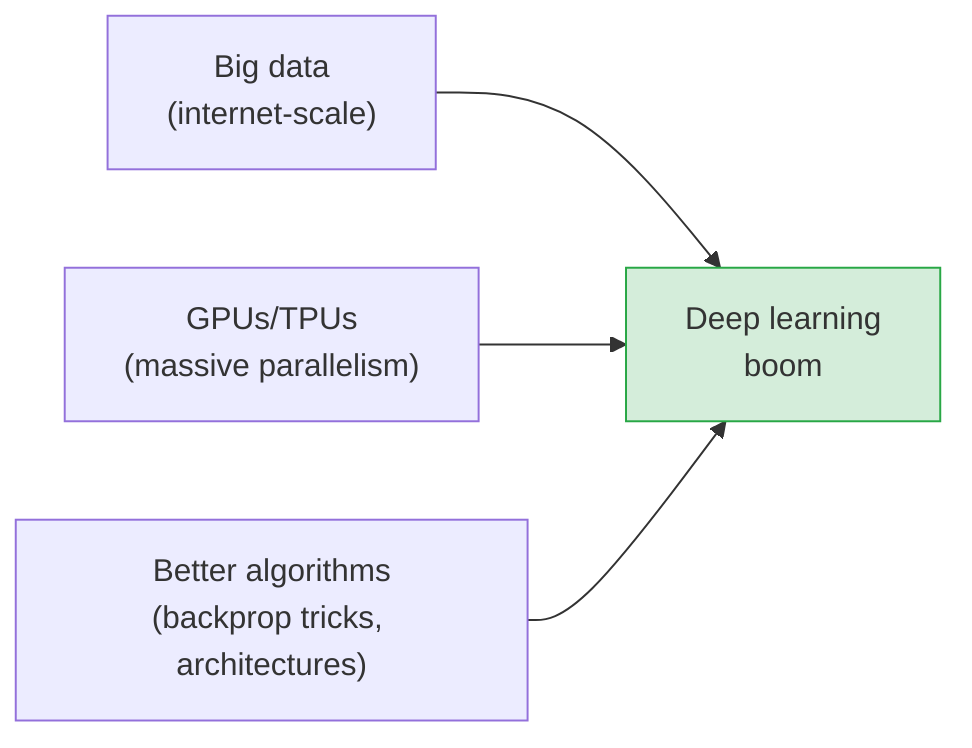

# Deep Learning & Neural Networks

[< Back](./machine-learning.md) | [Index](./README.md) | [Next: Transformers & LLMs >](./transformers-and-llms.md)

---

Deep learning is ML using **neural networks with many layers**. It's the breakthrough behind
image recognition, speech, translation, and — via transformers — modern GenAI. The core idea is
simpler than the hype suggests.

## The artificial neuron

A neuron takes inputs, multiplies each by a **weight**, sums them, adds a **bias**, and passes
the result through an **activation function** that decides how strongly to "fire."

That's it — a weighted sum plus a squish. The "learning" is finding the right **weights**. A
single neuron is weak; the power comes from wiring **millions** of them into layers.

## From neuron to network

- **Input layer** — your raw data (pixels, numbers, token IDs).
- **Hidden layers** — where the magic happens. "Deep" just means *many* hidden layers. Each
  layer learns increasingly abstract features (edges → shapes → faces).
- **Output layer** — the prediction (class probabilities, a number, next token).

> **Why "deep" works:** early layers learn simple features (edges, colors), middle layers combine
> them (textures, parts), later layers assemble concepts (a face, a cat). The network builds a
> **hierarchy of features automatically** — no manual feature engineering. That's the leap over
> classical ML.

## How networks learn: backpropagation

Training a network is the same predict → measure → adjust loop as any ML, but the adjustment
uses **backpropagation**:

1. **Forward pass** — data flows through the network to produce a prediction.
2. **Loss** — measure the error.
3. **Backward pass (backprop)** — using calculus (the chain rule), compute how much *each*
   weight contributed to the error.
4. **Update** — nudge every weight to reduce the error. Repeat millions of times.

Backprop + gradient descent is *the* algorithm that makes deep learning possible. You rarely
implement it — frameworks (PyTorch, TensorFlow) do it automatically — but understanding it
demystifies training.

## The major architectures (know what each is for)

| Architecture | Built for | Key idea |
|--------------|-----------|----------|
| **Feedforward (MLP)** | General tabular / basic tasks | Fully connected layers |
| **CNN** (Convolutional) | Images, spatial data | Filters that detect local patterns (edges → objects) |
| **RNN / LSTM** | Sequences (text, time series) | Memory of previous steps; largely superseded by transformers |
| **Transformer** | Text, and now everything | **Attention** — see any part of the input at once (next chapter) |
| **GAN / Diffusion** | Generating images | Two nets compete / iteratively denoise noise into images |

- **CNNs** revolutionized computer vision — the convolution slides small filters across an image
  to detect features regardless of position.
- **RNNs/LSTMs** handled sequences by carrying a "memory," but struggled with long-range
  dependencies. **Transformers** replaced them by looking at the whole sequence at once.

## Why deep learning took off *now* (three ingredients)

The theory existed for decades. It exploded in the 2010s when three things aligned: **massive
labeled datasets**, **GPUs** (which do the parallel matrix math neural nets need, thousands of
times faster than CPUs), and **algorithmic advances**. Deep learning is fundamentally a
**data-and-compute-hungry** approach — it beats classical ML when you have lots of both.

## The trade-offs (why not always deep learning?)

| Deep learning strength | Deep learning weakness |
|------------------------|------------------------|
| Learns features automatically | Needs *lots* of data |
| State-of-the-art on images/text/audio | Expensive to train (GPUs, time, money) |
| Scales with more data/compute | A "black box" — hard to explain decisions |
| Handles unstructured data | Often *loses* to XGBoost on tabular data |

> **Don't default to deep learning.** It shines on unstructured data (images, audio, language)
> and at large scale. For structured/tabular problems with modest data, classical ML is usually
> faster, cheaper, more explainable, and *more accurate*. Match the tool to the problem — a
> recurring theme in this whole repo.

## The takeaways

1. **A neural network is layers of simple neurons** (weighted sum + activation); "deep" means
   many hidden layers that build a **hierarchy of features automatically**.
2. **Backpropagation + gradient descent** is how they learn — assign blame for the error to each
   weight, then nudge. Frameworks do it for you.
3. **Architecture matches data:** CNNs for images, RNN/LSTM (old) then Transformers for
   sequences, GANs/diffusion for generation.
4. **Three enablers:** big data + GPUs + better algorithms. DL is data- and compute-hungry.
5. **Deep learning isn't always the answer** — it's a black box that needs lots of data, and it
   loses to gradient-boosted trees on tabular problems.

---

[< Back](./machine-learning.md) | [Index](./README.md) | [Next: Transformers & LLMs >](./transformers-and-llms.md)
