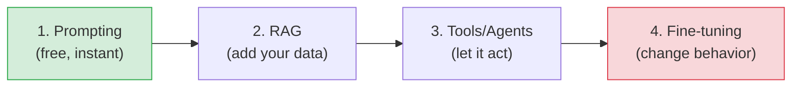
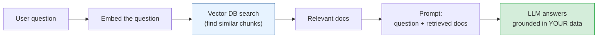

# Generative AI in Practice (Prompting, RAG & Agents)

[< Back](./transformers-and-llms.md) | [Index](./README.md) | [Next: MLOps >](./mlops.md)

---

This is the chapter most engineers actually need in 2025+: not how to *train* an LLM, but how to
*build with one*. There's a ladder of techniques from cheap-and-easy to expensive-and-powerful.
Climb it only as far as your problem requires.

## The build-with-LLMs ladder (cheapest first)



> **Golden rule: try the cheapest technique first.** Most problems are solved by good prompting
> + RAG. Fine-tuning is the last resort, not the first. People reach for fine-tuning far too
> early and waste time and money.

## 1. Prompt engineering (start here, always)

The prompt is your API to the model. Small wording changes produce big quality changes.

**Techniques that reliably help:**

- **Be specific and give context.** Vague prompt → vague answer. State the role, task, format,
  and constraints explicitly.
- **Few-shot examples.** Show 2-3 examples of input → desired output. The model imitates the
  pattern. Hugely effective.
- **Chain-of-thought.** "Think step by step" — asking the model to reason before answering
  measurably improves logic and math.
- **Structured output.** Ask for JSON (and specify the schema) when you need to parse the result
  programmatically.
- **System prompt.** Set persistent behavior/role ("You are a terse SQL expert. Only output
  SQL.").

```text
BAD:  "Summarize this."
GOOD: "Summarize the text below in exactly 3 bullet points, each under 15 words,
       aimed at a busy executive. Text: '''...'''"
```

## 2. RAG — Retrieval-Augmented Generation (the workhorse)

LLMs don't know *your* data (your docs, your database, recent events) and hallucinate when they
don't know. **RAG fixes this by retrieving relevant information and stuffing it into the prompt**
so the model answers from real, current facts.



**How RAG works:**
1. **Index (offline):** split your documents into chunks, create an **embedding** for each, store
   them in a **vector database** (Pinecone, Weaviate, pgvector, Milvus).
2. **Retrieve (per query):** embed the user's question, find the most *semantically similar*
   chunks (nearest vectors).
3. **Augment & generate:** put those chunks in the prompt as context; the LLM answers grounded in
   them — and can cite sources.

**Why RAG is usually the right answer:**
- Grounds answers in *your* current data → **fewer hallucinations**, citable sources.
- No expensive retraining — update the knowledge base anytime.
- Keeps proprietary data out of the model weights.

> RAG is how you build "chat with your docs," internal knowledge assistants, and support bots.
> It's the single most useful GenAI pattern for businesses. Master it before anything fancier.

## 3. Tools & agents (let the model *act*)

An LLM alone can only produce text. **Tool use (function calling)** lets it call your functions —
search the web, query a database, do math, hit an API — and use the results.


An **agent** takes this further: it loops — *reason → pick a tool → observe result → reason
again* — to accomplish multi-step tasks autonomously ("research this topic and write a report").

> **Agents are powerful but immature and risky.** They compound the LLM's unreliability over
> many steps, cost adds up per step, and giving an LLM the power to *act* (delete data, spend
> money, send emails) is a serious safety and security concern. Keep agents narrow, add guardrails
> and human approval for consequential actions, and cap their loops. Don't hand an autonomous
> agent the keys to production.

## 4. Fine-tuning (last resort)

Fine-tuning further trains the model on your examples to change its *behavior/style*. Use it
when prompting + RAG genuinely aren't enough.

| Fine-tuning is good for | Fine-tuning is NOT for |
|-------------------------|------------------------|
| A consistent style/format/tone | Adding knowledge (use RAG instead!) |
| A narrow, repetitive task | Keeping facts current (use RAG) |
| Reducing prompt length/cost at scale | A first attempt (try prompting first) |

> **The #1 mistake: fine-tuning to add knowledge.** Fine-tuning teaches *behavior*, not *facts* —
> and it bakes data in statically (stale immediately). For "know my data," the answer is almost
> always **RAG**, not fine-tuning.

## Practical engineering concerns

- **Cost** — priced per token (input + output). RAG and long prompts add up fast. Monitor spend;
  cache repeated queries; use smaller/cheaper models where they suffice.
- **Latency** — LLM calls are slow (seconds). Stream tokens to the UI; do heavy work async (see
  [messaging-and-streaming](../messaging-and-streaming/README.md)).
- **Evaluation** — LLM outputs are non-deterministic and open-ended, so testing is *hard*. Build
  an eval set of representative inputs + expected qualities; use rubrics or an "LLM-as-judge";
  track quality over time. Don't ship changes on vibes.
- **Guardrails** — validate/constrain outputs, filter unsafe content, and never trust LLM output
  in a critical path without a check. Treat model output like untrusted input.
- **Privacy & security** — don't send secrets/PII to third-party APIs without clearing it;
  beware prompt injection from any user- or web-supplied text.
- **Model choice** — bigger isn't always better. Match model size/cost to the task; a small model
  + good RAG often beats a giant model alone.

## The takeaways

1. **Climb the ladder cheapest-first:** prompting → RAG → tools/agents → fine-tuning. Most
   problems stop at RAG.
2. **Prompt engineering is real leverage** — be specific, give examples, ask for step-by-step and
   structured output.
3. **RAG is the workhorse:** retrieve your data into the prompt to ground answers and cut
   hallucination. It beats fine-tuning for "know my data."
4. **Agents let LLMs act — powerful, risky.** Add guardrails, human approval for real actions,
   and loop caps.
5. **Fine-tune for behavior, never for knowledge**, and only as a last resort.
6. **Engineering still applies:** watch cost and latency, build real evals, add guardrails, and
   treat LLM output as untrusted.

---

[< Back](./transformers-and-llms.md) | [Index](./README.md) | [Next: MLOps >](./mlops.md)
