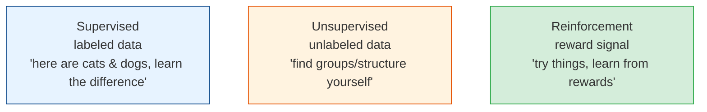
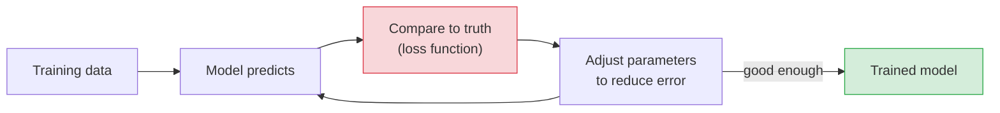
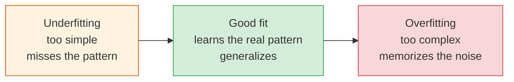
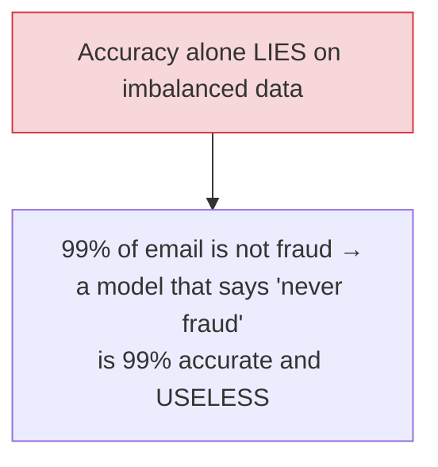

# Machine Learning Fundamentals

[< Back](./what-is-ai.md) | [Index](./README.md) | [Next: Deep Learning >](./deep-learning.md)

---

At its core, ML is: **feed a model examples, it learns a function that maps inputs to outputs,
then use it to predict on new inputs.** Everything else — deep learning, LLMs — is an
elaboration of this one idea. Nail the fundamentals and the rest clicks.

## The three kinds of learning

| Type | You give it | It learns | Examples |
|------|-------------|-----------|----------|
| **Supervised** | Inputs **+ correct answers** (labels) | To predict the label | Spam detection, price prediction, image classification |
| **Unsupervised** | Inputs only (no labels) | Hidden structure/groups | Customer segmentation, anomaly detection, topic discovery |
| **Reinforcement** | An environment + rewards | A policy that maximizes reward | Game AI, robotics, ad bidding |

Supervised learning dominates real-world business use — because labeled "input → answer" data is
what most problems have.

## Two flavors of supervised learning

- **Classification** — predict a *category*. "Spam or not?" "Cat, dog, or bird?" Output is a
  discrete label (often with a probability).
- **Regression** — predict a *number*. "What will this house sell for?" "How many units next
  month?" Output is continuous.

## How a model actually learns (the training loop)

1. The model makes a prediction (initially garbage — parameters are random).
2. A **loss function** measures how wrong it is versus the true answer.
3. An optimizer (**gradient descent**) nudges the parameters to reduce the loss.
4. Repeat over the data many times (**epochs**) until the error stops improving.

That's it. "Training" is just repeatedly guessing, measuring the error, and adjusting to be less
wrong. **Gradient descent** is the workhorse: it computes which direction to nudge each
parameter to reduce error, and takes a small step that way (the **learning rate** controls step
size).

## Features: the thing that actually decides success

A **feature** is an input variable the model uses (a house's square footage, a user's age, the
words in an email). **Feature engineering** — choosing and transforming the right inputs — is
often what makes or breaks classical ML.

> **"Garbage in, garbage out" is the iron law of ML.** The model is only as good as the data and
> features you feed it. Practitioners spend far more time on data cleaning and feature
> engineering than on fancy algorithms. Data quality beats model cleverness almost every time.

## The central villain: overfitting

- **Overfitting** — the model *memorizes* the training data (including its noise) and fails on
  new data. It "aced the practice test by memorizing answers" but bombs the real exam. The #1
  ML failure mode.
- **Underfitting** — the model is too simple to capture the real pattern. Bad on training *and*
  new data.
- **The goal is generalization** — performing well on data it has *never seen*.

### How you catch and fight overfitting

- **Train/validation/test split** — train on one chunk, tune on another, and *only* judge final
  performance on a held-out **test set** the model never saw. Never evaluate on training data —
  that's cheating and it lies to you.
- **Cross-validation** — rotate which chunk is held out for a more robust estimate.
- **Regularization** — penalize complexity to keep the model simpler.
- **More/better data** — the most reliable cure.

## Measuring a model (accuracy is a trap)

| Metric | Answers | Use when |
|--------|---------|----------|
| **Accuracy** | % correct overall | Balanced classes only |
| **Precision** | Of predicted-positive, how many were right? | False positives are costly (spam flagging good mail) |
| **Recall** | Of actual-positive, how many did we catch? | False negatives are costly (missing cancer, fraud) |
| **F1 score** | Harmonic mean of precision & recall | Balancing both |
| **AUC-ROC** | Ranking quality across thresholds | Overall discrimination |

> **Precision vs recall is a trade-off you tune to the business.** A cancer screen wants high
> **recall** (never miss a case, tolerate false alarms). A spam filter wants high **precision**
> (never trash a real email, tolerate some spam getting through). There is no free lunch — pushing
> one usually lowers the other.

## Common classical algorithms (worth knowing by name)

| Algorithm | Good for | Notes |
|-----------|----------|-------|
| **Linear/Logistic Regression** | Baselines, interpretability | Start here; simple & explainable |
| **Decision Trees** | Interpretable rules | Prone to overfitting alone |
| **Random Forest / Gradient Boosting (XGBoost)** | Tabular data | Often the *best* choice for spreadsheets |
| **k-Nearest Neighbors** | Simple similarity | Slow at scale |
| **k-Means** | Clustering (unsupervised) | Grouping without labels |
| **SVM** | Classification with clear margins | Less common now |

## The takeaways

1. **ML learns a function from examples** via a loop: predict → measure error → adjust.
   Supervised (labeled) dominates real use.
2. **Data and features beat algorithms.** Garbage in, garbage out — spend your time here.
3. **Overfitting is the enemy;** always evaluate on a held-out **test set**, never on training
   data.
4. **Accuracy lies on imbalanced data.** Use precision/recall/F1 and tune the trade-off to the
   business cost of each error type.
5. **For tabular data, gradient-boosted trees (XGBoost) are usually the strongest, cheapest
   choice** — reach for deep learning only when you have images, audio, or text.

---

[< Back](./what-is-ai.md) | [Index](./README.md) | [Next: Deep Learning >](./deep-learning.md)
