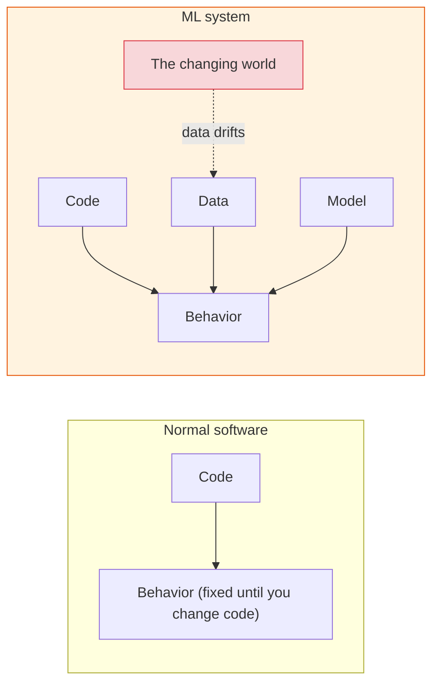
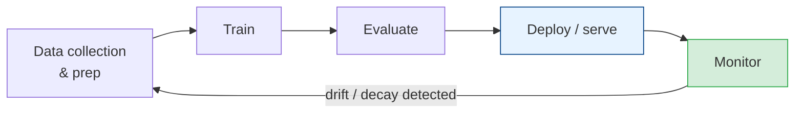
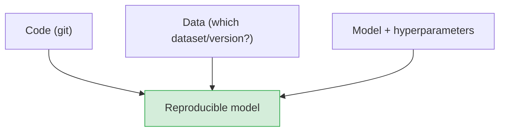

# MLOps: Shipping AI to Production

[< Back](./generative-ai-in-practice.md) | [Index](./README.md)

---

Building a model in a notebook is maybe 10% of the work. The other 90% — deploying it, serving
it reliably, monitoring it, and keeping it accurate as the world changes — is **MLOps**. This is
where most AI projects quietly die, and where the real senior AI-engineering value lives.

## Why ML in production is different from normal software

Regular code is deterministic and static — it does the same thing until you change it. ML systems
have a third moving part that shifts *on its own*: **the data**.

> **The defining truth of MLOps: a model that was accurate at launch silently gets *worse* over
> time**, even with zero code changes, because the real-world data drifts away from what it was
> trained on. Normal software rots slowly; ML models rot on their own schedule. You must monitor
> for it.

## The ML lifecycle (it's a loop, not a line)

MLOps is DevOps (see [architecture-patterns/deployment](../architecture-patterns/deployment-and-cost.md))
plus the extra concerns of **data** and **models**. The loop never ends — you retrain and
redeploy continuously.

## Serving a model (two modes)

| Mode | How | Use for |
|------|-----|---------|
| **Batch (offline)** | Run predictions on a schedule, store results | Recommendations refreshed nightly, risk scores |
| **Real-time (online)** | Model behind an API, predicts per request | Fraud checks, search ranking, chatbots |

Real-time serving has all the usual system-design concerns — latency, throughput, scaling,
caching, load balancing (this whole repo applies) — **plus** the model is often big and
GPU-hungry, making it the expensive, slow part of the request path. Cache predictions where you
can; batch requests to the GPU.

## The three things you MUST version

Reproducibility in ML needs more than git:

- **Code** — the training and serving code (normal git).
- **Data** — *which exact dataset* produced this model. "It worked on my data" is useless if you
  can't say which data. Tools: DVC, dataset snapshots.
- **Model + config** — the trained weights, hyperparameters, and metrics, tracked in a **model
  registry** (MLflow, SageMaker, Weights & Biases) so you know what's deployed and can roll back.

> Without versioning all three, you can't reproduce a result, debug a regression, or explain
> "why did the model do that in March?" — a real problem when audits or incidents hit.

## Monitoring: the part everyone forgets

You monitor normal services for errors and latency. ML systems need that **plus** model-quality
monitoring:

| What to monitor | Why | Signal |
|-----------------|-----|--------|
| **Operational** (latency, errors, cost) | It's still a service | Same as any API |
| **Data drift** | Input distribution shifting away from training data | Feature stats change over time |
| **Concept drift** | The *relationship* input→output changed (world moved) | Accuracy drops on fresh labels |
| **Prediction drift** | Output distribution shifts | Sudden change in predicted classes |
| **Model quality** | Is it still accurate? | Compare predictions to ground truth when it arrives |

**Data drift example:** a demand-forecasting model trained pre-pandemic became useless overnight
when behavior changed. The code was fine; the *world* moved. Only drift monitoring catches this.

## Retraining strategy

Because models decay, you retrain — but *when*?

- **Scheduled** — retrain every week/month regardless. Simple, predictable.
- **Triggered** — retrain when monitoring detects drift or an accuracy drop. Efficient, more
  complex.
- **Continuous/online** — constantly update from fresh data. Powerful but risky (a bad data day
  poisons the model fast).

Always **evaluate the new model against the old one before promoting it** (offline metrics, then
a canary / A/B test in production). Never blind-swap a retrained model — it can be *worse*.

## Testing & deploying ML safely

- **Shadow deployment** — run the new model alongside the old, on real traffic, *without* serving
  its answers. Compare quietly before trusting it.
- **Canary / A/B** — route a small % to the new model, watch business + quality metrics, then
  ramp (same idea as [deployment strategies](../architecture-patterns/deployment-and-cost.md)).
- **Fast rollback** — keep the previous model ready; a bad model is an incident, and rollback is
  your best friend.
- **Test the data pipeline, not just the model** — most production ML failures are *data*
  failures (a nulled column, a changed unit, a broken upstream feed), not model bugs.

## The feature store (for larger orgs)

A **feature store** centralizes computed features so training and serving use the *exact same*
feature logic. This prevents **training/serving skew** — the nasty bug where a feature is computed
one way in training and another way in production, quietly wrecking accuracy.

## Cost & the honest ROI question

- Training (especially deep learning / LLMs) and GPU serving are **expensive**. Track it as a
  first-class metric (see [deployment & cost](../architecture-patterns/deployment-and-cost.md)).
- **Ask whether you need ML at all.** Many "AI" problems are better solved by rules, a heuristic,
  or a `WHERE` clause — cheaper, faster, explainable, and no drift. The most senior MLOps decision
  is sometimes "let's not." (Yes, this repo keeps saying that. It keeps being true.)

## The takeaways

1. **The notebook is 10% of the job; production is the other 90%.** MLOps is where projects live
   or die.
2. **Models decay on their own** as data drifts — monitoring for drift and quality is
   non-negotiable, not optional.
3. **Version code + data + model** for reproducibility; use a model registry.
4. **Retrain (scheduled or drift-triggered), and always evaluate the new model vs the old before
   promoting** — shadow/canary, then ramp, with fast rollback ready.
5. **Most production ML failures are data-pipeline failures** — test the data, watch for
   training/serving skew.
6. **Track cost, and honestly ask if you even need ML.** Rules and heuristics often win.

---

[< Back](./generative-ai-in-practice.md) | [Index](./README.md)
