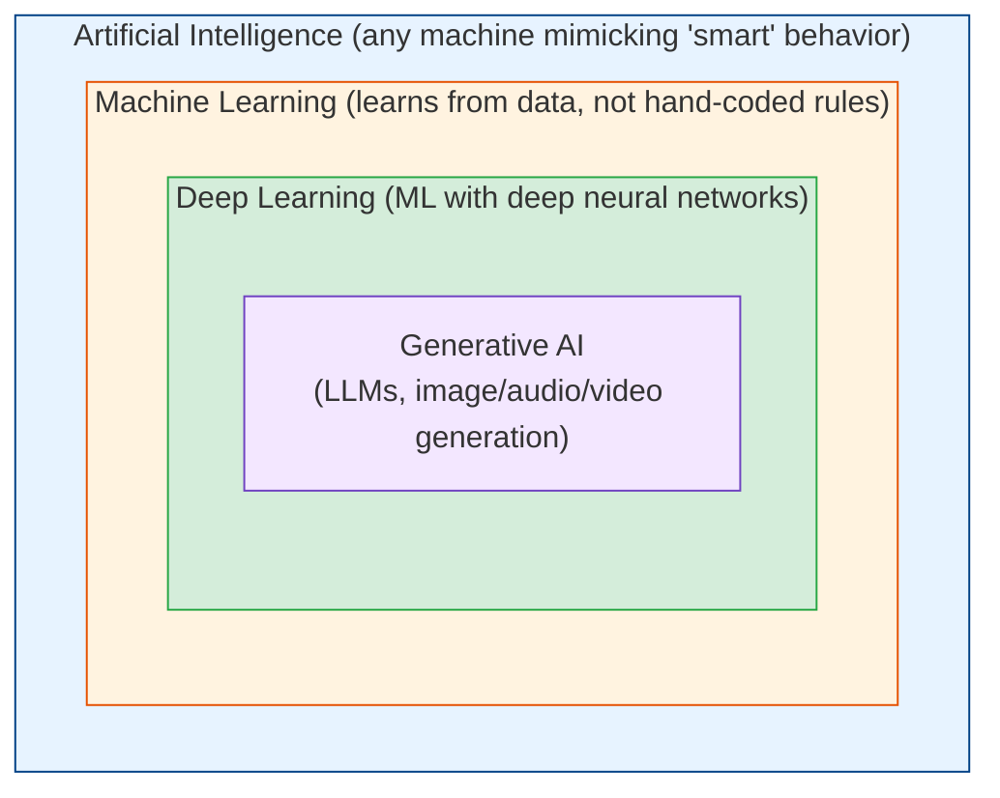
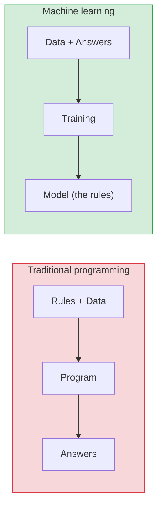

# What is AI? (AI vs ML vs DL vs GenAI)

[Index](./README.md) | [Next: Machine Learning >](./machine-learning.md)

---

These four terms get used interchangeably by marketers, journalists, and — embarrassingly —
engineers. They are **nested**, not synonyms. Getting the relationship straight is the first
step to reasoning clearly about any AI system.

## The nesting (the single most useful diagram)

| Term | Definition | Example |
|------|-----------|---------|
| **AI** | Any technique that makes a machine mimic intelligent behavior | A chess engine, a rule-based chatbot, a Roomba's path planning |
| **ML** | AI that **learns patterns from data** instead of being explicitly programmed | Spam filter, fraud detection, recommendations |
| **DL** | ML using **deep neural networks** (many layers) | Image recognition, speech-to-text, translation |
| **GenAI** | DL models that **generate new content** (text, images, code, audio) | ChatGPT, Midjourney, GitHub Copilot |

> **Every GenAI is DL, every DL is ML, every ML is AI — but not vice versa.** A hand-coded
> `if temperature > 30: turn_on_ac()` is technically "AI" (automated decision) but not ML (it
> didn't learn anything).

## The two eras of AI

### 1. Symbolic AI (rules) — "good old-fashioned AI"
Humans write explicit rules and logic. The machine follows them.
- **Examples:** expert systems, rule engines, classic search (A*, minimax in chess).
- **Strength:** transparent, predictable, no data needed.
- **Weakness:** brittle. You can't write rules for "is this photo a cat?" — there are infinite
  edge cases. Doesn't handle ambiguity or scale.

### 2. Machine Learning (data) — the modern approach
Instead of writing rules, you **show the machine examples** and it learns the rules itself.

**This is the key inversion:** traditional programming takes rules + data → answers. ML takes
data + answers → *the rules* (a model). That flip is why ML solves problems we could never write
rules for (vision, language, speech).

## Narrow AI vs AGI (managing the hype)

- **Narrow AI (what exists today)** — good at *one* task: playing Go, generating text,
  recognizing faces. Even the most impressive LLM is narrow — it predicts text; it doesn't
  "understand" or have goals. Everything you can use today is narrow AI.
- **AGI (Artificial General Intelligence)** — hypothetical human-level intelligence across *any*
  task. Does **not** exist. Timelines are fiercely debated and nobody knows.
- **ASI (Superintelligence)** — beyond human. Purely speculative.

> When someone says "the AI understands" or "the AI wants," be skeptical. Today's systems are
> extraordinarily capable *pattern machines*, not minds. Anthropomorphizing them leads to bad
> engineering decisions.

## Where each fits (when to use what)

| Problem type | Best approach |
|--------------|---------------|
| Clear, stable rules a human can write | **Plain code / symbolic** — don't over-engineer |
| Patterns in structured data (tabular) | **Classical ML** (often beats deep learning here!) |
| Images, audio, unstructured signals | **Deep learning** |
| Generating text, code, images | **Generative AI / LLMs** |

> **Reality check:** for most business problems on tabular data (spreadsheets, databases), a
> boring classical model like gradient-boosted trees (XGBoost) *beats* deep learning and is
> cheaper, faster, and easier to explain. Don't reach for an LLM when a `WHERE` clause or a
> simple model will do. The most senior AI move is often *not* using AI.

## The takeaways

1. **AI ⊃ ML ⊃ DL ⊃ GenAI** — nested, not interchangeable. Use the words precisely.
2. **ML flips programming:** data + answers → the rules (a model), instead of rules + data →
   answers.
3. **Everything today is Narrow AI.** AGI does not exist; treat "understands/wants" claims with
   skepticism.
4. **Match the tool to the problem** — classical ML often beats deep learning on tabular data,
   and plain code beats both when you can just write the rules.

---

[Index](./README.md) | [Next: Machine Learning >](./machine-learning.md)
