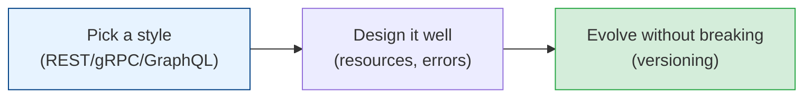

# API Design

APIs are the contracts between systems and teams — the single most durable, most public thing
you build. A good API is a joy for years; a bad one is a prison you can't escape because
everyone depends on it. This module covers designing APIs that are clear, evolvable, and hard to
misuse — a skill that quietly separates senior engineers from the rest.

## Contents

| # | Topic | File | Level |
|---|-------|------|-------|
| 0 | The map (this file) | *(here)* | Basic |
| 1 | REST, gRPC & GraphQL (choosing a style) | [api-styles.md](./api-styles.md) | Basic → Intermediate |
| 2 | Designing good REST APIs (resources, status codes, errors) | [rest-design.md](./rest-design.md) | Intermediate |
| 3 | Versioning, pagination & evolution | [versioning-and-evolution.md](./versioning-and-evolution.md) | Advanced |

---

## How to read this module

- **Chapter 1** helps you pick the right paradigm — REST vs gRPC vs GraphQL — a decision you make
  before writing a line.
- **Chapter 2** is the craft of REST done right: the conventions that make an API predictable and
  pleasant.
- **Chapter 3** is the senior material: how to change an API *without* breaking the thousands of
  clients depending on it — the hardest and most important API skill.

## Related modules

Builds on [system-design-fundamentals](../system-design-fundamentals/README.md) (the design
framework's "API design" step), [microservices](../microservices/README.md) (how services talk),
and [architecture-patterns/security](../architecture-patterns/security-by-design.md) (auth).

## The one truth

> **An API is a promise, and once people depend on it, you can't easily take it back.** Design as
> if you'll support it for a decade — because the contract outlives every implementation behind
> it. Ship the smallest, clearest surface you can; you can always add, but you can rarely remove.

Start with [api-styles.md](./api-styles.md). **Next >**
