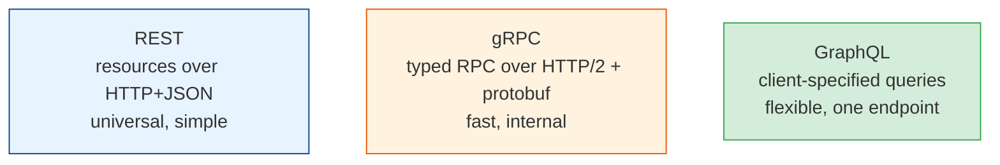
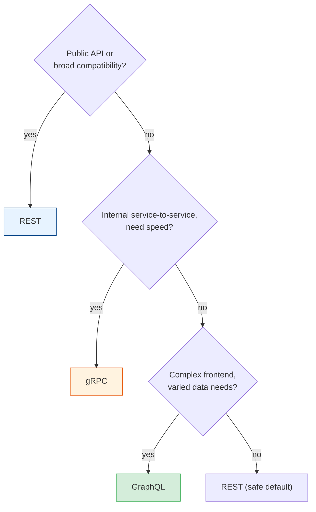

# REST, gRPC & GraphQL (Choosing a Style)

[Index](./README.md) | [Next: REST Design >](./rest-design.md)

---

Three dominant API paradigms, each optimized for different things. Picking the right one up front
saves years of friction. Here's how they actually differ and when to use each.

## The three at a glance



## REST (Representational State Transfer)

The default for public and web APIs. Model your system as **resources** (nouns) manipulated with
**HTTP verbs**.

```
GET    /users/42        # fetch user 42
POST   /users           # create a user
PUT    /users/42        # replace user 42
DELETE /users/42        # delete user 42
```

- **Strengths:** universal, human-readable, cacheable (HTTP caching), debuggable (curl, browser),
  works everywhere, huge ecosystem.
- **Weaknesses:** over-fetching (you get the whole resource) and under-fetching (need multiple
  calls to assemble a screen); no strict typed contract by default (mitigated by OpenAPI).
- **Use for:** public APIs, web/mobile backends, broad compatibility, CRUD-style services.

## gRPC

A high-performance **RPC** framework: you call remote functions as if local. Uses **Protocol
Buffers** (protobuf) — a compact binary format with a strict schema — over HTTP/2.

```protobuf
service UserService {
  rpc GetUser (GetUserRequest) returns (User);
}
```

- **Strengths:** fast and compact (binary, not JSON text), **strongly typed contract**
  (auto-generates client/server code in many languages), bidirectional **streaming**, HTTP/2
  multiplexing.
- **Weaknesses:** not human-readable, poor browser support (needs a proxy), harder to debug, less
  approachable.
- **Use for:** **internal service-to-service** communication, low-latency/high-throughput,
  polyglot microservices, streaming.

## GraphQL

A **query language** for APIs. One endpoint; the *client* specifies exactly what data it wants,
in one round trip.

```graphql
query {
  user(id: 42) {
    name
    orders(last: 3) { total }   # exactly the fields I need, nested
  }
}
```

- **Strengths:** no over/under-fetching (client picks fields), one request for nested/related
  data, strongly typed schema, great for varied frontends with different data needs.
- **Weaknesses:** complex to implement well, HTTP caching is hard (it's usually all POST),
  easy to write expensive queries (the "N+1" and deep-nesting problems), overkill for simple
  APIs.
- **Use for:** complex frontends (esp. mobile) that need flexible, aggregated data; when many
  clients want different slices of the same graph.

## The comparison table

| Dimension | REST | gRPC | GraphQL |
|-----------|------|------|---------|
| **Format** | JSON (text) | Protobuf (binary) | JSON (text) |
| **Transport** | HTTP/1.1+ | HTTP/2 | HTTP (usually POST) |
| **Contract** | Loose (OpenAPI optional) | Strict (proto) | Strict (schema) |
| **Performance** | Good | Best | Good |
| **Browser-friendly** | Yes | No (needs proxy) | Yes |
| **Caching** | Easy (HTTP) | Manual | Hard |
| **Over/under-fetching** | Common | N/A | Solved |
| **Best for** | Public/web APIs | Internal services | Flexible frontends |

## How to choose (the practical rule)



- **Public API / maximum compatibility / simple CRUD** → **REST** (the safe default).
- **Internal microservices needing performance & typed contracts** → **gRPC**.
- **Complex/varied frontends fighting over/under-fetching** → **GraphQL**.

> These aren't mutually exclusive. A common real setup: **REST or GraphQL at the edge** (client-
> facing), **gRPC between internal services**. Use each where it's strongest.

## The takeaways

1. **REST is the safe default** — universal, cacheable, debuggable. Reach for others only with a
   reason.
2. **gRPC for internal, high-performance, typed service-to-service** communication and streaming.
3. **GraphQL solves over/under-fetching for complex frontends** — but adds real complexity and
   caching pain.
4. **Mix them by layer:** flexible/compatible at the edge, fast/typed between services.

---

[Index](./README.md) | [Next: REST Design >](./rest-design.md)
