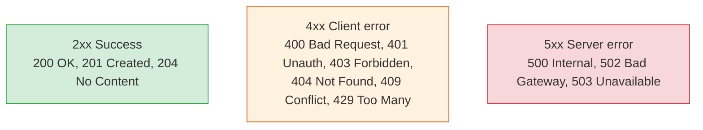

# Designing Good REST APIs

[< Back](./api-styles.md) | [Index](./README.md) | [Next: Versioning & Evolution >](./versioning-and-evolution.md)

---

REST is simple to start and easy to do badly. A well-designed REST API is *predictable* — a
developer can guess the next endpoint without reading docs. These are the conventions that get
you there.

## Resources are nouns; verbs are HTTP methods

The core REST idea: URLs name **resources (nouns)**, and **HTTP methods** are the verbs acting on
them. Don't put verbs in URLs.

```
GOOD                          BAD
GET    /users/42              GET  /getUser?id=42
POST   /users                 POST /createUser
DELETE /users/42              POST /deleteUser
GET    /users/42/orders       GET  /getOrdersForUser?id=42
```

**Conventions that make APIs predictable:**
- **Plural nouns** for collections: `/users`, `/orders` (not `/user`).
- **Nest for relationships:** `/users/42/orders` = orders belonging to user 42.
- **Lowercase, hyphenated** paths: `/shipping-addresses`, not `/shippingAddresses`.
- **Query params for filtering/sorting/paging:** `/users?status=active&sort=-created_at`.

## Use HTTP methods correctly (and know their semantics)

| Method | Purpose | Safe? | Idempotent? |
|--------|---------|-------|-------------|
| `GET` | Read a resource | Yes | Yes |
| `POST` | Create / non-idempotent action | No | **No** |
| `PUT` | Replace a resource fully | No | Yes |
| `PATCH` | Partial update | No | Not necessarily |
| `DELETE` | Remove a resource | No | Yes |

- **Safe** = no side effects (read-only). **Idempotent** = doing it twice = doing it once.
- This matters for retries: a client (or proxy) can safely retry `GET`/`PUT`/`DELETE` but **not**
  `POST` — which is why important `POST`s need idempotency keys (see
  [distributed-systems/idempotency](../distributed-systems/time-and-idempotency.md)).

## Use the right status codes (don't return 200 for everything)



| Code | Meaning | Use when |
|------|---------|----------|
| `200 OK` | Success with body | Successful GET/PUT/PATCH |
| `201 Created` | Resource created | Successful POST that creates |
| `204 No Content` | Success, no body | Successful DELETE |
| `400 Bad Request` | Malformed/invalid input | Validation failed |
| `401 Unauthorized` | Not authenticated | Missing/invalid credentials |
| `403 Forbidden` | Authenticated but not allowed | No permission |
| `404 Not Found` | Resource doesn't exist | Unknown ID |
| `409 Conflict` | State conflict | Duplicate, version mismatch |
| `429 Too Many Requests` | Rate limited | Client exceeded limits |
| `500 Internal Server Error` | Server bug | Unhandled failure |

> **The cardinal sin: returning `200 OK` with `{"error": "..."}` in the body.** It breaks every
> client, proxy, and monitoring tool that relies on status codes. **401 vs 403** is a classic
> mixup: 401 = "I don't know who you are" (authenticate); 403 = "I know who you are, and you can't
> do this" (authorized-denied). (See [security-by-design](../architecture-patterns/security-by-design.md).)

## Return helpful, consistent error bodies

Errors are part of your API contract. Make them machine-parseable *and* human-readable:

```json
{
  "error": {
    "code": "INSUFFICIENT_FUNDS",
    "message": "Account balance is too low for this transfer.",
    "field": "amount",
    "request_id": "req_abc123"
  }
}
```

- A **stable error `code`** clients can branch on (don't make them string-match `message`).
- A **human message** for logs and developers.
- A **`request_id`** so support can trace it (ties to your
  [observability](../observability-and-reliability/README.md) correlation IDs).
- **Consistent shape across every endpoint** — one error format, always.

## Design principles that age well

1. **Consistency above cleverness.** Same naming, same error shape, same paging everywhere. A
   predictable API needs less documentation and causes fewer bugs.
2. **Make the common case easy and the API hard to misuse.** Sensible defaults, clear required
   vs optional fields, validation with helpful messages.
3. **Least surprise.** Do what an experienced developer would expect. Surprises become support
   tickets.
4. **Document with a spec (OpenAPI/Swagger).** A machine-readable contract gives you docs,
   client generation, and validation for free. Write it *with* the API, not after.
5. **Design the smallest surface that works.** Every endpoint and field is a forever-commitment.
   You can always add; you can rarely remove (see [next chapter](./versioning-and-evolution.md)).
6. **Secure by default** — authenticate, authorize per resource, validate all input, rate-limit.
   (See [rate limiting](../infrastructure/rate-limiting.md).)

## The takeaways

1. **Resources are nouns; HTTP methods are the verbs.** No verbs in URLs; plural collections;
   nest relationships.
2. **Respect method semantics** (safe/idempotent) — it governs what clients can retry.
3. **Use accurate status codes** — never `200` with an error body; know `401` vs `403`.
4. **Return consistent, coded, traceable error bodies** — errors are part of the contract.
5. **Consistency, least surprise, smallest surface, and an OpenAPI spec** make an API that's a
   pleasure to use and cheap to maintain.

---

[< Back](./api-styles.md) | [Index](./README.md) | [Next: Versioning & Evolution >](./versioning-and-evolution.md)
