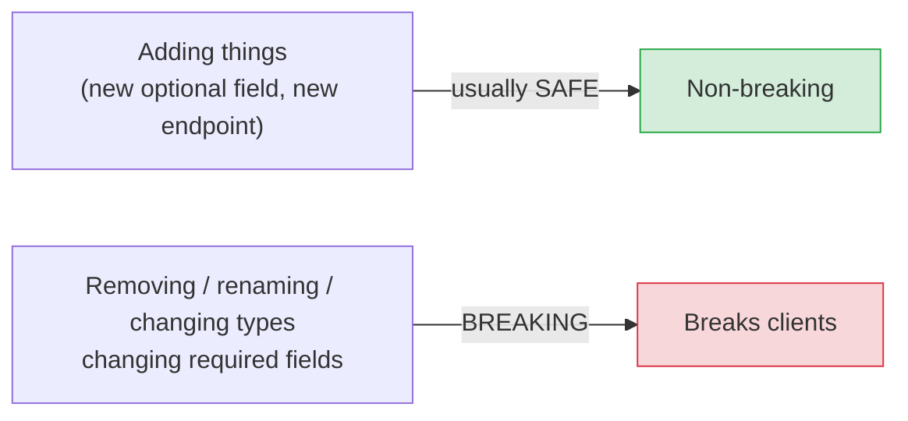
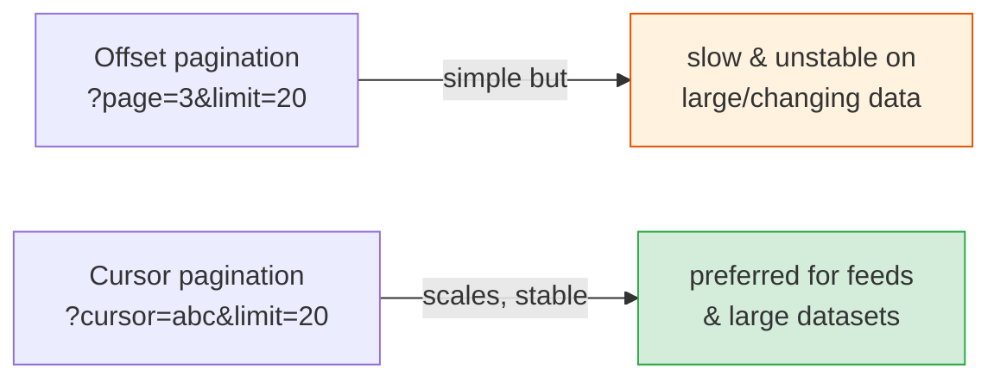

# Versioning, Pagination & Evolution

[< Back](./rest-design.md) | [Index](./README.md)

---

The hardest part of APIs isn't building them — it's *changing* them after thousands of clients
depend on them. This chapter is about evolving an API without breaking the people who rely on it,
which is the senior-most API skill.

## The golden rule of API evolution



> **You can almost always *add* safely; you can almost never *remove* or *change* safely.** New
> optional fields and new endpoints don't break existing clients. Removing a field, renaming one,
> changing a type, or making an optional field required **will** break someone. This asymmetry
> should shape every API decision — start minimal, grow additively.

### Non-breaking vs breaking changes

| Non-breaking (safe) | Breaking (needs a new version) |
|---------------------|-------------------------------|
| Add a new optional field | Remove or rename a field |
| Add a new endpoint | Change a field's type or meaning |
| Add a new optional query param | Make an optional field required |
| Add a new enum value* | Change status codes / error codes |
| Loosen a validation rule | Tighten a validation rule |

*Adding enum values can break clients that exhaustively switch on them — document expected
behavior for unknowns.

## Versioning strategies

When you *must* make a breaking change, you version. The main approaches:

| Strategy | Example | Notes |
|----------|---------|-------|
| **URI path** | `GET /v1/users` | Most common, most visible, easy to route/cache |
| **Header** | `Accept: application/vnd.api.v2+json` | Cleaner URLs, less discoverable |
| **Query param** | `GET /users?version=2` | Simple, but muddies caching |

```
/v1/users   <- old clients keep working
/v2/users   <- new breaking shape lives here
```

**Practical guidance:**
- **URI versioning (`/v1/`) is the pragmatic default** — obvious, easy to route, easy to cache.
- **Version at a coarse grain** (the whole API, or a large surface), not per-endpoint — a maze of
  per-endpoint versions is unmaintainable.
- **Only bump the major version for *breaking* changes.** Additive changes stay in the current
  version.
- **Support old versions for a defined window**, announce **deprecation** with a timeline and
  clear migration docs, and use metrics to see who's still on the old version before you sunset it.

> **Every version you support is a maintenance cost forever.** The best versioning strategy is to
> *avoid needing it* by designing extensibly and changing additively. Version reluctantly.

## Pagination (never return unbounded lists)

Returning "all users" works with 10 rows and takes down your database with 10 million. **Always
paginate list endpoints from day one** — adding it later is a breaking change.



| Approach | How | Trade-off |
|----------|-----|-----------|
| **Offset/limit** | `?limit=20&offset=40` (or `page=3`) | Simple; but slow at high offsets and **skips/duplicates rows** if data changes between pages |
| **Cursor (keyset)** | `?limit=20&cursor=<opaque>` | Scales to huge datasets, stable under inserts; can't jump to an arbitrary page |

> **Prefer cursor-based pagination** for large or real-time datasets (feeds, logs, timelines).
> Offset pagination is fine for small, stable admin lists. Return the `next_cursor` in the
> response so clients don't construct it themselves. (This mirrors the design-framework advice in
> [system-design-fundamentals](../system-design-fundamentals/design-framework.md).)

## Other evolution essentials

- **Rate limiting** — communicate limits via headers (`X-RateLimit-Remaining`, `Retry-After`) and
  return `429` when exceeded. Protects you and sets client expectations. (See
  [rate limiting](../infrastructure/rate-limiting.md).)
- **Idempotency keys** — for create/payment `POST`s, accept an `Idempotency-Key` header so retries
  don't duplicate. (See [idempotency](../distributed-systems/time-and-idempotency.md).)
- **Filtering, sorting, field selection** — design these as query params early; they're common
  needs that are painful to bolt on.
- **Deprecation signaling** — use the `Deprecation` and `Sunset` HTTP headers and changelogs so
  clients get warned in-band, not by surprise.
- **Backward-compatible defaults** — when you add a field or param, choose a default that
  preserves old behavior.

## The takeaways

1. **Add freely, remove almost never.** The asymmetry between safe (additive) and breaking
   (removing/changing) changes governs all API evolution.
2. **Version only for breaking changes**, coarse-grained, URI-based by default; support old
   versions for a defined, communicated window.
3. **Paginate every list from day one** — prefer cursor-based for scale and stability; adding
   pagination later is itself a breaking change.
4. **Design in rate limits, idempotency keys, filtering, and deprecation signaling early** —
   they're expensive to retrofit.
5. **The best versioning is the versioning you avoid** by designing extensibly and changing
   additively.

---

[< Back](./rest-design.md) | [Index](./README.md)
