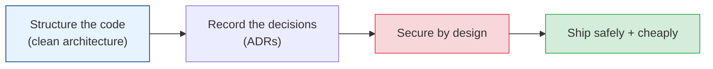

# Architecture & Design Patterns

Beyond individual components lies the shape of the whole system and the code inside it. This
module covers the enduring patterns — how to structure code so it survives change, how to
document big decisions, the security foundations every architect must own, and how to reason
about deploys and cost. This is the "senior/staff engineer" layer: not "how do I build X" but
"how do I build things that stay good for years."

## Contents

| # | Topic | File | Level |
|---|-------|------|-------|
| 0 | The map (this file) | *(here)* | L4 · Advanced |
| 1 | Code architecture: layers, hexagonal, clean & the principles | [code-architecture.md](./code-architecture.md) | L3 · Intermediate |
| 2 | Architecture Decision Records (ADRs) & documenting choices | [adrs-and-decisions.md](./adrs-and-decisions.md) | L4 · Advanced |
| 3 | Security by design (authn/authz, defense in depth, secrets) | [security-by-design.md](./security-by-design.md) | L4 · Advanced |
| 4 | Deployment, delivery & cost awareness | [deployment-and-cost.md](./deployment-and-cost.md) | L4 · Advanced |

---

## How to read this module

- **Chapter 1** applies at every level — clean code architecture makes every future change
  cheaper. Read it early and often.
- **Chapters 2–4** are staff/architect concerns: recording *why* decisions were made, baking
  security in from the start, and treating deployment and cost as first-class design inputs.

## The one idea

> **Architecture is the set of decisions that are expensive to change.** Good architecture
> isn't the fanciest design — it's the one that keeps the expensive-to-change decisions few,
> deferred, and reversible for as long as possible.

Start with [code-architecture.md](./code-architecture.md). **Next >**
