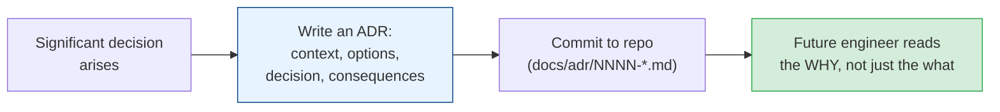

# Architecture Decision Records (ADRs) & Documenting Choices

[< Back](./code-architecture.md) | [Index](./README.md) | [Next: Security by Design >](./security-by-design.md)

---

Six months from now, someone (maybe you) will stare at a weird design choice and ask "why on
earth did we do it this way?" — and nobody will remember. **Context is the most perishable
resource in engineering.** ADRs are the cheap, durable fix.

## What an ADR is

An **Architecture Decision Record** is a short, dated document capturing one significant
decision: what you decided, why, what you considered, and what it costs. Stored **in the repo**
(usually `docs/adr/`), version-controlled alongside the code it describes.



## The template (keep it short — one page)

```markdown
# ADR-0007: Use PostgreSQL for the orders service

## Status
Accepted   (Proposed | Accepted | Deprecated | Superseded by ADR-0012)

## Context
We need a datastore for orders. Orders are highly relational (customers,
items, payments), require ACID transactions, and current scale is ~500 QPS
with no near-term need for horizontal sharding. The team knows SQL well.

## Decision
We will use PostgreSQL as the primary datastore for the orders service.

## Alternatives considered
- DynamoDB: great scale, but our access patterns need flexible queries and
  cross-entity transactions that DynamoDB makes painful.
- MongoDB: flexible schema, but we need strong relational integrity.

## Consequences
+ Strong ACID guarantees, rich querying, team expertise, boring & proven.
- Vertical scaling ceiling; if we exceed it we'll revisit sharding (see ADR-future).
- We accept managing migrations carefully (expand/contract).
```

That's it. **Status, Context, Decision, Alternatives, Consequences.** Five sections, one page.
The magic is in *Context* and *Consequences* — they capture the reasoning that evaporates from
memory.

## Why ADRs are worth the tiny effort

1. **They record the *why*, which code can't.** Code shows *what* you did; an ADR explains *why*
   — the constraints, the trade-offs, the roads not taken.
2. **They stop re-litigating settled debates.** New team member wants to swap Postgres for
   Mongo? Point them at ADR-0007. Either the context still holds (decision stands) or it changed
   (write ADR-0012 that supersedes it). Either way, no groundhog-day argument.
3. **They onboard people fast.** Reading the ADR log is the fastest way to understand *how a
   system came to be* — the archaeology, pre-dug.
4. **They make you think.** Writing "alternatives considered" forces you to actually consider
   alternatives instead of grabbing the first idea.
5. **They're immutable history.** You don't edit old ADRs; you supersede them with new ones. The
   trail of superseded decisions *is* the system's intellectual history.

> An ADR is not bureaucracy — it's a 15-minute investment that saves hours of future confusion
> and prevents the same debate from recurring every time someone new joins. The ROI is absurd.

## When to write one

Write an ADR for decisions that are **significant and hard to reverse:**

- Choosing a datastore, language, or major framework.
- A key architectural pattern (monolith vs services, sync vs event-driven).
- A cross-cutting convention (how we do auth, error handling, API versioning).
- Anything where future-you would ask "why did we do it this way?"

**Don't** write one for trivial or easily reversed choices (variable naming, which lodash
function). Reserve ADRs for the expensive-to-change stuff — the actual architecture.

## Documentation more broadly (the senior habit)

ADRs are one tool in a bigger discipline. The documentation that actually pays off:

| Doc type | Purpose | Lives |
|----------|---------|-------|
| **ADRs** | Why we made key decisions | `docs/adr/` in repo |
| **READMEs** | How to run/use this thing | Next to the code |
| **Runbooks** | What to do when it breaks (for on-call) | Linked from alerts |
| **Design docs / RFCs** | Propose & review a change *before* building | Wiki / repo, reviewed |
| **Architecture diagrams** | The big picture (C4 model is great) | Repo, kept current |

> **Write docs for the reader who has the context you have *now* but won't in six months — or
> who never had it.** The best time to document a decision is the moment you make it, while the
> reasoning is fresh. Nobody ever reconstructs it accurately later.

## The takeaways

1. **Capture the *why*, not just the what.** Code records the what; ADRs record the why.
2. **Keep ADRs short, dated, in-repo, and immutable** (supersede, don't edit).
3. **Write them for expensive, hard-to-reverse decisions** — not trivia.
4. **They kill repeated debates and accelerate onboarding** at near-zero cost.
5. **Documentation is a senior responsibility**, not a chore for juniors. The person who made
   the decision is the only one who can explain it well.

---

[< Back](./code-architecture.md) | [Index](./README.md) | [Next: Security by Design >](./security-by-design.md)
