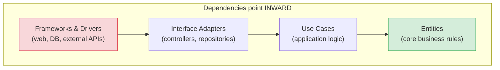

# Code Architecture: Layers, Hexagonal, Clean & the Principles

[Index](./README.md) | [Next: ADRs & Decisions >](./adrs-and-decisions.md)

---

System design decides how *services* fit together; code architecture decides how the *code
inside* a service fits together. Both matter. Messy internals turn every feature into a slog and
every bug into an archaeology dig. This is about structuring code so it stays changeable.

## The principles that underpin everything

### SOLID (the object-oriented five)

| Principle | One-liner | Why it matters |
|-----------|-----------|----------------|
| **S**ingle Responsibility | A class/module has one reason to change | Changes stay local, not sprawling |
| **O**pen/Closed | Open to extension, closed to modification | Add behavior without rewriting tested code |
| **L**iskov Substitution | Subtypes must be usable as their base type | No surprise breakage via inheritance |
| **I**nterface Segregation | Many small interfaces beat one fat one | Clients don't depend on things they don't use |
| **D**ependency Inversion | Depend on abstractions, not concretions | Swap implementations; testable code |

### The everyday trio

- **DRY** (Don't Repeat Yourself) — one source of truth for each piece of knowledge. But beware
  **over-DRYing**: a little duplication is far cheaper than the wrong abstraction. Wait until you
  see the pattern three times.
- **YAGNI** (You Aren't Gonna Need It) — don't build for imagined future needs. Most of them
  never arrive, and the flexibility you added is dead weight that makes everything harder.
- **KISS** (Keep It Simple) — the simplest thing that works, ships, and is understood by the
  next person. Cleverness is a liability.

> These pull against each other on purpose. DRY says "abstract"; YAGNI and KISS say "not yet."
> Senior judgment is knowing which one wins *right now.* The Zen of Python nails it: "Simple is
> better than complex. Complex is better than complicated."

## The layered architectures

The common thread of all good code architecture: **dependencies point inward, toward your
business logic, which knows nothing about the outside world** (DB, web framework, third-party
APIs). Your domain shouldn't care whether data comes from Postgres or a CSV.

### Layered (n-tier) — the classic
Presentation → Business logic → Data access → Database. Simple, familiar, everywhere. Risk: the
business layer leaks into knowing about the DB, and "layers" become mud.

### Hexagonal (Ports & Adapters)
Your core logic exposes **ports** (interfaces); the outside world plugs in via **adapters** (a
Postgres adapter, a REST adapter, a test adapter). The core has zero knowledge of what's plugged
in. Swapping the database or adding a CLI is just a new adapter — the core never changes.

### Clean Architecture
Uncle Bob's concentric circles (diagram above). Entities (enterprise rules) at the center, use
cases around them, adapters outside, frameworks at the edge. **The dependency rule: source-code
dependencies only point inward.** The database and web framework are *details*, plugged in at
the edge, easily replaced.

## Why this matters (the payoff)

- **Testability** — business logic with no DB/network dependency is trivially unit-testable
  (inject a fake adapter). Slow, flaky integration tests shrink to a thin edge.
- **Changeability** — swap Postgres for DynamoDB, REST for gRPC, without touching core logic.
- **Comprehensibility** — a new hire finds business rules in one place, not smeared across
  controllers and SQL.
- **Deferred decisions** — you can delay "which database" because the core doesn't depend on it.
  Keeping decisions reversible is the whole game.

## The pragmatic warning

> Don't cargo-cult clean architecture into a tiny CRUD app — the ceremony (interfaces,
> adapters, mappers) can outweigh the benefit. **Match the architecture to the complexity.** A
> 200-line script doesn't need hexagonal ports; a 200k-line system absolutely does. Adding
> layers "to be clean" when there's no complexity to manage is just YAGNI wearing a nice suit.

## Practical heuristics that age well

1. **Separate the "what" (business rules) from the "how" (DB, HTTP, frameworks).** This single
   split delivers most of the benefit of every fancy architecture.
2. **Depend on interfaces at boundaries** so pieces are swappable and testable.
3. **Keep functions/classes small and single-purpose.** Big things hide bugs.
4. **Push side effects to the edges; keep the core pure** where you can — pure logic is easy to
   test and reason about.
5. **Optimize for deletion and change, not for cleverness.** You'll change this code far more
   than you'll admire it.
6. **Consistency beats personal preference.** A codebase where everything follows one (even
   imperfect) pattern beats a mix of five "better" ones.

---

[Index](./README.md) | [Next: ADRs & Decisions >](./adrs-and-decisions.md)
