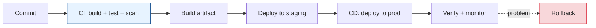
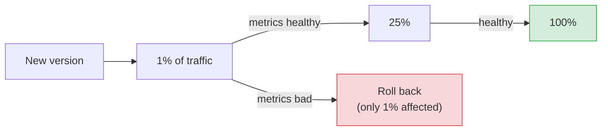
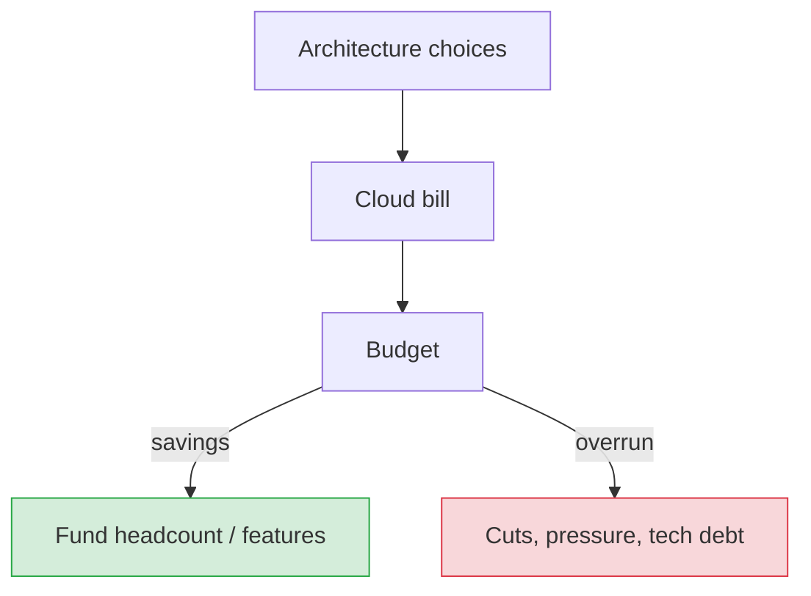

# Deployment, Delivery & Cost Awareness

[< Back](./security-by-design.md) | [Index](./README.md)

---

Code that isn't shipped delivers zero value, and code that ships unsafely delivers negative
value. This chapter covers how to get changes into production *safely and often*, and the cost
awareness that separates engineers who build things from engineers who build things the company
can afford.

## CI/CD: the delivery backbone

- **CI (Continuous Integration)** — every commit is automatically built, tested, and scanned.
  Catches breakage early, keeps `main` always releasable.
- **CD (Continuous Delivery/Deployment)** — changes flow automatically (or one-click) to
  production. Small, frequent deploys are *safer* than big rare ones — less changes per deploy
  means smaller blast radius and easier rollback.

> **Deploy small, deploy often.** A 3-line deploy that breaks is trivial to find and revert. A
> 3-week mega-deploy that breaks is a whodunit. Batch size is inversely correlated with safety —
> this is one of the most robust findings in software delivery (see DORA metrics).

## Deployment strategies (releasing without downtime or drama)

| Strategy | How | Trade-off |
|----------|-----|-----------|
| **Rolling** | Replace instances gradually | No downtime; mixed versions briefly |
| **Blue-green** | Two full environments; switch traffic all at once | Instant rollback; 2x infra during switch |
| **Canary** | Route 1% → 5% → 50% → 100%, watching metrics | Catch problems tiny; slower rollout |
| **Feature flags** | Deploy code dark, toggle on separately | Decouple deploy from release; instant off-switch |

> **Canary + feature flags is the modern gold standard.** Feature flags decouple *deploying*
> code from *releasing* a feature — you can ship dark, turn it on for internal users, then 1% of
> real users, and kill it instantly if it misbehaves without a redeploy. The fastest rollback is
> a flag flip.

## The single most valuable operational capability

> **Fast, reliable rollback.** Everything else being equal, the ability to instantly revert a
> bad change is the highest-leverage reliability investment you can make. It turns "we caused an
> outage" into "we had a 2-minute blip." Practice it — an untested rollback is not a rollback.

Make rollback safe: **backward-compatible changes** (see
[data modeling migrations](../databases/data-modeling.md)) so new and old versions coexist
during a rollout, and never ship a DB migration that can't be reversed alongside the code.

## Infrastructure as Code (IaC)

Define infrastructure in version-controlled code (Terraform, Pulumi, CloudFormation), not
by clicking in a console.

- **Reproducible** — spin up an identical environment from code.
- **Reviewable** — infra changes go through PR review like any code.
- **Auditable** — git history shows who changed what and when.
- **No snowflakes** — no hand-tweaked servers nobody can recreate (the "works on that one box"
  nightmare).

## Cost awareness: the constraint juniors ignore and seniors own

"Just add more servers" has a bill attached, and at scale that bill funds (or starves) your
team. Cost is a real engineering constraint, not finance's problem.

**Where the money goes (and how to think about it):**

- **Compute** — right-size instances; use autoscaling; spot/preemptible for fault-tolerant work.
- **Data transfer / egress** — often a *shocking* line item. Cross-region and internet egress
  cost real money; keep chatty traffic in-region. (Recall the [fallacies](../distributed-systems/fallacies.md):
  transport cost is *not* zero.)
- **Storage** — tier it (hot/warm/cold/archive); delete what you don't need; set lifecycle
  policies.
- **Managed services** — convenience has a premium; sometimes worth it (less ops), sometimes not
  (at scale, self-hosting can be far cheaper). A real trade-off, not a default.
- **Idle resources** — the silent killer. Non-prod environments running 24/7, oversized
  instances, forgotten resources. Turn things off.

> **Efficiency is architecture at scale.** A design that costs 3x more for the same result isn't
> "working" — it's quietly bleeding the company. A senior engineer weighs the cloud bill as a
> first-class design input alongside latency and reliability. A 30% cost cut can fund a whole
> engineer.

**But** — beware premature cost optimization too (YAGNI applies here as well). Don't contort an
architecture to save $50/month on a system serving 100 users. Optimize cost where it's
*material*, using real billing data, the same way you optimize performance with real profiling.

## The takeaways

1. **Automate the pipeline (CI/CD).** Manual deploys are slow, error-prone, and don't scale.
2. **Deploy small and often** — smaller batches mean smaller blast radius and easier rollback.
3. **Use canary + feature flags** to release gradually and kill problems instantly.
4. **Fast, tested rollback is your highest-leverage reliability tool.** Keep changes
   backward-compatible so you *can* roll back.
5. **Infrastructure as code** — reproducible, reviewable, no snowflakes.
6. **Own the cost.** Architecture decisions are spending decisions; watch compute, egress,
   storage, and idle waste — but optimize where it's material, not everywhere.

---

[< Back](./security-by-design.md) | [Index](./README.md)
