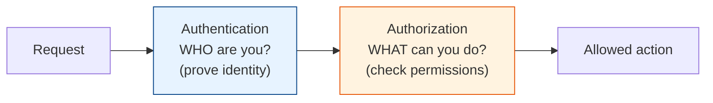

# Security by Design

[< Back](./adrs-and-decisions.md) | [Index](./README.md) | [Next: Deployment & Cost >](./deployment-and-cost.md)

---

Security is not a feature you bolt on before launch — it's a property you design in from the
start. Retrofitting security is expensive, incomplete, and usually happens right after a breach.
This chapter is the security foundation every engineer (not just the security team) must own.
For crypto internals, see the repo's [encryption](../encryption/README.md) and
[security](../security/README.md) modules.

## AuthN vs AuthZ (never confuse these)

- **Authentication (AuthN)** — *who are you?* Verifying identity (password, token, MFA,
  certificate).
- **Authorization (AuthZ)** — *what are you allowed to do?* Checking permissions once identity
  is known.

You **authenticate first, then authorize.** A logged-in user (authenticated) still can't delete
another user's data (not authorized). Mixing these up — e.g., checking identity but forgetting
the permission check — is a classic, catastrophic bug (broken access control, #1 on the OWASP
Top 10).

## Common auth mechanisms

| Mechanism | What it is | Use for |
|-----------|-----------|---------|
| **Session + cookie** | Server stores session; cookie holds the ID | Traditional web apps |
| **JWT** | Signed, self-contained token the client holds | Stateless APIs, SPAs, mobile |
| **OAuth 2.0** | Delegated authorization ("log in with Google") | Third-party access, SSO |
| **OIDC** | Auth layer on top of OAuth 2.0 (adds identity) | Modern SSO/login |
| **API keys** | Simple shared secret | Service-to-service, simple APIs |
| **mTLS** | Both sides present certificates | Zero-trust service-to-service |

> **JWT gotcha:** JWTs are signed (tamper-evident) but readable by anyone — **never put secrets
> in a JWT payload.** And they're hard to revoke before expiry, so keep lifetimes short and pair
> with refresh tokens.

## Authorization models

- **RBAC (Role-Based)** — permissions attach to roles; users get roles ("admin," "editor").
  Simple, scales to most apps.
- **ABAC (Attribute-Based)** — decisions from attributes (user dept, resource owner, time of
  day). Flexible, more complex.
- **ReBAC (Relationship-Based)** — permissions from relationships ("can edit docs *I own* or
  that are *shared with me*"). Google Zanzibar-style; powerful for sharing-heavy products.

## The security principles that never go out of style

1. **Defense in depth.** Never rely on one control. Layer them: network firewall + WAF +
   authn + authz + input validation + encryption + monitoring. If one fails, others hold.
   (See [security/firewall](../security/firewall.md).)
2. **Least privilege.** Every user, service, and token gets the *minimum* access needed, for the
   *minimum* time. The database user for a read API should not have `DROP TABLE`. Over-permissioned
   credentials turn a small breach into a catastrophe.
3. **Zero trust.** "Inside the network" is not a trust boundary. Authenticate and authorize
   *every* request, even service-to-service (mTLS). Assume the network is already compromised
   (see the [fallacies](../distributed-systems/fallacies.md)).
4. **Never trust input.** All input is hostile until validated. This single principle prevents
   SQL injection, XSS, command injection — most of the OWASP Top 10.
5. **Fail secure (fail closed).** When something errors, deny by default. An auth check that
   throws should block access, not accidentally allow it.
6. **Encrypt in transit and at rest.** TLS everywhere on the wire; encrypt sensitive data on
   disk. Assume storage and backups can be stolen.

## The bugs that actually get people (OWASP-flavored)

| Vulnerability | The fix |
|---------------|---------|
| **SQL injection** | Parameterized queries / prepared statements — **never** string-concatenate SQL |
| **XSS** (cross-site scripting) | Escape/encode output; use a Content Security Policy |
| **Broken access control** | Check authorization on *every* request, server-side, per resource |
| **Sensitive data exposure** | Encrypt; don't log secrets/PII; minimize what you collect |
| **CSRF** | Anti-CSRF tokens, `SameSite` cookies |
| **SSRF** | Validate/allowlist outbound URLs; block internal ranges |
| **Insecure deserialization** | Don't deserialize untrusted data into objects |
| **Vulnerable dependencies** | Scan (Snyk/Dependabot); patch promptly — most breaches use known CVEs |

## Secrets management (the boring one that burns everyone)

> **Never commit secrets to git.** Not passwords, API keys, tokens, or certificates — not even
> "temporarily." Git history is forever, and scrapers find committed keys within *minutes*.

- Use a **secrets manager** (Vault, AWS Secrets Manager, cloud KMS) — not env files in the repo.
- **Rotate** secrets regularly and immediately after any suspected exposure.
- Use **short-lived, scoped credentials** over long-lived ones wherever possible.
- Scan for accidentally committed secrets in CI (git-secrets, truffleHog).
- Keep PII/secrets out of `.env` files that get committed; `.gitignore` them and check before
  every commit.

## The takeaways

1. **AuthN (who) then AuthZ (what)** — and check authorization on *every* request, per resource.
2. **Defense in depth + least privilege + zero trust** — the three pillars that contain any
   single failure.
3. **Never trust input; parameterize queries; escape output.** That covers most of the OWASP
   Top 10.
4. **Encrypt in transit and at rest; fail closed.**
5. **Secrets never touch git.** Use a secrets manager, rotate, and scope tightly.
6. **Patch your dependencies.** Most real breaches exploit a known, fixed CVE you didn't update.
7. **Security is everyone's job, designed in from day one** — not a gate at the end or someone
   else's problem.

---

[< Back](./adrs-and-decisions.md) | [Index](./README.md) | [Next: Deployment & Cost >](./deployment-and-cost.md)
