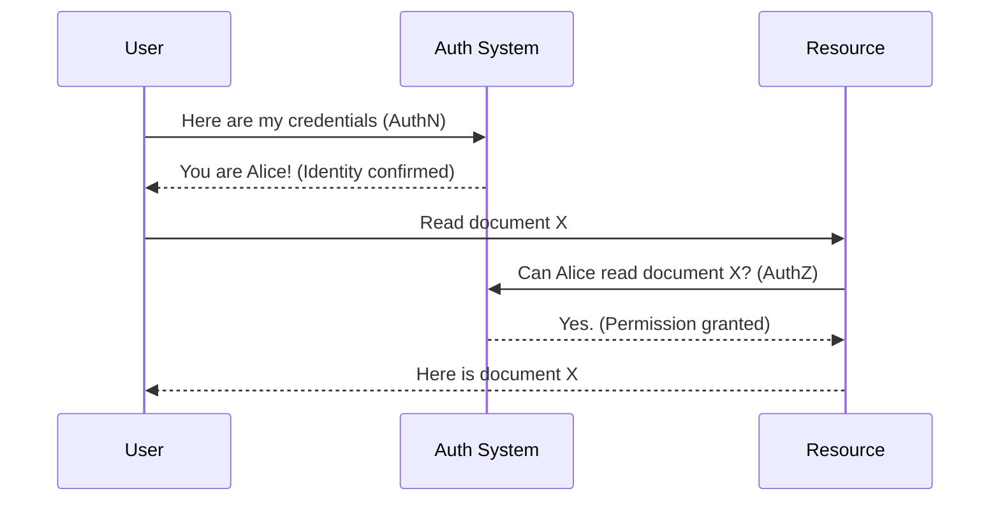

# Authentication Fundamentals

[< Back](./README.md) | [Index](./README.md) | [Next: OAuth 2.0 and OIDC >](./oauth2-and-oidc.md)

---

Authentication and authorization are the bouncers of your application. Let's get the terminology straight before we dive into the deep end.

## AuthN vs AuthZ

- **Authentication (AuthN):** *Who are you?* (Identity verification)
- **Authorization (AuthZ):** *What are you allowed to do?* (Permissions)

## Passwords and Hashing

Storing passwords in plaintext is a career-ending move. If your database is breached, the attacker gets every user's password. 

Instead, we hash them. But a simple hash (like SHA-256) is vulnerable to rainbow tables (precomputed dictionary attacks).

You must use a slow, salted hashing algorithm like **bcrypt**, **Argon2**, or **scrypt**.

> **Salting** means adding a random string (the salt) to the password before hashing it. This ensures that even if two users have the password "hunter2", their hashes will look completely different in the database.

## Session-based vs Token-based Auth

Once a user proves who they are, you need a way to remember them on subsequent requests without asking for a password every time.

### Session-based Authentication

The server creates a session record in its memory (or Redis/database) and sends a Session ID back to the client as an `HttpOnly` cookie. The browser automatically sends this cookie with every subsequent request.

- **Pros:** Easy to revoke, built-in browser cookie handling.
- **Cons:** Server must store state (hard to scale), vulnerable to Cross-Site Request Forgery (CSRF).

### Token-based Authentication

The server creates a token (often a JWT) containing user information, signs it cryptographically, and sends it to the client. The client stores it and sends it via the `Authorization: Bearer <token>` header on each request. The server validates the signature, so it doesn't need to store session state.

- **Pros:** Stateless (scales infinitely), cross-domain friendly.
- **Cons:** Hard to revoke before expiration, client-side storage risks (XSS).

### The Comparison

| Feature | Session-based | Token-based |
|---------|---------------|-------------|
| **State** | Stateful (server stores sessions) | Stateless (token contains all info) |
| **Storage** | Memory, Redis, DB | Client-side (Local Storage, memory, cookies) |
| **Revocation**| Instant (delete session record) | Hard (requires blocklists or short expirations) |
| **Common use**| Traditional web apps (SSR) | SPAs, Mobile apps, Microservices |

## Multi-Factor Authentication (MFA)

Passwords are fundamentally weak because humans are terrible at choosing them and reuse them everywhere. MFA requires the user to provide two or more verification factors:

1. Something you **know** (password)
2. Something you **have** (authenticator app, security key)
3. Something you **are** (biometrics)

## The Takeaways

- **AuthN** is identity (who you are), **AuthZ** is permissions (what you can do).
- **Never store plaintext passwords.** Use bcrypt or Argon2 with salting.
- **Session-based auth** stores state on the server; **Token-based auth** pushes state to the client.
- **MFA** is non-negotiable for critical systems today.

---

[< Back](./README.md) | [Index](./README.md) | [Next: OAuth 2.0 and OIDC >](./oauth2-and-oidc.md)
