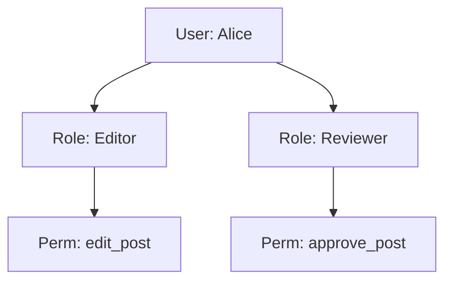
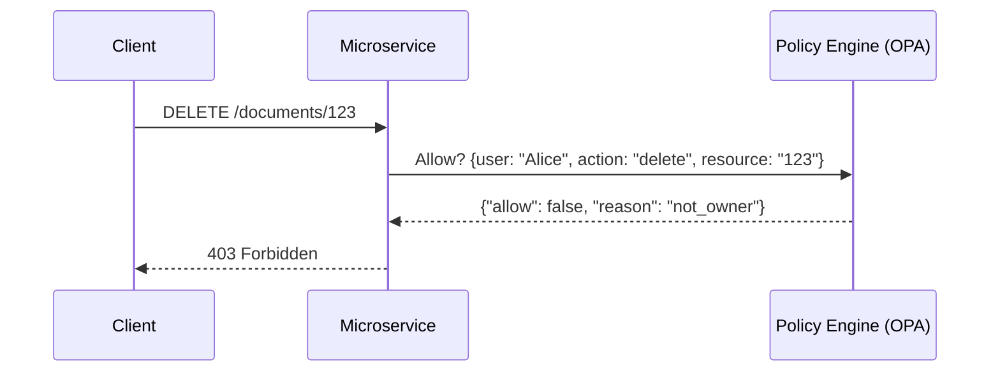

# Authorization Patterns

[< Back](./jwt-and-token-security.md) | [Index](./README.md) | [Next: None >](./README.md)

---

Authentication (knowing who the user is) is a solved problem. Authorization (deciding what they can do) is where architectures go to die. 

AuthZ is deeply tied to your business logic. Let's look at how to structure it as you scale.

## The Big Three Models

### 1. Role-Based Access Control (RBAC)
Users have roles, roles have permissions. 

- **Pros:** Easy to understand, standard in most enterprise apps.
- **Cons:** "Role Explosion." You end up with roles like `JuniorEditorUSWest` because RBAC doesn't handle context well.

### 2. Attribute-Based Access Control (ABAC)
Access is granted based on attributes of the user, resource, and environment evaluated through policies.

*Policy Example:* "A user can edit a document IF `user.department == doc.department` AND `time < 17:00`."

- **Pros:** Infinitely flexible and fine-grained.
- **Cons:** Very complex to model, hard to audit ("Who has access to X?" requires simulating the universe).

### 3. Relationship-Based Access Control (ReBAC)
Popularized by Google's Zanzibar. Permissions are based on a graph of relationships.

*Example:* "Alice can view Folder A because she is a member of Group B, which is a viewer of Folder A."

- **Pros:** Perfect for hierarchical, sharing-based apps (like Google Drive, Notion, Figma).
- **Cons:** Requires a dedicated graph database service to perform path traversals fast.

### Comparison

| Model | Best For | Complexity | Example |
|-------|----------|------------|---------|
| **RBAC** | Simple B2B SaaS, Admin panels | Low | "Admins can delete users" |
| **ABAC** | Regulated industries, dynamic rules | High | "Doctors can view patient records only during shifts" |
| **ReBAC** | Collaborative tools, nested folders | Medium-High | "Users can edit docs shared with their team" |

## Centralized Policy Engines

In a microservices architecture, you don't want every team hardcoding `if (user.role == 'admin')` in their services. When policies change, you have to update 10 different codebases.

Instead, use a **Policy Engine** like Open Policy Agent (OPA) or AWS Cedar.
You write policies in a specialized language (like Rego for OPA), and services ask the engine: *"Can user X do Y on resource Z?"*

## Zero Trust Principles

The old security model was a castle and moat: protect the perimeter, and trust everything inside the VPN. **Zero Trust** means: "Never trust, always verify."

Even if Microservice A calls Microservice B inside your private network, B must verify A's identity and authorization.
- Use **mTLS** (Mutual TLS) for service identity.
- Pass user identity (via JWT) through the call chain.

## The Takeaways

- **AuthZ is harder than AuthN** because it's entangled with business logic.
- Start with **RBAC**, move to **ABAC** for dynamic context, or **ReBAC** if your app involves complex sharing hierarchies.
- Decouple policy from code using a **Policy Engine** (OPA/Cedar) in distributed systems.
- Adopt **Zero Trust**: authorize every request, even internal service-to-service calls.

---

[< Back](./jwt-and-token-security.md) | [Index](./README.md) | [Next: None >](./README.md)
