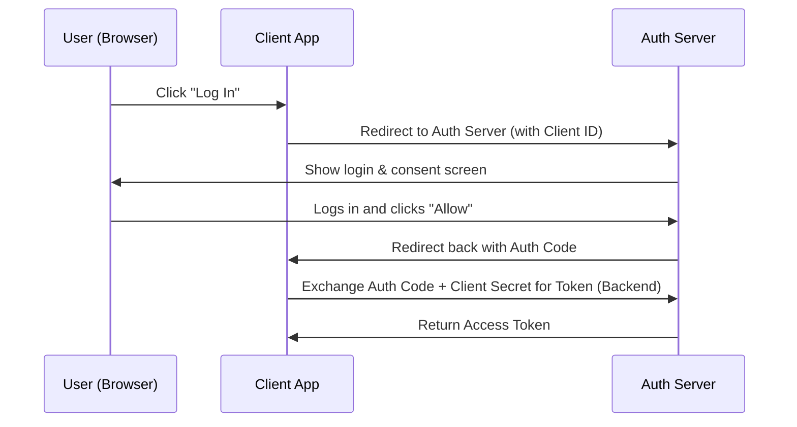
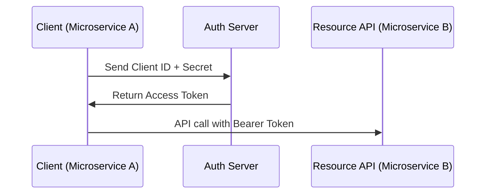

# OAuth 2.0 and OIDC

[< Back](./authentication-fundamentals.md) | [Index](./README.md) | [Next: JWT and Token Security >](./jwt-and-token-security.md)

---

If you've ever clicked "Log in with Google" or let an app post to Twitter on your behalf, you've used OAuth. It's the industry standard for authorization delegation.

## Why OAuth Exists (The Delegation Problem)

Imagine an app called "PrintMyPhotos" wants to access your Google Drive to print images. Without OAuth, you would have to give PrintMyPhotos your Google password. This is awful: they have full access to your email, drive, and everything else, forever.

OAuth allows you to give PrintMyPhotos a temporary, limited-scope key (an access token) to *only* read your photos, without ever seeing your password.

## OAuth 2.0 Roles

- **Resource Owner:** You (the user).
- **Client:** The app requesting access (PrintMyPhotos).
- **Authorization Server:** The system granting access (Google Auth).
- **Resource Server:** The API holding the data (Google Drive API).

## Grant Types

OAuth has several "flows" or grant types depending on the client.

### 1. Authorization Code Grant (+ PKCE)
Used for server-side apps, SPAs, and mobile apps. This is the gold standard.

*(Note: SPAs and mobile apps use PKCE—Proof Key for Code Exchange—instead of a Client Secret since they can't keep secrets).*

### 2. Client Credentials Grant
Used for machine-to-machine (M2M) communication where there is no user involved.

### When to use which?

| Client Type | Recommended Grant |
|-------------|-------------------|
| Web App (Server-rendered) | Auth Code |
| Single Page App (React/Vue) | Auth Code + PKCE |
| Mobile App | Auth Code + PKCE |
| Machine-to-Machine / CRON | Client Credentials |

## OpenID Connect (OIDC)

OAuth 2.0 is an **authorization** protocol, not an authentication protocol. It doesn't tell the client *who* the user is, only that they granted access.

OIDC is an identity layer built on top of OAuth 2.0. It introduces the **ID Token** (a JWT), which contains claims about the user (name, email, etc.). Now the client knows who just logged in.

> If you want an API token, use OAuth. If you want to know who the user is, use OIDC.

## Scopes, Consent, and Refresh Tokens

- **Scopes:** Define what access is requested (e.g., `read:photos`).
- **Consent:** The screen where the user approves the requested scopes.
- **Refresh Tokens:** Access tokens are intentionally short-lived (e.g., 15 mins). When they expire, the client uses a long-lived refresh token to get a new access token without asking the user to log in again.

## The Takeaways

- **OAuth 2.0** solves delegation: apps accessing APIs on your behalf without your password.
- **OIDC** adds identity to OAuth, giving you user profiles via the ID Token.
- Use **Authorization Code + PKCE** for user-facing apps.
- Use **Client Credentials** for server-to-server communication.

---

[< Back](./authentication-fundamentals.md) | [Index](./README.md) | [Next: JWT and Token Security >](./jwt-and-token-security.md)
