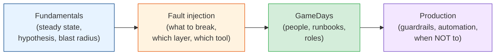

# Chaos Engineering

You find out how a system fails either on purpose or by accident. By accident means a pager at
3am, an unfamiliar failure, and a runbook nobody has opened in a year. On purpose means a
planned experiment at 11am with a hypothesis, a small blast radius, and someone holding the
abort switch. Chaos engineering is the on-purpose version: injecting real-world failures
(dead instances, slow dependencies, broken DNS, a lost availability zone) to check that
timeouts, fallbacks, failover, alerts, and people all work the way you think they do. This
module covers the method, the fault-injection toolbox, GameDays, and how to run experiments
continuously in production without causing the outages you're trying to prevent.

## Contents

| # | Topic | File | Level |
|---|-------|------|-------|
| 0 | The map (this file) | *(here)* | L3 · Intermediate |
| 1 | Chaos fundamentals: history, steady state, hypotheses, blast radius & abort conditions | [chaos-fundamentals.md](./chaos-fundamentals.md) | L3 · Intermediate |
| 2 | Fault injection: the fault catalogue, injection layers & tools (tc, Toxiproxy, Istio, Chaos Mesh, FIS) | [fault-injection.md](./fault-injection.md) | L4 · Advanced |
| 3 | GameDays: roles, planning, running the day & the write-up | [gamedays.md](./gamedays.md) | L4 · Advanced |
| 4 | Chaos in production: guardrails, continuous experiments, maturity & when not to | [chaos-in-production.md](./chaos-in-production.md) | L4 · Advanced |

---

## How to read this module

- **Chapter 1** is the method. Read it before touching any tool, because the difference
  between an experiment and an outage is the hypothesis and the abort plan, not the fault.
- **Chapter 2** is the toolbox: which failures to simulate, at which layer, and with which
  tool. Start with latency. It finds more than killing things does.
- **Chapter 3** is the human side. GameDays test runbooks, alerts, access, and incident roles,
  which break more often than the code does.
- **Chapter 4** is about making it continuous and safe: guardrails for production, a chaos
  stage in the pipeline, how to show the programme is worth it, and when you're not ready.

## Prerequisites

Chaos engineering checks defences you're supposed to have already. Read these first:

- [observability-and-reliability/slos-and-error-budgets.md](../observability-and-reliability/slos-and-error-budgets.md):
  steady state is usually an SLI, and the error budget decides when you can experiment.
- [distributed-systems/failure-handling.md](../distributed-systems/failure-handling.md):
  timeouts, retries, circuit breakers, bulkheads, and fallbacks are what most experiments test.

## Related modules

- [observability-and-reliability/incidents-and-postmortems.md](../observability-and-reliability/incidents-and-postmortems.md):
  GameDays reuse the incident roles and the blameless write-up.
- [performance-engineering/load-testing-and-capacity.md](../performance-engineering/load-testing-and-capacity.md):
  load tests find capacity limits; chaos finds failure-handling gaps. They combine well.
- [containers-and-orchestration/production-patterns.md](../containers-and-orchestration/production-patterns.md):
  probes, resource limits, and the service mesh are both targets and tools for injection.
- [cloud-and-serverless/cloud-architecture-patterns.md](../cloud-and-serverless/cloud-architecture-patterns.md):
  multi-region and disaster recovery plans, which only count once a GameDay has tested them.
- [cicd-and-devops/](../cicd-and-devops/README.md): where an automated chaos stage fits in the
  delivery pipeline.

## The one idea

> **An untested recovery path doesn't work.** Every failover, fallback, and runbook is a
> hypothesis until you've watched it run. Chaos engineering tests those hypotheses at a time
> you choose, at a size you control, with a way to stop. Otherwise a real failure tests them
> for you.

Start with [chaos-fundamentals.md](./chaos-fundamentals.md). **Next >**
