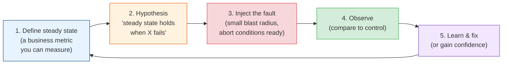
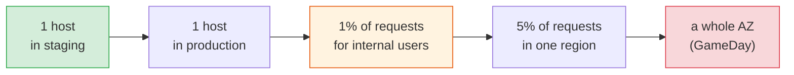

# Chaos Engineering Fundamentals: Principles & the Steady-State Hypothesis

[Index](./README.md) | [Next: Fault Injection >](./fault-injection.md)

---

Every system has a set of failures it can survive and a set it can't. The trouble is that you
usually learn which is which at 3am, from a pager, with customers watching. The retry policy
that looked fine in review turns out to triple the load on a struggling database. The
"redundant" second replica turns out to share a DNS dependency with the first. The circuit
breaker was configured, but nobody ever saw it open.

Chaos engineering is the practice of finding those things out on purpose, on a schedule, with
someone ready to stop the experiment. It's closer to a fire drill than to breaking things for
fun.

## Where it came from

After a database corruption in 2008 took DVD shipping down for days, Netflix started moving
from its own data centres to AWS. In the cloud, instances
disappear without warning, so the team wrote Chaos Monkey around 2010: a tool that terminated
random production instances during business hours. The logic was blunt. If instances are
going to die anyway, have them die at 11am on a Tuesday when engineers are at their desks,
not at 3am on a Sunday. Services that couldn't survive it got fixed quickly.

The idea grew from there:

| Year (approx.) | Milestone |
|----------------|-----------|
| Mid-2000s | Amazon runs "GameDays", deliberately failing data-centre capacity to test recovery |
| 2006 onwards | Google runs DiRT (Disaster Recovery Testing), company-wide failure exercises |
| 2010-2012 | Netflix builds Chaos Monkey, then the Simian Army (Latency Monkey, Chaos Gorilla for a whole availability zone, Chaos Kong for a region); Chaos Monkey is open-sourced in 2012 |
| 2014-2017 | Netflix moves to targeted request-level injection (FIT, then ChAP) instead of random kills |
| 2015 onwards | The *Principles of Chaos Engineering* are published; Gremlin and other tools appear |
| 2018 onwards | Kubernetes-native tools (Chaos Mesh, LitmusChaos) join the CNCF; cloud providers ship managed services (AWS Fault Injection Service, Azure Chaos Studio) |

The direction of travel matters. It started as "kill random things" and became "run a precise,
measured experiment with a small blast radius". The second version is what this module
teaches.

## It's an experiment, not an outage

The core move is the scientific method applied to a running system:

Compare two ways to say the same thing:

- **Breaking things:** "Let's kill the Redis primary and see what happens."
- **An experiment:** "We believe that if the Redis primary fails, checkout success rate stays
  above 99.5% and p99 latency stays under 800ms, because Sentinel promotes a replica within 15
  seconds and the cart service falls back to Postgres. We'll fail the primary for 5% of
  traffic in one region, and abort if success rate drops below 99%."

The second version tells you what to measure, what "pass" means, how far the damage can spread,
and when to stop. If it fails, you learn something specific. If the first one goes badly, you
mostly learn that you caused an incident.

## Steady state: measure what customers feel

The steady state is the normal, measurable output of the system. The *Principles* insist it be
something the business cares about, not an internal metric:

| Good steady-state metric | Why | Weak metric | Why |
|--------------------------|-----|-------------|-----|
| Orders completed per minute | Directly what the business sells | CPU utilisation | Can look fine while users get errors |
| Stream starts per second (Netflix's "SPS") | Drops the moment playback breaks | Pod restart count | Says nothing about users |
| Login success rate | Captures auth, DB, and UI together | Error log lines | Noisy, and not all errors hurt |
| Your [SLIs](../observability-and-reliability/slos-and-error-budgets.md) | Already agreed as "what good looks like" | "The dashboards look OK" | Not a hypothesis anyone can falsify |

If you can't name a steady-state metric and see it on a dashboard with a few seconds of lag,
you aren't ready to run chaos experiments yet. Fix observability first. The
[three pillars chapter](../observability-and-reliability/three-pillars.md) is the place to start.

## The principles, in plain words

The published principles boil down to five rules:

1. **Build a hypothesis around steady-state behaviour.** Predict what the business metric will
   do, not what a server will do.
2. **Vary real-world events.** Inject failures that actually happen: instance loss, slow
   dependencies, DNS errors, full disks, expired certificates, a bad config push. Rank them by
   how often they happen and how much they hurt.
3. **Run experiments in production.** Staging has different traffic, different data, different
   scale, and usually different config. The confidence you want is about production, so that's
   where the strongest evidence comes from. You get there gradually
   ([chapter 4](./chaos-in-production.md) covers how).
4. **Automate experiments to run continuously.** A system that survived a failure in March can
   lose that ability in April after a refactor. One-off experiments decay.
5. **Minimise blast radius.** Start with the smallest experiment that can teach you something:
   one instance, one percent of traffic, one internal user. Grow only after it passes.

## Blast radius and abort conditions

Two controls separate an experiment from an incident.

**Blast radius** is how much of the system and how many users the fault can touch. You shrink
it along several axes at once:

**Abort conditions** are pre-agreed signals that stop the experiment immediately, ideally
automatically:

- Steady-state metric crosses a threshold (success rate below 99%).
- Error budget burn rate spikes (see
  [error budgets](../observability-and-reliability/slos-and-error-budgets.md#error-budgets-the-killer-idea)).
- A real incident starts anywhere nearby, chaos or not.
- Anyone in the room says stop. No justification needed.

Write the abort conditions down before you start. Deciding "is this bad enough to stop?" in
the middle of an experiment, while the graphs move, is how small experiments become long
outages.

## What chaos engineering is not

| It's not | Because |
|----------|---------|
| Random destruction | Every experiment has a hypothesis, a scope, and an abort plan |
| A replacement for testing | Unit and integration tests check the code you wrote; chaos checks how the running system behaves when the world misbehaves |
| Load testing | [Load tests](../performance-engineering/load-testing-and-capacity.md) find capacity limits. Chaos finds failure-handling gaps. You can combine them |
| Something you do instead of fixing known issues | If you already know the database has no replica, don't run an experiment to prove it. Fix it |
| Only for Netflix-scale companies | A ten-person team can run a one-hour experiment against staging with `tc` and a dashboard |

## The takeaways

1. **Chaos engineering is controlled experimentation.** Hypothesis, measurement, small blast
   radius, and an abort plan. Without those it's just an outage you caused.
2. **Steady state is a business metric.** Orders per minute or login success rate, not CPU.
   If you can't see it in near real time, fix observability first.
3. **Inject failures that really happen.** Instance loss, slow dependencies, DNS, disk, config.
4. **Production gives the strongest evidence, earned gradually.** Start in staging, then one
   host, then a small slice of real traffic.
5. **Decide the abort conditions before you start,** and let anyone call stop.

---

[Index](./README.md) | [Next: Fault Injection >](./fault-injection.md)
