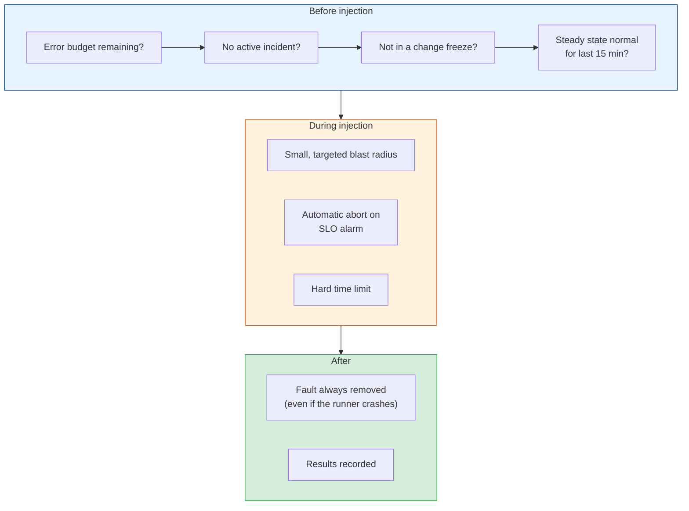
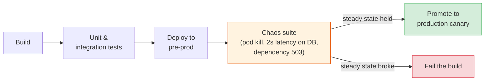

# Chaos in Production: Automation, Guardrails & Maturity

[< Back](./gamedays.md) | [Index](./README.md)

---

A GameDay gives you one data point on one afternoon. Systems change every day: a new
dependency, a refactored client library, a tweaked timeout. The resilience you proved in March
can quietly disappear by May. The last step of chaos engineering is to make experiments
continuous, so a regression shows up as a failed experiment instead of an outage.

That means running them automatically, often in production, which only works with solid
guardrails. This chapter covers both, plus a maturity model and the cases where you shouldn't
do any of it yet.

## Why production at all

Staging gives you weaker evidence than most teams think:

| Difference | Why it matters for failure behaviour |
|------------|--------------------------------------|
| Traffic shape | Retry storms and thread-pool exhaustion only appear under real concurrency |
| Data volume | A failover that takes 10s on a 2 GB staging database can take 10 minutes on 2 TB |
| Configuration drift | Timeouts, pool sizes, and feature flags often differ between environments |
| Topology | Production has more replicas, more regions, more dependencies |
| Third parties | Staging usually talks to sandboxes that never fail the way the real API does |

Staging is still the right place to start, and some experiments (destroying data stores,
anything irreversible) should stay there. But "it passed in staging" is a weak claim about
production. The way to get stronger evidence safely is to shrink the blast radius, not to stay
out of production forever.

## Guardrails: making production experiments safe

The guardrails that matter most:

- **Error-budget gating.** Only run experiments when the service has budget to spare. If the
  [error budget](../observability-and-reliability/slos-and-error-budgets.md#error-budgets-the-killer-idea)
  is nearly spent, the service is already fragile enough. This also gives chaos a natural place
  in the SLO conversation: budget is something you can spend on learning.
- **Automatic abort.** The experiment watches the steady-state metric and removes the fault the
  moment it crosses the threshold. AWS FIS stop conditions, LitmusChaos probes, and Gremlin's
  halt conditions all do this. A human watching a graph is too slow.
- **Fault removal that can't be skipped.** Every injected fault needs a hard expiry set at
  injection time (`duration: 5m` in Chaos Mesh, a TTL on an application flag). If the
  experiment runner crashes halfway through, the fault must still go away on its own.
- **Targeting.** Inject into synthetic traffic, internal users, or a percentage of requests
  through a header or flag, as in
  [chapter 2](./fault-injection.md#service-mesh-istio-and-envoy-fault-injection).
- **Business-hours scheduling.** Run when the people who own the service are awake and at
  work. That was the original logic behind Chaos Monkey.
- **A kill switch.** One command or one button that stops every running experiment in the
  organisation. Test it regularly.

## Continuous experiments

Once an experiment has passed by hand a few times, automate it.

### In the delivery pipeline

Run a set of short experiments against a pre-production environment on every release
candidate, the same way you run integration tests:

This catches the commonest regression: someone changes a client library or a timeout and the
fallback silently stops working. The [CI/CD module](../cicd-and-devops/cicd-fundamentals.md)
covers where such a stage fits in the pipeline.

### Scheduled production experiments

Small experiments that run on a schedule against production: kill one random pod per
deployment per day, add latency to one dependency for 1% of synthetic traffic every hour. Each
run reports pass or fail against its hypothesis. A failing experiment is treated like a failing
test: it gets a ticket and an owner.

### Experiments as code

Store experiment definitions in the service's repository, review them like any other change,
and give each one an owner. An experiment nobody owns will eventually fail at a bad moment and
nobody will know what it was testing.

## Measuring whether it's working

Chaos programmes get cancelled when they can't show value. Track:

| Metric | What it tells you |
|--------|-------------------|
| Weaknesses found per quarter, and how many got fixed | Whether experiments find real problems, and whether the organisation acts on them |
| Experiments running continuously | Coverage of known failure modes |
| Time to detect and time to mitigate in GameDays, over time | Whether people and tooling are improving |
| Incidents whose cause had a passing experiment | Gaps between what you tested and what really happens |
| Incidents caused by chaos experiments | Should be near zero. If not, guardrails need work |

The strongest argument is usually a story: "the March GameDay found that payment retries had
no jitter; we fixed it; in July the payment provider had a 20-minute outage and we didn't
page anyone." Collect those.

## A maturity model

| Level | What it looks like |
|-------|-------------------|
| 0. Not ready | No SLOs, weak monitoring, known single points of failure unfixed |
| 1. Ad hoc | Occasional experiments in staging, run by one enthusiast |
| 2. GameDays | Regular, planned GameDays with write-ups and action items; some in production |
| 3. Automated | Chaos suite in the pipeline; scheduled small experiments in production with automatic abort |
| 4. Continuous & owned | Every critical service owns its experiments; results feed SLO reviews and architecture decisions |

Most organisations don't need level 4. Level 2 with a handful of level 3 experiments on the
most critical paths covers most of the value.

## When not to do chaos engineering (yet)

| Situation | Do this instead |
|-----------|-----------------|
| No usable monitoring or SLOs | Build observability first. You can't run an experiment you can't measure |
| Known, unfixed single points of failure | Fix them. An experiment would only confirm what you already know |
| The team is already firefighting weekly | Production is running experiments on you. Stabilise first; use postmortems to pick fixes |
| No rollback or abort path | Build and test the rollback before injecting anything |
| Leadership hasn't agreed | A production experiment that causes a visible blip without prior agreement can end the whole programme. Get explicit sign-off |
| Regulated systems with strict change control | Start in a production-like environment and agree a path with compliance |

Chaos engineering amplifies an existing reliability practice. Without SLOs, alerting, runbooks,
and a working [incident process](../observability-and-reliability/incidents-and-postmortems.md),
there's nothing for it to amplify.

## The takeaways

1. **One-off experiments decay.** Systems change, so resilience has to be re-checked
   continuously.
2. **Production gives the strongest evidence, so earn it with guardrails.** Error-budget
   gating, automatic abort, hard fault expiry, targeted traffic, and a kill switch.
3. **Put a chaos suite in the pipeline.** It catches the fallback that a refactor broke.
4. **Measure findings fixed and incidents avoided,** and collect the stories.
5. **Don't start before the basics.** Monitoring, SLOs, a working incident process, and no
   known single points of failure.

---

[< Back](./gamedays.md) | [Index](./README.md)
