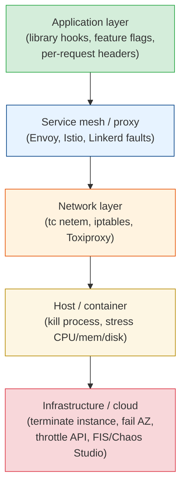

# Fault Injection: What to Break and How

[< Back](./chaos-fundamentals.md) | [Index](./README.md) | [Next: GameDays >](./gamedays.md)

---

The [previous chapter](./chaos-fundamentals.md) was about the method. This one is about the
faults themselves: which failures are worth simulating, which layer to inject them at, and the
tools that do the injecting. The short version is that slow beats dead. Systems handle a
dependency that's gone far better than one that answers in 30 seconds.

## A catalogue of faults worth injecting

Pick faults from your own incident history first. If the last three postmortems mention DNS,
start with DNS.

| Fault | What it simulates | Typical finding |
|-------|-------------------|-----------------|
| Kill a process or instance | Crash, OOM kill, spot reclaim, host failure | Missing health checks, slow failover, sticky sessions lost |
| Added latency (200ms to 10s) | Overloaded dependency, GC pauses, cross-region hop | No timeouts, or timeouts longer than the caller's own; thread pools fill up |
| Error responses (HTTP 500/503) | Dependency bug or overload | Retries that amplify load; no fallback |
| Packet loss or a network partition | Bad NIC, misconfigured security group, AZ network trouble | Split brain, hung connections without keepalives |
| DNS failure | Resolver outage, expired record, bad deploy of DNS config | Clients that cache failures, or never re-resolve |
| CPU or memory pressure | Noisy neighbour, runaway query, leak | Autoscaling too slow; latency SLO missed long before CPU hits 100% |
| Disk full or slow I/O | Logs filling the volume, degraded EBS | Service crashes instead of shedding writes; health check still passes |
| Clock skew | NTP failure, VM pause | Token validation fails, leases expire early, ordering bugs |
| Certificate expiry | Forgotten renewal | Nobody knows which services are affected until they fail |
| Dependency removed entirely | A third-party API is down, a feature-flag service is unreachable | Hard dependencies nobody knew were hard |

The latency row deserves the most attention. A dead dependency fails fast and trips circuit
breakers. A slow one ties up threads and connections, and the slowdown spreads to every caller.
That's the failure [timeouts and circuit breakers](../distributed-systems/failure-handling.md)
are meant to stop, and the one most likely to show they aren't configured the way people think.

## Where to inject: the layers



| Layer | Precision | Realism | Good for |
|-------|-----------|---------|----------|
| Application | Highest: one user, one endpoint, one request | Lowest: your code fakes the failure | Production experiments on a sliver of traffic |
| Service mesh | High: by route, header, percentage | Good: real network path | Latency and error injection between services |
| Network | Medium: by host, port, interface | High | Partitions, packet loss, DNS |
| Host | Low: whole process or machine | High | Crash recovery, resource exhaustion |
| Infrastructure | Lowest: whole instance, AZ, or region | Highest | Failover and disaster recovery |

A sensible path is to start at the precise end (application or mesh, small slice of traffic)
and move toward the realistic end as confidence grows. Precision keeps the blast radius small;
realism finds the problems that only show up when the failure is real.

## The tools, by layer

### Network: `tc netem` and Toxiproxy

On any Linux host, `tc` with the `netem` queue discipline adds latency, jitter, and loss to an
interface. It needs root and affects everything on that interface, so use it on a dedicated
test host or inside a container's network namespace.

```bash
# 300ms delay with 50ms jitter on eth0
sudo tc qdisc add dev eth0 root netem delay 300ms 50ms

# 5% packet loss instead
sudo tc qdisc change dev eth0 root netem loss 5%

# always clean up
sudo tc qdisc del dev eth0 root
```

Toxiproxy (from Shopify) is a TCP proxy you put between your service and a dependency. It's
built for tests and staging: point the app at the proxy, then add "toxics" through an API.

```bash
toxiproxy-cli create -l localhost:26379 -u redis:6379 redis
toxiproxy-cli toxic add -t latency -a latency=1000 redis    # every Redis call now takes 1s
toxiproxy-cli toxic add -t timeout -a timeout=0 redis       # connections hang forever
```

It fits well into integration tests: start the service with Toxiproxy in front of the database
and assert that the API returns a degraded response within its timeout instead of hanging.

### Service mesh: Istio and Envoy fault injection

If you run a mesh, you already have a fault injector. Istio's `VirtualService` can delay or
abort a percentage of requests to a service:

```yaml
apiVersion: networking.istio.io/v1beta1
kind: VirtualService
metadata:
  name: ratings
spec:
  hosts: [ratings]
  http:
  - match:
    - headers:
        x-chaos-experiment:
          exact: "ratings-latency"
    fault:
      delay:
        percentage:
          value: 100
        fixedDelay: 3s
    route:
    - destination:
        host: ratings
  - route:
    - destination:
        host: ratings
```

The header match is the useful trick. Only requests carrying `x-chaos-experiment` get the
delay, so you can aim the fault at test users or a synthetic load generator while real traffic
goes through untouched.

### Kubernetes: Chaos Mesh and LitmusChaos

Both are CNCF projects that run experiments as Kubernetes custom resources. You declare the
fault, the target selector, and the duration, and the controller injects and then removes it.

```yaml
apiVersion: chaos-mesh.org/v1alpha1
kind: NetworkChaos
metadata:
  name: payments-latency
  namespace: chaos-testing
spec:
  action: delay
  mode: one                      # one random pod from the selection
  selector:
    namespaces: [checkout]
    labelSelectors:
      app: payments
  delay:
    latency: "300ms"
    jitter: "50ms"
  duration: "5m"
```

Chaos Mesh also covers pod kills, CPU and memory stress, I/O faults, DNS errors, and clock
skew (`TimeChaos`). LitmusChaos ships a hub of ready-made experiments and "probes" that check
your steady-state metric during the run and fail the experiment if it breaks.

### Cloud: AWS FIS and Azure Chaos Studio

Managed services inject faults at the infrastructure level: stop or terminate instances, throttle
cloud APIs, disrupt networking for a subnet, fail over a database. Their biggest strength is
built-in stop conditions. AWS Fault Injection Service, for example, can watch a CloudWatch alarm
and roll back the experiment the moment the alarm fires. That's an automatic abort condition
you don't have to build.

### Application-level injection

The most precise option is code you own: a middleware that, for requests carrying a chaos
header or belonging to a flagged test account, adds delay or throws before calling a
dependency.

```python
@app.middleware("http")
async def chaos(request, call_next):
    experiment = flags.get("chaos.payments_latency")          # off unless a flag is set
    if experiment and request.headers.get("x-chaos-experiment") == experiment.id:
        await asyncio.sleep(experiment.delay_seconds)
    return await call_next(request)
```

Keep this code tiny, behind a flag that's off by default, and covered by its own test. A
chaos hook that fires by accident is an incident with a very embarrassing postmortem.

## Picking the first experiments

A good first list, roughly in order of value for a typical web service:

1. **Kill one instance of a stateless service.** Does the load balancer notice, and how fast?
   Do any requests fail during the gap?
2. **Add 2 seconds of latency to the most-called dependency.** Do timeouts fire? Does the
   caller degrade or hang?
3. **Return 503 from a non-critical dependency** (recommendations, avatars, analytics). Does the
   page still render without it?
4. **Fail the primary database over.** How long until writes succeed again? Do connection
   pools recover without a restart?
5. **Break DNS for one dependency.** Does the service recover when DNS comes back, or does it
   need a restart?

Each one maps to a defence from
[distributed-systems/failure-handling.md](../distributed-systems/failure-handling.md):
health checks, timeouts, fallbacks, failover, reconnection. The experiment checks that the
defence exists and actually works.

## The takeaways

1. **Start from your incident history.** Inject the failures that have actually hurt you.
2. **Slow is worse than dead.** Latency injection finds more problems than killing things.
3. **Precision first, realism later.** Application and mesh injection on a slice of traffic,
   then network and host, then infrastructure.
4. **Use the tools you already have.** `tc`, Toxiproxy, Istio, Chaos Mesh, LitmusChaos, AWS FIS,
   Azure Chaos Studio. You rarely need to build an injector.
5. **Every experiment tests a specific defence.** Timeout, fallback, failover, retry budget.
   Name it in the hypothesis.

---

[< Back](./chaos-fundamentals.md) | [Index](./README.md) | [Next: GameDays >](./gamedays.md)
