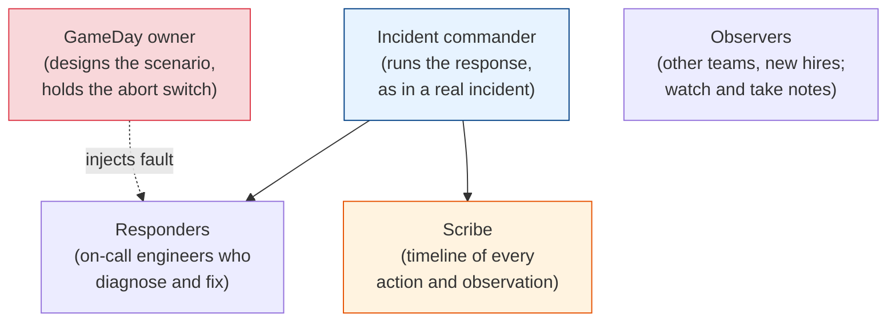
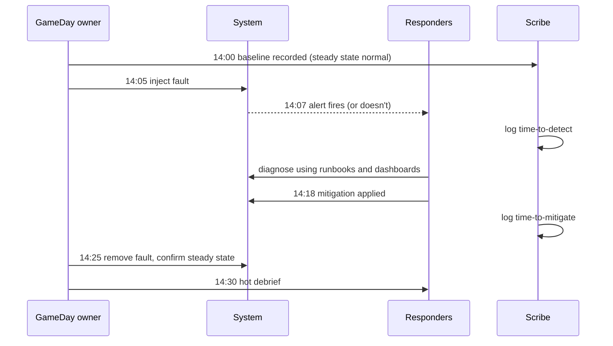

# GameDays: Running Chaos Experiments as a Team

[< Back](./fault-injection.md) | [Index](./README.md) | [Next: Chaos in Production >](./chaos-in-production.md)

---

Automated experiments test the machines. GameDays test the people and the machines together.
A GameDay is a scheduled session where a team deliberately causes a failure, usually a
bigger one than any automated experiment would risk, and then has to detect it, diagnose it,
and recover, while someone writes down everything that goes wrong.

What goes wrong is usually not the technology. It's the runbook that links to a dashboard that
was deleted, the alert that pages a team that was reorganised, or the failover script that
needs a credential only one person has. Those gaps don't show up in automated tests. They
show up when humans try to follow the process.

## What a GameDay is for

| Goal | Example question |
|------|------------------|
| Test the system's failure handling | Does the service survive losing an availability zone? |
| Test detection | How long until an alert fires? Does it page the right person? |
| Test the runbooks | Can someone who didn't write the runbook follow it? |
| Test the people and roles | Does the incident commander structure actually work under pressure? |
| Train new on-call engineers | First time seeing a database failover should not be during a real incident |
| Verify disaster recovery | Do the backups restore? How long does it take, really? |

Amazon called this "GameDay" in the mid-2000s, when Jesse Robbins ran exercises that failed
whole facilities. Google's version is DiRT. The idea is the same at any size: practise the bad
day before it happens.

## Roles

A GameDay borrows the [incident roles](../observability-and-reliability/incidents-and-postmortems.md#incident-roles-so-chaos-has-structure)
and adds two:



- The **GameDay owner** designs the scenario, runs the injection, and is the only person who
  knows exactly what was broken. They also own the abort decision.
- The **responders** ideally don't know the exact fault in advance. Knowing "today we're
  testing the database" is fine. Knowing "the primary's disk will fill at 14:10" makes the
  detection part of the test worthless.
- The **scribe** writes a timestamped log of everything. The timeline is the main output of
  the day, and nobody remembers it accurately afterwards.

## Before the day

Most of the work happens in the week before. A one-page plan covers:

```markdown
## GameDay: checkout survives loss of the Redis primary
- Date / time:      Tue 14:00-16:00 IST, low-traffic window
- Owner:            Priya (holds abort)       Incident commander: Sam
- Environment:      production, ap-south-1 only
- Hypothesis:       checkout success rate stays >= 99.5% and p99 < 800ms;
                    Sentinel promotes a replica in < 15s; alerts fire within 2 min
- Fault:            stop the Redis primary process on cache-1a
- Blast radius:     one region; other regions untouched
- Abort if:         checkout success < 99% for 1 min, any unrelated SEV, owner or IC says stop
- Rollback:         restart redis on cache-1a (runbook link); if needed, flag `cart.use_postgres`
- Comms:            #gameday channel; support and the on-call lead told 24h ahead
- Dashboards:       checkout SLO, Redis Sentinel, cart-service latency
```

The checklist behind that plan:

1. **Pick a scenario from real risk.** Postmortems, architecture reviews, and "we've never
   tested that" all count. Avoid scenarios you already know will fail. Fix those first.
2. **Write the hypothesis and the abort conditions.** Same as any
   [chaos experiment](./chaos-fundamentals.md#blast-radius-and-abort-conditions).
3. **Test the rollback before the day.** If the plan says "restart Redis", make sure someone
   has done it recently and has the access.
4. **Tell the people who'd otherwise panic.** Support, the on-call lead for neighbouring teams,
   and anyone who watches the status page. Don't surprise them.
5. **Pick the environment deliberately.** First GameDays usually run in staging. Production
   GameDays come once the team trusts the abort path.
6. **Check nothing else is happening.** No big launch, no freeze period, no ongoing incident.

## Running the day



A few rules make the session useful:

- **Record the baseline first.** Five minutes of normal metrics gives you something to compare
  against.
- **Treat it like a real incident.** Use the real incident channel conventions, the real
  paging tool, the real runbooks. Shortcuts hide the gaps you came to find.
- **The owner doesn't help.** If responders go down the wrong path, let them, unless the abort
  conditions are close. The wrong path is data.
- **Stop when the hypothesis is answered,** not when the clock runs out. If you learned the
  important thing in 20 minutes, end there.
- **Hold a hot debrief right after,** while memories are fresh. Twenty minutes is enough.

## After the day

The output is a short write-up in the same blameless format as a
[postmortem](../observability-and-reliability/incidents-and-postmortems.md#postmortems-the-blameless-learning-engine):

| Section | Content |
|---------|---------|
| Hypothesis and result | Held, partly held, or failed, with the numbers |
| Timeline | From the scribe's log: inject, detect, diagnose, mitigate, recover |
| Key timings | Time to detect, time to mitigate, time to full recovery |
| What surprised us | The most valuable section. Anything nobody predicted |
| Action items | Each with an owner and a date. "Fix runbook link" counts |
| Next GameDay | Rerun this scenario after fixes, or move to a bigger one |

A GameDay that ends with zero action items wasn't hard enough, or nobody was writing things
down. A GameDay with 30 action items needs a follow-up where the top five actually get done.
The point is to close gaps, not to collect them.

Rerun the same scenario after the fixes. Passing the second time is what turns "we think we
fixed it" into evidence.

## Scaling GameDays up

Teams usually progress through scenarios like this:

| Stage | Scenario | Environment |
|-------|----------|-------------|
| 1 | Kill one pod or instance | Staging |
| 2 | Slow or failing dependency for one service | Staging, then production with a small slice |
| 3 | Database failover | Production, low-traffic window |
| 4 | Lose an availability zone | Production |
| 5 | Region evacuation, restoring from backups | Production or a full DR environment |
| 6 | "Wheel of misfortune" or unannounced drills | Production, with responders not told the scenario |

Stage 5 is where [disaster recovery plans](../cloud-and-serverless/cloud-architecture-patterns.md#disaster-recovery-rpo-vs-rto)
meet reality. An untested RTO is a guess. A team that has actually failed over a region and
timed it knows its RTO.

## The takeaways

1. **GameDays test people and process, not just systems.** Runbooks, alerts, access, and
   roles break more often than the code does.
2. **Plan on one page.** Hypothesis, fault, blast radius, abort conditions, rollback, comms.
3. **Run it like a real incident,** with a scribe and an owner who holds the abort switch.
4. **The write-up is the product.** Timeline, timings, surprises, and owned action items.
5. **Rerun after fixing, then scale up.** One pod, then a dependency, then a database, then an
   availability zone, then a region.

---

[< Back](./fault-injection.md) | [Index](./README.md) | [Next: Chaos in Production >](./chaos-in-production.md)
