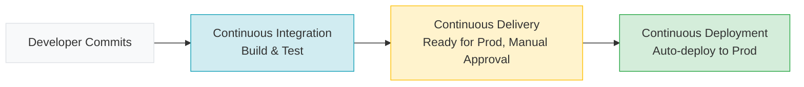

# CI/CD Fundamentals

[< Back](./README.md) | [Index](./README.md) | [Next: Deployment Strategies >](./deployment-strategies.md)

---

Let's get one thing straight: if you don't have automated CI/CD, you are playing engineering on hard mode. CI/CD isn't just a set of scripts; it's a culture of fast feedback and automated confidence.

## What is CI/CD and why should you care?

CI/CD stands for Continuous Integration, Continuous Delivery, and Continuous Deployment. The goal is simple: automate the journey of your code from a commit to a running application. Humans are terrible at doing repetitive tasks reliably. Computers are great at it. Let the computers do the deploying.

### CI vs CD vs CD



- **Continuous Integration (CI)**: You push code, the pipeline builds it and runs tests. If it breaks, you fix it immediately.
- **Continuous Delivery (CD)**: Your code is always in a deployable state. You can click a button to ship it to production.
- **Continuous Deployment (CD)**: No humans involved. Every passing commit goes straight to production. 

## The Pipeline Anatomy

A typical pipeline looks like a factory assembly line:

`Source → Build → Test → Package → Deploy`

1. **Source**: Developer pushes to a branch.
2. **Build**: Compile the code, resolve dependencies.
3. **Test**: Run unit and integration tests. The feedback loop must be fast here.
4. **Package**: Create a build artifact (like a Docker image) and push it to a registry.
5. **Deploy**: Pull the artifact and run it in the target environment.

> **Golden Rule**: Build your artifact exactly once. Do not rebuild it for each environment. Promote the *same* artifact from staging to production.

## Trunk-Based Development vs Feature Branches

If your pipeline takes an hour and you merge code once a month, CI/CD won't save you. You need small, frequent merges.

- **Feature Branches**: Long-lived branches where code goes to die. Merge conflicts are a nightmare.
- **Trunk-Based Development**: Everyone pushes to `main` (the trunk) frequently, at least daily. This is how high-performing teams work.

## Pipeline-as-Code

Never click around a UI to configure your pipeline. Keep it in version control right next to your application code.

Here's a simple GitHub Actions example:

```yaml
name: CI Pipeline
on: [push]

jobs:
  build-and-test:
    runs-on: ubuntu-latest
    steps:
      - uses: actions/checkout@v3
      - name: Set up Node.js
        uses: actions/setup-node@v3
        with:
          node-version: '18'
      - run: npm ci
      - run: npm test
      - run: docker build -t my-app:${{ github.sha }} .
```

## The Feedback Loop: Fail Fast

If your pipeline takes 45 minutes, developers will context switch, and productivity will tank. Optimize for a fast feedback loop. Run the fastest tests first. Fail fast.

## Takeaways

- Automate everything from commit to deploy.
- Build your artifact once and promote it through environments.
- Practice trunk-based development for smaller, safer merges.
- Store your pipeline configuration as code in version control.
- Optimize for a fast feedback loop—failing tests should alert you in minutes, not hours.

---

[< Back](./README.md) | [Index](./README.md) | [Next: Deployment Strategies >](./deployment-strategies.md)
