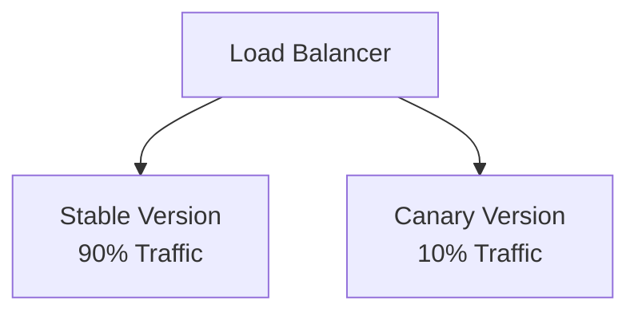

# Deployment Strategies

[< Back](./cicd-fundamentals.md) | [Index](./README.md) | [Next: GitOps and IaC >](./gitops-and-iac.md)

---

You have a pipeline, and your code is packaged. Now, how do you put it in front of users without breaking everything? "Just restart the server" is not a deployment strategy. 

## Why Deployment Strategy Matters

Deployments are inherently risky. A good deployment strategy minimizes risk, allows for quick rollbacks, and ideally results in zero downtime. 

## Blue/Green Deployments

You have two identical environments: Blue (currently live) and Green (idle).

```mermaid
flowchart TD
    Router[Load Balancer / Router]
    Blue[Blue Environment<br/>v1.0 (Live)]
    Green[Green Environment<br/>v1.1 (Idle)]
    
    Router -->|100% Traffic| Blue
    Router -.->|0% Traffic| Green
```

You deploy the new version to Green. Once you verify it works, you switch the router to point 100% of traffic to Green. Blue becomes the new idle environment.

- **Pros**: Instant rollback (just flip the router back). Zero downtime.
- **Cons**: Requires 2x the infrastructure. 

## Canary Releases

Instead of switching everyone at once, you release the new version to a small subset of users (the "canary in the coal mine").



If the error rates or latency on the canary spike, you automatically roll back. If it looks good, you gradually ramp up to 100%.

## A/B Testing vs Canary vs Shadow

- **Canary**: Testing for stability and performance. "Will this break production?"
- **A/B Testing**: Testing for business metrics. "Does the blue button get more clicks than the green one?"
- **Shadow/Dark Launches**: Sending a copy of production traffic to the new version without affecting the actual user response. Great for testing performance of major rewrites.

## Rolling Updates

You slowly replace instances of the old version with the new version. If you have 10 servers, you update them one by one. This is the default in Kubernetes.

- **Pros**: Doesn't require double the infrastructure.
- **Cons**: Rollbacks are slow (you have to roll backward one by one). Both versions are live at the same time, which can cause issues.

## Decouple Deploy from Release: Feature Flags

Deploying code and releasing a feature are two different things.

> **Feature Flags** allow you to deploy unfinished code to production behind a toggle. You can turn the feature on for internal users, then beta testers, then everyone else—all without deploying new code.

## The Database Migration Problem

Zero-downtime deployments are easy until you change the database schema. Since both v1 and v2 of your app might be running simultaneously (during a rolling update or canary), your database changes must be backward compatible.

1. Add the new column.
2. Deploy v2 of the app (which writes to both old and new columns).
3. Backfill data.
4. Deploy v3 of the app (which only uses the new column).
5. Drop the old column.

## Strategy Comparison

| Strategy | Risk | Infrastructure Cost | Rollback Speed | Best For |
|----------|------|---------------------|----------------|----------|
| **Recreate** | High | Low | Slow | Non-critical internal apps |
| **Rolling** | Medium | Low | Slow | Standard web apps |
| **Blue/Green** | Low | High | Instant | Critical apps where downtime is unacceptable |
| **Canary** | Low | Medium | Fast | High-traffic services, catching subtle bugs |

## Takeaways

- Never deploy by just shutting down the old version and starting the new one.
- Use Blue/Green for safe, instant rollbacks.
- Use Canary deployments to limit the blast radius of bad code.
- Feature flags decouple code deployment from feature release.
- Database changes are the hardest part of zero-downtime deploys—always make them backward compatible.

---

[< Back](./cicd-fundamentals.md) | [Index](./README.md) | [Next: GitOps and IaC >](./gitops-and-iac.md)
