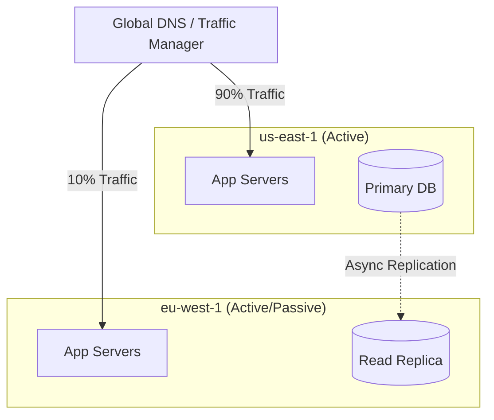

# Cloud Architecture Patterns

[< Back](./serverless-patterns.md) | [Index](./README.md) | [Next: Done >](./README.md)

---

Building for the cloud isn't just about provisioning infrastructure; it's about designing systems that are resilient, scalable, and cost-effective. As your footprint grows, you have to architect for failure proactively and optimize aggressively.

## Multi-Region Architecture

A single region (even with multiple Availability Zones) can still experience catastrophic outages (e.g., DNS failures, massive fiber cuts). Multi-region design protects against this, but it introduces massive complexity, specifically around data replication and latency.

- **Active-Passive**: Traffic goes to Region A. Region B is a warm standby. If A fails, you promote B's database to primary and flip DNS. Easier to build, slower to recover.
- **Active-Active**: Both regions take traffic. Requires master-master database replication or complex sharding logic. Extremely hard to get right without conflict issues.

## Disaster Recovery: RPO vs RTO

Disaster Recovery (DR) plans are defined by two metrics:

- **Recovery Point Objective (RPO)**: How much data can you afford to lose? (e.g., an RPO of 1 hour means you might lose up to the last hour of transactions).
- **Recovery Time Objective (RTO)**: How long can the system be down? (e.g., an RTO of 4 hours means you must be back online in 4 hours).

| Strategy | RPO/RTO | Cost | Example |
|----------|---------|------|---------|
| **Backup & Restore** | Hours / Days | Lowest | S3 backups, restore to new DB when needed. |
| **Pilot Light** | Minutes / Hours | Low | Core DB replicated, compute scaled to zero until needed. |
| **Warm Standby** | Minutes | Medium | Scaled-down version of full stack running in backup region. |
| **Multi-Site (Active-Active)** | Near Zero | Highest | Full production capacity across multiple regions. |

## Cloud Cost Optimization (FinOps)

The cloud is a bottomless pit for your budget if you aren't paying attention. 

1. **Right-sizing**: Don't use an `m5.4xlarge` if CPU utilization averages 4%. Downsize it.
2. **Spot / Preemptible Instances**: Use spare cloud capacity at up to a 90% discount. The catch? The cloud provider can terminate them with 2 minutes' notice. Great for stateless workers or batch processing.
3. **Reserved Capacity / Savings Plans**: Commit to a specific baseline usage for 1-3 years in exchange for heavy discounts (up to 70%).
4. **Lifecycle Policies**: Automatically transition old S3 data to cheaper, colder storage classes like Glacier.

> **Key Rule**: Cost optimization isn't an afterthought; it's an architectural non-functional requirement.

## Well-Architected Frameworks

Every major cloud provider has a "Well-Architected Framework." AWS introduced the concept, defining 6 pillars that you should measure your architecture against:

1. **Operational Excellence**: Automate deployments, monitor heavily, and have runbooks.
2. **Security**: Identity management, encrypt everything, principle of least privilege.
3. **Reliability**: Self-healing, multi-AZ, tested failover procedures.
4. **Performance Efficiency**: Serverless, right-sizing, edge caching.
5. **Cost Optimization**: Stop paying for idle resources.
6. **Sustainability**: Minimize energy consumption (usually aligns with cost optimization).

## Vendor Lock-in: Real vs. Perceived

Many teams obsess over avoiding vendor lock-in, trying to make their app deployable anywhere. 
- **The Reality**: The switching cost of migrating clouds is so astronomically high (retraining staff, refactoring CI/CD, moving petabytes of data) that you almost never do it.
- **The Strategy**: Embrace the native tools of your primary cloud (DynamoDB, BigQuery) to build faster. Standardize the things that are easy to standardize (e.g., containerize your apps, use Terraform for IaC).

## Multi-Cloud

Running the same workload seamlessly across AWS and GCP simultaneously (True Multi-Cloud) is an architectural nightmare. 
When multi-cloud actually makes sense:
- **Best-of-breed**: Running your main app on AWS, but piping data to GCP for BigQuery analytics.
- **Acquisitions**: Your company bought another company running on Azure.
- **Compliance**: Rare enterprise/government regulations requiring dual-provider redundancy.

## Landing Zones and Tagging

As organizations grow, a single AWS account or GCP project becomes unmanageable.
- **Landing Zones**: A pre-configured baseline environment with centralized billing, security guardrails, and isolated accounts (e.g., a dedicated account just for production DBs).
- **Tagging Strategy**: Tag every resource with `Environment=Prod`, `Team=Payments`, `CostCenter=1234`. Without draconian tagging enforcement, it is impossible to figure out why the bill went up.

## Takeaways
- Multi-region architectures protect against massive outages but require careful thought about data replication (RPO/RTO).
- Cost optimization (FinOps) is an architectural responsibility—utilize spot instances and right-sizing.
- Don't let the fear of vendor lock-in prevent you from using highly productive native cloud services.
- True multi-cloud is rarely worth the complexity unless driven by strict compliance or distinct tooling needs.
- Enforce strict resource tagging policies from day one for cost tracking and ownership.

---

[< Back](./serverless-patterns.md) | [Index](./README.md) | [Next: Done >](./README.md)
