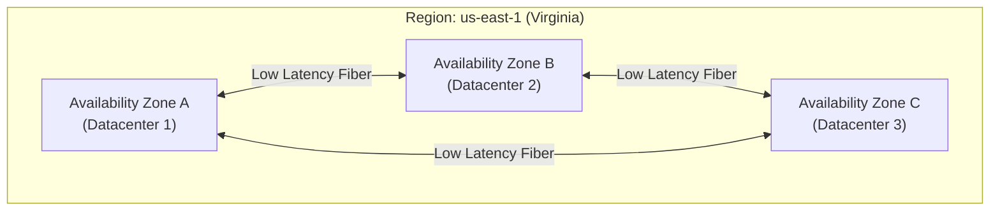

# Cloud Native Fundamentals

[< Back](./README.md) | [Index](./README.md) | [Next: Serverless Patterns >](./serverless-patterns.md)

---

"Cloud native" isn't just about running your code on someone else's computer. It's a fundamental shift in how you architect, deploy, and manage applications to take full advantage of the cloud computing model.

## What "cloud native" actually means (and doesn't)

Cloud native means your app expects things to fail, scales horizontally by default, and relies on declarative infrastructure. It does **not** mean you just took your monolithic on-prem application and stuffed it into an EC2 instance. That's called "lift and shift," and it usually gives you all the cost of the cloud with none of the benefits.

## The 12-Factor App

If you want to build a true cloud-native app, the 12-factor methodology is your bible. It was written by the Heroku team years ago, and it still holds up:

1. **Codebase**: One codebase tracked in revision control, many deploys.
2. **Dependencies**: Explicitly declare and isolate dependencies. Never rely on system-wide packages.
3. **Config**: Store config in the environment, not the code.
4. **Backing services**: Treat backing services (DBs, caches) as attached resources.
5. **Build, release, run**: Strictly separate build and run stages.
6. **Processes**: Execute the app as one or more stateless processes. Share nothing.
7. **Port binding**: Export services via port binding (listen on a port, don't rely on Apache/Nginx injection).
8. **Concurrency**: Scale out via the process model (horizontal scaling).
9. **Disposability**: Maximize robustness with fast startup and graceful shutdown.
10. **Dev/prod parity**: Keep development, staging, and production as similar as possible.
11. **Logs**: Treat logs as event streams. Don't write to local files, stream to stdout.
12. **Admin processes**: Run admin/management tasks as one-off processes.

## The "aaS" Spectrum

Understanding where your workload sits on this spectrum determines your operational burden.

| Model | What is it? | Examples | You manage... | They manage... |
|-------|-------------|----------|---------------|----------------|
| **On-Prem** | Your own data center | Racks in a closet | Everything | Nothing |
| **IaaS** (Infrastructure) | Virtualized hardware | EC2, GCE, VMs | OS, Runtime, Data, App | Servers, Storage, Network |
| **PaaS** (Platform) | Managed execution environment | Heroku, Elastic Beanstalk | Data, App | OS, Runtime, Servers, etc. |
| **FaaS** (Function) | Event-driven code execution | AWS Lambda, Cloud Functions | Just the App code | Everything else |
| **SaaS** (Software) | Ready-to-use application | Salesforce, Google Workspace | Nothing (just config) | Everything |

> **Rule of thumb**: Move as far to the right (SaaS/FaaS) as your budget and constraints allow to minimize undifferentiated heavy lifting.

## Regions & Availability Zones (AZs)

The cloud isn't magic; it's physical data centers. A **Region** is a distinct geographic area (e.g., `us-east-1` in Virginia). An **Availability Zone (AZ)** is a discrete, isolated data center (or cluster of them) within that region, complete with redundant power and networking.

Deploying across multiple AZs gives you high availability (HA) against a single data center failing (e.g., someone cuts the power line).

## Managed vs. Self-Managed Services

Should you run Postgres on an EC2 instance (self-managed) or use RDS (managed)?
- **Self-managed**: Cheaper compute costs, full control over tuning, but *you* are responsible for patching, backups, failovers, and waking up at 3 AM.
- **Managed**: Higher hourly cost, less low-level control, but you get automated backups, easy version upgrades, and push-button high availability.

Usually, paying for the managed service is cheaper than hiring a dedicated DBA.

## Cloud Provider Agnosticism

"We need to be cloud agnostic so we don't get locked in!" is a noble goal that usually leads to the lowest common denominator architecture (e.g., only using raw VMs and Kubernetes). The reality is that abstracting away the cloud provider's native services often costs more in engineering time than it saves in switching costs. Commit to a cloud, use its native features, but keep your core domain logic portable.

## The Shared Responsibility Model

If your S3 bucket leaks customer data, Amazon isn't going to take the blame.
- **Security OF the cloud**: The provider is responsible for physically securing the data centers, hardware, and hypervisors.
- **Security IN the cloud**: You are responsible for your application code, IAM permissions, network firewalls, and data encryption.

## Takeaways
- Cloud-native means building for failure, statelessness, and horizontal scale.
- Follow the 12-Factor App methodology for robust deployments.
- Understand the abstraction spectrum (IaaS vs PaaS vs FaaS).
- Multi-AZ deployments are the baseline for high availability.
- Managed services are usually worth the premium over self-hosting.
- The shared responsibility model dictates that your application's security is still your job.

---

[< Back](./README.md) | [Index](./README.md) | [Next: Serverless Patterns >](./serverless-patterns.md)
