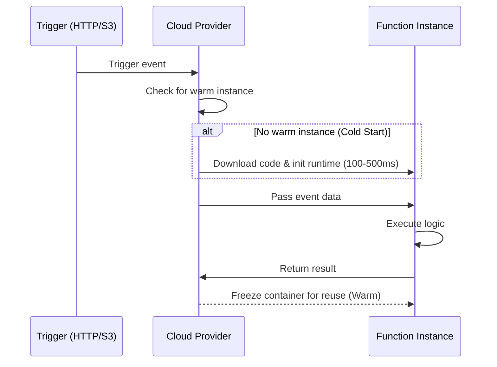
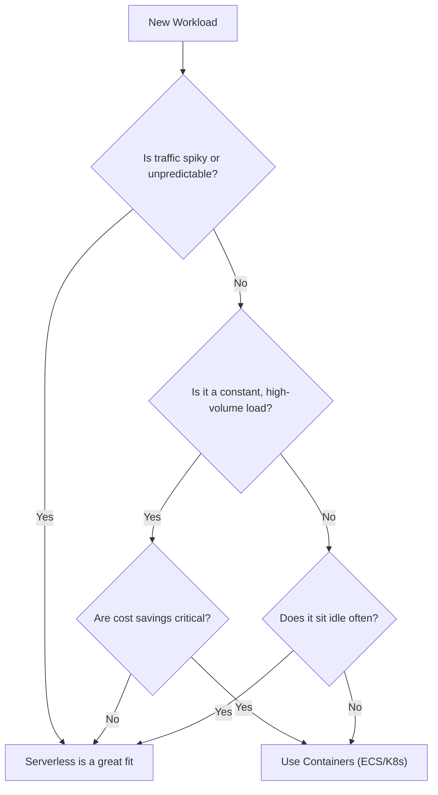

# Serverless Patterns

[< Back](./cloud-native-fundamentals.md) | [Index](./README.md) | [Next: Cloud Architecture Patterns >](./cloud-architecture-patterns.md)

---

"Serverless" is a terrible name. There are absolutely still servers. The difference is that you don't provision, patch, or scale them, and you only pay for the exact milliseconds your code is executing. It's the ultimate expression of the "Functions as a Service" (FaaS) model.

## The FaaS Execution Model

In a traditional app, your server sits idle, waiting for requests. In serverless, your code is dormant until an event triggers it. The provider spins up an execution environment (a container), runs your function, and then freezes or destroys the container.

## Cold Starts: The Serverless Bogeyman

A **cold start** happens when a request triggers your function, but there is no "warm" container ready to handle it. The cloud provider has to provision the container, load your code, and initialize your runtime (like the JVM or Node engine) before your code even starts running.

- **Why it happens**: After a period of inactivity (e.g., 10-15 minutes), providers destroy idle containers to free up resources. It also happens during sudden spikes in traffic when concurrent executions exceed the number of warm containers.
- **Mitigation**: 
  - Write smaller functions with fewer dependencies.
  - Choose faster-starting runtimes (Go/Rust/Node over Java/C#).
  - Use **Provisioned Concurrency** (paying to keep a baseline number of instances perpetually warm).

## Event-Driven Architectures

Serverless thrives on events. Instead of a monolithic router handling everything, discrete events trigger specific functions.

- **HTTP Triggers**: API Gateway invokes a function for a REST request.
- **Queue/Stream Triggers**: Messages landing in SQS, Kafka, or Kinesis invoke a function to process them (great for decoupling and buffering traffic spikes).
- **Schedule Triggers**: Cron jobs replacing dedicated worker servers.
- **Storage Events**: Uploading a file to an S3 bucket automatically triggers a function to generate a thumbnail.

## Serverless Databases

You can't pair a serverless app that scales to 10,000 concurrent connections instantly with a traditional Postgres database that has a strict connection limit of 100. Serverless compute demands serverless storage.

- **DynamoDB / Firestore**: No-SQL, HTTP-based APIs. Perfect for serverless because they handle millions of connections gracefully and scale instantly.
- **Aurora Serverless / CockroachDB Serverless**: Relational databases that automatically scale compute capacity up and down (even to zero) based on load, often with built-in connection pooling (like RDS Proxy).

## The Serverless Decision Flowchart

When should you actually use serverless?

## Cost Model: Pay-Per-Invocation Math

Serverless is billed on the number of requests and the execution duration (usually measured in GB-seconds). 
If your function runs 1 million times a month and takes 100ms per run, your AWS Lambda bill is practically $0.

However, if you have a massive, continuous, high-throughput workload (e.g., processing millions of events per second constantly), serverless will be astronomically more expensive than a few beefy EC2 instances.

> **Serverless is cheap for idle workloads and expensive for constant, heavy workloads.**

## Step Functions / Workflow Orchestration

Functions should be stateless and short-lived. But what if you have a complex workflow? (e.g., Checkout -> Charge Card -> Send Email -> Ship Order).
**Do not** have functions call other functions directly. This leads to paying for function A to sit idle while waiting for function B to finish. 
Use orchestration tools like **AWS Step Functions** or GCP Workflows to manage state machines, retries, and error handling outside of your code.

## Serverless Anti-Patterns (When NOT to use it)

- **Long-running processes**: Functions have strict timeouts (e.g., 15 mins for Lambda). Don't use them for massive batch jobs.
- **Heavy state/caching**: Since containers are ephemeral, relying on in-memory state is a recipe for disaster.
- **Latency-critical synchronous APIs**: If a 500ms cold start will break your application SLA, reconsider.
- **Function Pinball**: Emitting events blindly that trigger other events endlessly, leading to an un-debuggable infinite loop and a huge bill.

## Takeaways
- Serverless shifts operational focus entirely to the code; you pay only for execution time.
- Beware of cold starts and optimize your initialization time.
- Pair serverless compute with serverless databases to avoid connection exhaustion.
- Use orchestration (Step Functions) instead of chaining functions together directly.
- Serverless is ideal for spiky, unpredictable, or low-volume workloads, but can be costly for constant high throughput.

---

[< Back](./cloud-native-fundamentals.md) | [Index](./README.md) | [Next: Cloud Architecture Patterns >](./cloud-architecture-patterns.md)
