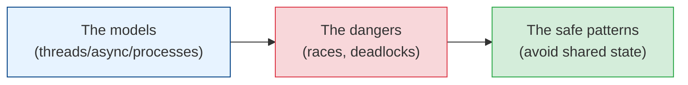

# Concurrency & Parallelism

The moment your program does more than one thing at a time — handling many requests, using
multiple cores, waiting on I/O without blocking — you enter the world of concurrency. It's one of
the hardest topics in software because the bugs are *non-deterministic*: they appear once in a
thousand runs, never in the debugger, and always in production. This module builds the mental
models to reason about it correctly.

## Contents

| # | Topic | File | Level |
|---|-------|------|-------|
| 0 | The map (this file) | *(here)* | Intermediate |
| 1 | Concurrency vs parallelism, processes, threads & async | [concurrency-vs-parallelism.md](./concurrency-vs-parallelism.md) | Intermediate |
| 2 | Race conditions, locks & synchronization | [race-conditions-and-locks.md](./race-conditions-and-locks.md) | Advanced |
| 3 | Patterns for safe concurrency | [safe-concurrency-patterns.md](./safe-concurrency-patterns.md) | Advanced |

---

## How to read this module

- **Chapter 1** untangles the vocabulary everyone confuses — concurrency vs parallelism,
  processes vs threads vs async — and when to use each.
- **Chapter 2** is the danger zone: race conditions, deadlocks, and the synchronization tools that
  tame (and complicate) them.
- **Chapter 3** is the wisdom: patterns and philosophies that let you get concurrency's benefits
  while sidestepping most of its pain.

## Related modules

Concurrency underlies [distributed-systems](../distributed-systems/README.md) (which is
concurrency across *machines*), [databases](../databases/transactions-acid.md) (isolation
levels are concurrency control), and [messaging-and-streaming](../messaging-and-streaming/README.md)
(async processing).

## The one truth

> **The safest concurrent code is code that doesn't share mutable state.** Almost every
> concurrency bug comes from two things touching the same data at the same time. Remove the
> sharing — or remove the mutation — and most of the danger evaporates. Everything else is
> damage control.

Start with [concurrency-vs-parallelism.md](./concurrency-vs-parallelism.md). **Next >**
