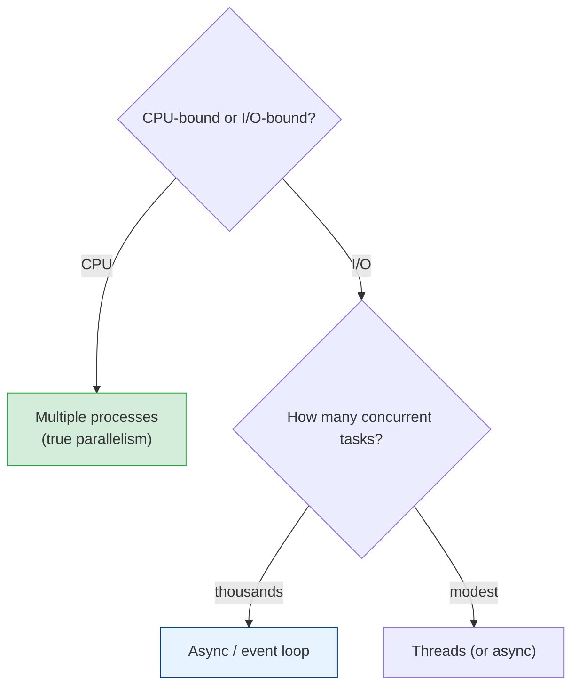

# Concurrency vs Parallelism, Processes, Threads & Async

[Index](./README.md) | [Next: Race Conditions & Locks >](./race-conditions-and-locks.md)

---

Step one is getting the vocabulary right — these words are used interchangeably and wrongly all
the time, and the confusion leads to picking the wrong tool.

## Concurrency vs parallelism (not the same thing)

- **Concurrency** — *structuring* a program to handle multiple tasks that are **in progress** at
  the same time (they may interleave on one core). It's about *dealing with* many things.
- **Parallelism** — actually **executing** multiple tasks **simultaneously** on multiple cores.
  It's about *doing* many things.

> Concurrency is a *design* property; parallelism is an *execution* property. You can have
> concurrency on a single core (tasks take turns) and you need multiple cores for true
> parallelism. A concurrent program *may* run in parallel — but doesn't have to. (Rob Pike:
> "Concurrency is not parallelism.")

## The two kinds of work (this decides everything)

The right concurrency tool depends entirely on what your program is *waiting* on:

| Workload | Bottleneck | Waiting on | Best tool |
|----------|-----------|------------|-----------|
| **I/O-bound** | Waiting, not computing | Network, disk, DB | **Async** or threads |
| **CPU-bound** | Actually computing | The processor itself | **Multiple processes / cores** |

- **I/O-bound** (a web server waiting on database and network calls) — the CPU is *idle* most of
  the time, just waiting. The win is doing *other* work during the wait. Async or threads.
- **CPU-bound** (image processing, number crunching) — the CPU is *maxed*. The only win is more
  cores working in parallel. Processes.

> **Diagnose the bottleneck first.** Throwing threads at a CPU-bound problem, or extra processes
> at an I/O-bound one, wastes effort and can make things *slower*. What are you waiting on?

## The execution models

### Processes
Independent programs with **separate memory**. The OS schedules them across cores → true
parallelism.

- **Pro:** true parallelism (bypasses limits like Python's GIL), isolation (one crash doesn't
  kill the others), no shared-memory races.
- **Con:** heavyweight (more memory), and communicating between them (IPC) is slower and clunkier.
- **Use for:** CPU-bound work; isolation.

### Threads
Multiple threads **within one process**, sharing the same memory. Lighter than processes.

- **Pro:** lightweight, easy data sharing (same memory), good for I/O concurrency.
- **Con:** **shared memory = race conditions** (next chapter). The hard bugs live here.
- **Con (Python-specific):** the **GIL** (Global Interpreter Lock) lets only one thread run Python
  bytecode at a time — so Python threads *don't* give true parallelism for CPU-bound work (they're
  still great for I/O-bound). Use multiprocessing for CPU-bound Python.

### Async (event loop)
A **single thread** that juggles many tasks by switching whenever one *would wait* (on I/O). No
threads, no shared-memory races — cooperative multitasking.

- **Pro:** handles *tens of thousands* of concurrent I/O tasks cheaply on one thread; no lock-
  based races.
- **Con:** only helps **I/O-bound** work; a single CPU-heavy task **blocks the whole loop**
  (starving everything). "Async all the way down" — one blocking call poisons it.
- **Use for:** high-concurrency I/O (web servers, API gateways, scrapers). Node.js is async by
  design; Python has `asyncio`; Go uses goroutines (a hybrid).

## Choosing the model

## The takeaways

1. **Concurrency (dealing with many things) ≠ parallelism (doing many things at once).**
   Concurrency is design; parallelism is execution needing multiple cores.
2. **Diagnose the bottleneck first:** **I/O-bound** → async/threads; **CPU-bound** → processes.
3. **Processes** = true parallelism + isolation, but heavy. **Threads** = light + shared memory,
   but races. **Async** = massive I/O concurrency on one thread, but a blocking call kills it.
4. **In Python, the GIL** means threads don't give CPU parallelism — use multiprocessing for
   CPU-bound work.

---

[Index](./README.md) | [Next: Race Conditions & Locks >](./race-conditions-and-locks.md)
