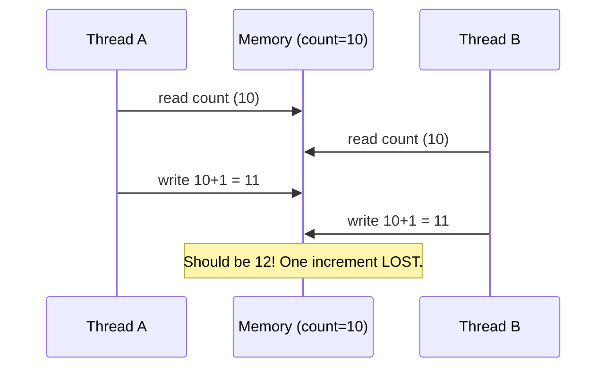
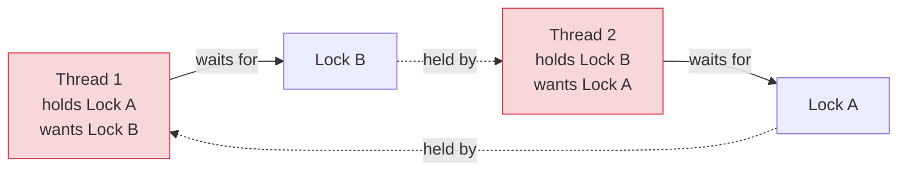

# Race Conditions, Locks & Synchronization

[< Back](./concurrency-vs-parallelism.md) | [Index](./README.md) | [Next: Safe Concurrency Patterns >](./safe-concurrency-patterns.md)

---

Here be dragons. When multiple threads touch the same data, you get bugs that are
non-deterministic, nearly impossible to reproduce, and invisible in a debugger. Understanding
*why* is the first defense.

## The race condition

A **race condition** is when the correctness of your program depends on the *timing* of
uncontrolled events — like which thread runs first. The classic example: two threads incrementing
a counter.



`count += 1` *looks* atomic but is actually three steps: **read**, add, **write**. If two threads
interleave those steps, one update vanishes. This is a **lost update** — and it happens rarely and
randomly, which is exactly what makes it so evil to debug.

> The core problem is a **critical section**: a piece of code that touches shared state and must
> not be run by two threads simultaneously. The whole game of synchronization is protecting
> critical sections.

## Locks (mutexes): the basic tool

A **lock** (mutex = "mutual exclusion") ensures only one thread enters a critical section at a
time. Others wait until it's released.

```python
import threading
lock = threading.Lock()
count = 0

def increment():
    global count
    with lock:          # only one thread in here at a time
        count += 1      # now safe: read-add-write can't interleave
```

Locks work, but they introduce their own family of problems:

| Lock problem | What happens |
|--------------|--------------|
| **Deadlock** | Threads wait on each other forever, nothing proceeds |
| **Livelock** | Threads keep reacting to each other but make no progress |
| **Starvation** | One thread never gets the lock (others keep grabbing it) |
| **Contention** | Many threads fighting for one lock → serialized, slow |
| **Priority inversion** | A low-priority thread holds a lock a high-priority one needs |

## Deadlock: the classic trap

A **deadlock** needs four conditions simultaneously (Coffman conditions); break any one and it
can't happen. The everyday cause: two threads grabbing two locks in *opposite order*.



Thread 1 has A and waits for B; Thread 2 has B and waits for A. Neither can proceed. Frozen
forever.

**How to prevent deadlock:**
1. **Lock ordering** — always acquire multiple locks in the *same global order*. This alone
   prevents the classic cycle above. The most practical rule.
2. **Lock timeouts** — don't wait forever; time out and retry/back off.
3. **Fewer locks / coarser locks** — less locking, less chance of a cycle (but more contention).
4. **Avoid nested locks** — holding one lock while grabbing another is the danger; minimize it.

## Synchronization primitives (the toolbox)

Beyond the basic mutex:

| Primitive | Purpose |
|-----------|---------|
| **Mutex / Lock** | One thread in the critical section at a time |
| **Read-Write lock** | Many readers OR one writer (great for read-heavy data) |
| **Semaphore** | Allow up to N threads (e.g., limit concurrent DB connections) |
| **Condition variable** | Wait until some condition is signaled |
| **Atomic operations** | Hardware-level indivisible ops (lock-free counters) |
| **Barrier** | All threads wait until everyone reaches a point |

## Beyond locks: memory visibility (the subtle one)

Even without a race on ordering, there's a subtler issue: **one thread's writes may not be
*visible* to another** due to CPU caches and compiler/CPU **reordering** of instructions for
speed. A value written by thread A might sit in a core's cache, unseen by thread B.

- Languages provide **memory models** and keywords (`volatile` in Java, atomics, memory fences)
  to force visibility and ordering.
- Locks also establish visibility (a "happens-before" relationship) — another reason to use them
  rather than hand-rolling.

> This is why "it works on my machine" and "it works in debug mode" are famous last words in
> concurrency — different hardware, load, and timing expose these bugs. You cannot test your way
> to confidence here; you must *reason* about correctness.

## The takeaways

1. **A race condition** = correctness depending on timing. `count += 1` isn't atomic (read-add-
   write), so concurrent access loses updates.
2. **Protect critical sections with locks**, but locks bring **deadlock, contention, and
   starvation.**
3. **Prevent deadlock primarily with consistent lock ordering** (plus timeouts, fewer/coarser
   locks, no nesting).
4. **Pick the right primitive:** read-write locks for read-heavy data, semaphores to limit
   concurrency, atomics for simple counters.
5. **Memory visibility and instruction reordering** make concurrency bugs invisible in debuggers —
   you must reason about correctness, not just test for it. (Which is why the next chapter is about
   *avoiding* shared mutable state entirely.)

---

[< Back](./concurrency-vs-parallelism.md) | [Index](./README.md) | [Next: Safe Concurrency Patterns >](./safe-concurrency-patterns.md)
