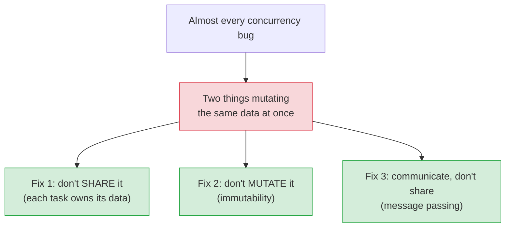
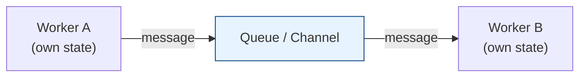
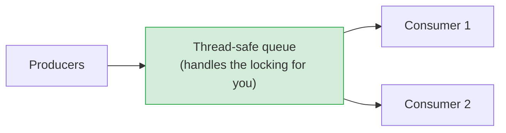
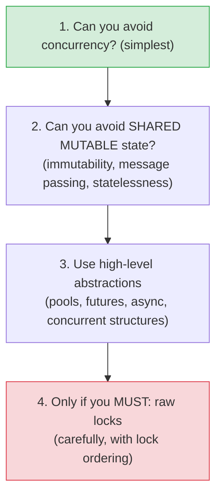

# Patterns for Safe Concurrency

[< Back](./race-conditions-and-locks.md) | [Index](./README.md)

---

The previous chapter showed how locks are a minefield. This chapter is the good news: the best
way to win at concurrency is to **avoid the minefield entirely**. Decades of hard experience point
to a handful of patterns that give you concurrency's benefits with far less of its pain.

## The prime directive: don't share mutable state

> The root of the trouble is *shared* + *mutable* + *concurrent*. Remove any one leg and the
> danger largely collapses. Every pattern below is a way to remove one of those legs.

## Pattern 1: Immutability (remove "mutable")

If data never changes after creation, it's **inherently thread-safe** — any number of threads can
read it simultaneously with zero risk. No locks needed.

- Prefer immutable objects/values. To "change" something, create a new copy.
- This is a core reason functional programming shines at concurrency.
- Practical version: make data immutable by default; mutate only in tightly controlled places.

## Pattern 2: Message passing (remove "shared")

Instead of threads sharing memory and guarding it with locks, give each its own state and have
them **communicate by sending messages**. No shared data → no data races.

> **Go's mantra: "Don't communicate by sharing memory; share memory by communicating."** Instead
> of a shared variable + lock, pass data through a **channel/queue**. This is also the **actor
> model** (Erlang, Akka): independent actors that own their state and only interact via messages.
> It scales naturally from threads to *machines* — which is why distributed systems use queues
> (see [messaging-and-streaming](../messaging-and-streaming/README.md)).

## Pattern 3: Confinement (isolate the mutable state)

Keep mutable state confined to a *single* owner so only one thread ever touches it.

- **Thread confinement** — a piece of data lives on exactly one thread; others must ask it (via
  messages) to act on it. No sharing, no locks.
- **Stateless services** — the big one for backends: if your request handlers hold **no** mutable
  shared state (all state lives in the DB/cache), you can run unlimited concurrent requests
  safely. This is why **statelessness** is the key to horizontal scaling (see
  [scaling](../system-design-fundamentals/scaling.md)). The whole app tier sidesteps
  concurrency bugs by owning no shared mutable state.

## Pattern 4: Higher-level abstractions (don't hand-roll)

Modern languages and libraries give you battle-tested tools so you rarely touch raw threads and
locks:

| Abstraction | What it gives you |
|-------------|-------------------|
| **Thread pools / executors** | Reuse a fixed set of workers; submit tasks, get futures |
| **Futures / Promises** | Represent a result that will arrive later; compose cleanly |
| **async/await** | Write concurrent I/O code that *reads* sequentially |
| **Parallel collections / map-reduce** | Parallelize data processing without manual threads |
| **Concurrent data structures** | Thread-safe maps/queues so you don't lock manually |

> **Prefer these over raw threads + locks.** They encode correctness that experts spent years
> getting right. Hand-rolling your own lock-based data structure is how subtle, catastrophic bugs
> get born. Use the standard library.

## Pattern 5: Producer-consumer with a queue

The single most useful concurrency pattern in practice: producers put work on a **thread-safe
queue**, consumers take it off. The queue handles all the synchronization.

It decouples producers from consumers, smooths bursts, and scales by adding consumers — the same
shape as async job processing and message queues, just in-process.

## The pragmatic hierarchy (how to actually decide)

1. **Do you even need concurrency?** Don't add it for imagined performance. Measure first (YAGNI).
2. **Can you avoid shared mutable state?** Immutability, message passing, statelessness — reach
   here first. This eliminates most bugs.
3. **Use high-level abstractions** — thread pools, async, concurrent collections.
4. **Raw locks are the last resort** — and when you must, keep critical sections tiny and lock
   order consistent.

## The takeaways

1. **The winning move is avoiding shared mutable state**, not mastering locks. Remove *shared*,
   *mutable*, or *concurrent* and the danger collapses.
2. **Immutability** makes data trivially thread-safe; **message passing / channels** ("share by
   communicating") sidestep data races; **statelessness** is why web app tiers scale safely.
3. **Prefer high-level abstractions** (pools, futures, async, concurrent structures) over raw
   threads and locks — don't hand-roll synchronization.
4. **Producer-consumer with a thread-safe queue** is the most useful everyday pattern.
5. **Reach for raw locks last**, keep critical sections small, and order locks consistently.

---

[< Back](./race-conditions-and-locks.md) | [Index](./README.md)
