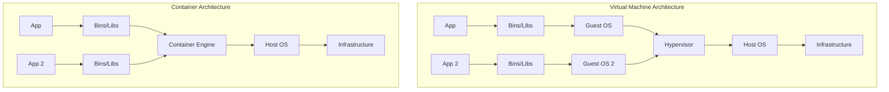

# Containers Fundamentals

[< Back](./README.md) | [Index](./README.md) | [Next: Kubernetes Core >](./kubernetes-core.md)

---

Before we can orchestrate thousands of containers, we need to understand what a single container actually is. Spoiler alert: it's not a lightweight virtual machine. It's just a Linux process with a really good disguise.

## Container vs. Virtual Machine

The most common misconception is thinking of containers as tiny VMs. Let's clear that up.



A Virtual Machine virtualizes the *hardware*. It runs a full Guest OS, kernel and all.
A Container virtualizes the *operating system*. It shares the host's kernel but isolates the application's view of the environment.

## The Magic Ingredients: Namespaces and Cgroups

If containers are just processes, how are they isolated? Two foundational Linux kernel features:

1. **Namespaces**: What a process can *see*. They provide isolation for network, process IDs (PID), mount points, users, etc. When a container looks around, it thinks it's alone on the machine.
2. **Cgroups (Control Groups)**: What a process can *use*. They restrict and account for resource usage (CPU, memory, disk I/O). This ensures one rogue container doesn't starve the rest of the system.

> Containers are essentially just isolated and restricted Linux processes, standardized by the **OCI (Open Container Initiative)** so any runtime can run any image.

## Docker Basics: Images and Layers

An **image** is a read-only template with instructions for creating a container. Images are built in **layers**. Each instruction in a Dockerfile creates a new layer. This allows caching and sharing of common layers across different images, saving disk space and network bandwidth when pulling from **Container Registries** (like Docker Hub or ECR).

### A Practical Dockerfile

Let's look at a production-ready multi-stage Dockerfile for a Node.js app. Multi-stage builds are critical because they keep your final image small and secure by leaving build tools behind.

```dockerfile
# Stage 1: Build
FROM node:18-alpine AS builder
WORKDIR /app
COPY package*.json ./
# Clean install for predictable builds
RUN npm ci 
COPY . .
RUN npm run build

# Stage 2: Production (Final Image)
FROM node:18-alpine
WORKDIR /app
# Use a non-root user for security
USER node
# Copy only the necessary files from the builder stage
COPY --from=builder /app/dist ./dist
COPY --from=builder /app/package*.json ./
RUN npm ci --only=production

EXPOSE 3000
CMD ["node", "dist/index.js"]
```

**Dockerfile Best Practices:**
- Order matters! Put instructions that change frequently (like `COPY . .`) towards the bottom to maximize build cache usage.
- Use specific tags (`node:18-alpine`), never `latest`.
- Always run as a non-root user.

## Takeaways
- Containers are isolated Linux processes using Namespaces (visibility) and Cgroups (resources), not lightweight VMs.
- Images are built in layers; layer order determines cache efficiency.
- Multi-stage builds are essential for keeping production images small and secure.
- Always pin image versions and run your containers as non-root users.

---

[< Back](./README.md) | [Index](./README.md) | [Next: Kubernetes Core >](./kubernetes-core.md)
