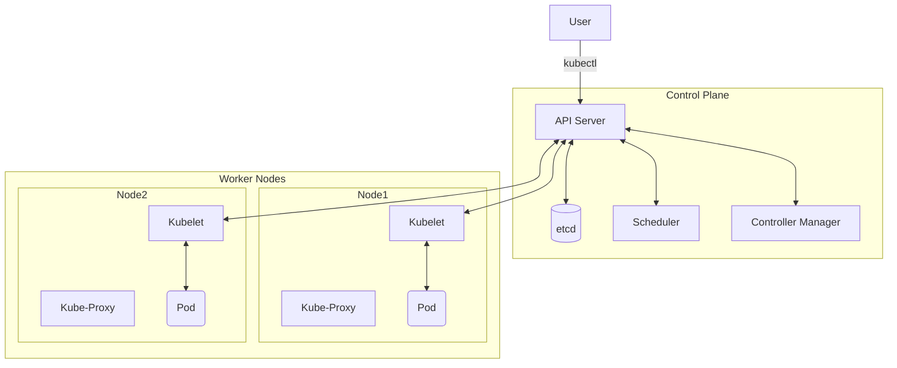

# Kubernetes Core

[< Back](./containers-fundamentals.md) | [Index](./README.md) | [Next: Networking and Storage >](./networking-and-storage.md)

---

So you have containers. Great. Now, how do you run a thousand of them, restart the ones that crash, route traffic to them, and scale them up when user traffic spikes? Doing this manually is a nightmare. This is the **orchestration problem**, and Kubernetes (K8s) is the industry-standard answer.

## Kubernetes Architecture

Kubernetes is a cluster made of a **Control Plane** (the brain) and **Worker Nodes** (the muscle).



- **API Server**: The only component you (or other components) talk to. The front door.
- **etcd**: The highly-available key-value store holding the cluster's state. The source of truth.
- **Scheduler**: Watches for new unassigned Pods and decides which Node they should run on.
- **Controller Manager**: Runs controller loops that ensure the actual state matches the desired state.
- **Kubelet**: The agent on each Node that actually starts and monitors containers.

## Core Objects

Kubernetes has a rich vocabulary of objects:
- **Pod**: The smallest deployable unit. Usually contains one container, sometimes tight-coupled sidecars.
- **ReplicaSet**: Ensures a specified number of Pod replicas are running at any given time.
- **Deployment**: Manages ReplicaSets and provides declarative updates (rollouts and rollbacks) for Pods. You almost always create Deployments, not raw Pods.
- **Service**: A stable network identity (IP and DNS) for a set of ephemeral Pods.
- **ConfigMap / Secret**: Injected configuration or sensitive data, keeping it separate from image code.
- **Namespace**: A virtual cluster inside the physical cluster, used for isolation.

## The Reconciliation Loop

Kubernetes is **declarative**, not imperative. You don't tell it *how* to do something, you tell it *what* you want.

> **The Reconciliation Loop**: You declare the **Desired State** in YAML. Controllers constantly compare the **Actual State** to the Desired State. If they differ, the controllers take action to make Actual = Desired.

## Declarative YAML & kubectl

Here is a practical example of a Deployment:

```yaml
apiVersion: apps/v1
kind: Deployment
metadata:
  name: my-app-deploy
spec:
  replicas: 3
  selector:
    matchLabels:
      app: my-app
  template:
    metadata:
      labels:
        app: my-app
    spec:
      containers:
      - name: my-app
        image: my-app:1.2.0
        ports:
        - containerPort: 8080
```

Apply this with `kubectl`:
```bash
# Create or update resources declarative
kubectl apply -f deployment.yaml

# The essentials
kubectl get pods
kubectl describe pod <pod-name>
kubectl logs <pod-name>
kubectl delete -f deployment.yaml
```

## Takeaways
- Kubernetes solves orchestration: scheduling, healing, and scaling containers across a cluster.
- The Control Plane (API, etcd, Scheduler, Controllers) manages the Worker Nodes (Kubelet, Pods).
- You deploy **Pods** using **Deployments**, and expose them via **Services**.
- K8s is declarative: you write the desired state in YAML, and the reconciliation loop makes it reality.

---

[< Back](./containers-fundamentals.md) | [Index](./README.md) | [Next: Networking and Storage >](./networking-and-storage.md)
