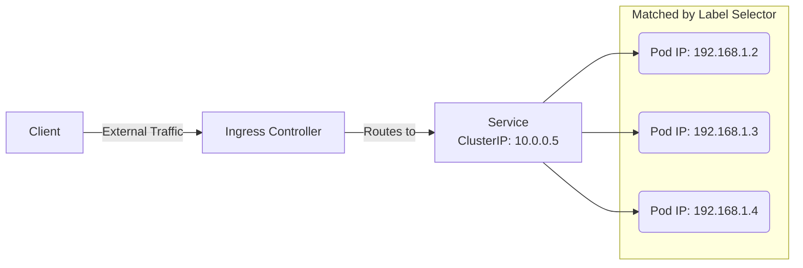

# Networking and Storage

[< Back](./kubernetes-core.md) | [Index](./README.md) | [Next: Production Patterns >](./production-patterns.md)

---

Once your Pods are running, they need to talk to each other, to the outside world, and save data that survives a restart. Kubernetes networking and storage can be complex, but the foundational models are straightforward.

## The Kubernetes Networking Model

The core rule of K8s networking is a **flat network**:
1. Every Pod gets its own unique IP address.
2. Pods can communicate with all other Pods on any node without NAT.
3. Agents on a node (e.g., Kubelet) can communicate with all Pods on that node.

This is implemented by **CNI (Container Network Interface)** plugins (like Calico, Flannel, or Cilium).

### Services: Stable Identities

Because Pods are ephemeral (they die and get new IPs), you can't rely on Pod IPs. You need a **Service**.

- **ClusterIP**: Default. Exposes the Service on an internal IP. Only reachable from within the cluster.
- **NodePort**: Exposes the Service on each Node's IP at a static port (30000-32767).
- **LoadBalancer**: Provisions an external load balancer (like AWS ALB) to route traffic to the Service.

### Ingress and DNS

A LoadBalancer per service gets expensive. **Ingress** is a smart router (like Nginx) that exposes multiple HTTP/HTTPS routes from outside the cluster to internal services based on URLs/hostnames, using a single external LoadBalancer.

Kubernetes also has built-in DNS (usually **CoreDNS**). If you have a service named `my-db` in the `backend` namespace, any pod can reach it at `my-db.backend.svc.cluster.local`.

> **NetworkPolicies** act as firewalls for Pods. By default, all Pods can talk to all Pods. NetworkPolicies let you restrict traffic (e.g., "only the frontend can talk to the backend").

## Persistent Storage

Containers are stateless. If a Pod dies, its local disk goes with it. For databases, you need persistent storage.

1. **PersistentVolume (PV)**: A piece of storage in the cluster (e.g., an AWS EBS volume or NFS share).
2. **PersistentVolumeClaim (PVC)**: A request for storage by a user. A Pod mounts a PVC, which binds to a PV.
3. **StorageClass**: Allows dynamic provisioning. You request a PVC, and the StorageClass automatically creates the PV and the underlying cloud disk for you.

### StatefulSets vs Deployments

Deployments treat all Pods as identical and interchangeable. For stateful workloads (like databases), use a **StatefulSet**.

- StatefulSets give Pods sticky, unique identities (`db-0`, `db-1`).
- They guarantee ordered, graceful deployment and scaling.
- They ensure that `db-0` always reconnects to the exact same PersistentVolume even if it is rescheduled to a new node.

## Takeaways
- Pods get unique IPs and communicate on a flat network via a CNI plugin.
- **Services** provide stable IPs/DNS names for a shifting set of Pods.
- **Ingress** routes HTTP/HTTPS traffic to multiple services using a single entry point.
- Use **PVCs** and **StorageClasses** to attach persistent disks to Pods.
- Use **StatefulSets** (not Deployments) for workloads requiring persistent identity and storage (like databases).

---

[< Back](./kubernetes-core.md) | [Index](./README.md) | [Next: Production Patterns >](./production-patterns.md)
