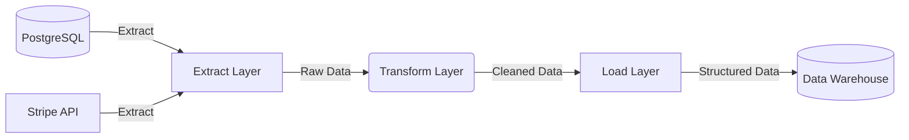

# Data Pipelines: Moving Data Safely

[< Back](./README.md) | [Index](./README.md) | [Next: Warehouses & Lakes >](./warehouses-and-lakes.md)

---

If data is the lifeblood of a modern company, data pipelines are the circulatory system. A data pipeline is simply a set of processes that extract data from various sources, transform it into a usable state, and load it into a destination (a sink) for analysis or operational use. 

## ETL vs ELT: The Great Debate

For decades, the industry standard was **ETL** (Extract, Transform, Load). You pulled data, transformed it in-flight using heavy middleware, and loaded the pristine results. 
Today, we lean heavily towards **ELT** (Extract, Load, Transform). Why? Because storage got dirt cheap and compute separated from storage. We dump raw data into a data lake/warehouse first, then use the warehouse's own massive compute power to transform it (using tools like dbt).

| Feature | ETL (Extract, Transform, Load) | ELT (Extract, Load, Transform) |
|---------|--------------------------------|--------------------------------|
| **Where transformation happens** | In-flight (middleware) | In the data warehouse/lake |
| **Flexibility** | Low: requires pipeline changes if requirements change | High: raw data is stored, transform logic can change anytime |
| **Cost & Speed** | Expensive middleware, slow to build | Cheap storage, fast to dump raw data |
| **When to use** | Strict compliance, PII masking before storage, legacy systems | Modern data stacks, agile analytics, massive scalability |

## Batch vs Stream Processing

How often does your pipeline run? That dictates your architecture.

| Paradigm | Batch Processing | Stream Processing |
|----------|------------------|-------------------|
| **Data Flow** | Bounded, discrete chunks (e.g., daily dumps) | Unbounded, continuous flow |
| **Latency** | High (hours to days) | Low (milliseconds to seconds) |
| **Complexity** | Lower. If it fails, just rerun the batch. | High. State management, out-of-order events. |
| **Use Case** | End-of-day financial reporting, ML model training | Fraud detection, real-time dashboards |

## Pipeline Patterns

You rarely have a simple straight line.
- **Fan-out**: One source feeds multiple downstream systems. (e.g., User signup event goes to Marketing DB and Analytics DB).
- **Fan-in**: Multiple sources converge into one model. (e.g., Salesforce data and Zendesk data combined to calculate Customer Health Score).
- **Staged (Medallion Architecture)**: Bronze (raw) → Silver (cleaned/joined) → Gold (business-level aggregates).

## Idempotency: The Golden Rule

> A data pipeline MUST be **idempotent**. This means running it once has the exact same effect as running it 100 times.

If your pipeline fails halfway through, you will rerun it. If rerunning it duplicates data, you are dead in the water. 

**Bad:** `INSERT INTO sales VALUES (data);` (Running twice duplicates sales)
**Good:** `MERGE INTO sales USING data ON id = data.id WHEN MATCHED UPDATE... WHEN NOT MATCHED INSERT...` (Safe to rerun endlessly)

## Orchestration: The Conductors

Cron is not enough. When Job C depends on Job A and B finishing successfully, you need a Directed Acyclic Graph (DAG) orchestrator.

| Tool | Vibe |
|------|------|
| **Apache Airflow** | The industry heavyweight. Python-based DAGs. Powerful, but can be a beast to maintain. |
| **Dagster** | Data-aware orchestration. Focuses on data assets rather than just tasks. Excellent local dev experience. |
| **Prefect** | Pythonic and dynamic. Easier to write than Airflow, great for complex, parameter-driven workflows. |

## Data Quality, Contracts, and Observability

Garbage in, garbage out. You need tests for your data, just like your code.
- **Data Contracts**: Agreements between software engineers (producers) and data engineers (consumers) about schema and semantics. If an engineer drops a column, the contract breaks *before* it hits production.
- **Validation**: Tools like Great Expectations run checks: "Is this column never null?", "Is this value between 0 and 100?".
- **Lineage**: Knowing exactly which upstream tables fed into a downstream report. When a dashboard breaks, lineage tells you exactly which source job failed.

## Handling Failures

Pipelines *will* fail. APIs rate-limit you, schemas change unexpectedly, databases go down.
1. **Retries with Exponential Backoff**: Transient errors usually fix themselves.
2. **Dead Letter Queues (DLQs)**: Don't stop the whole pipeline for one bad record. Route the bad record to a DLQ and process the rest.
3. **Alerting**: Alert on failures, but also alert on *data freshness* (e.g., the job succeeded but processed 0 rows).

## Takeaways

- ELT is the modern standard over ETL due to cheap cloud storage and powerful warehouses.
- Build for idempotency. Rerunning a pipeline should never corrupt your data state.
- Use a real orchestrator (Airflow, Dagster) instead of cron scripts to manage complex dependencies.
- Treat data like code: use data contracts, lineage tracking, and automated validation.

---

[< Back](./README.md) | [Index](./README.md) | [Next: Warehouses & Lakes >](./warehouses-and-lakes.md)
