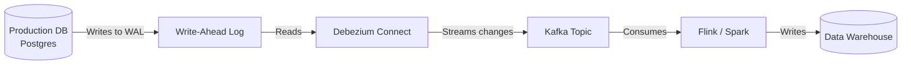

# Streaming at Scale: Moving Data in Real-Time

[< Back](./warehouses-and-lakes.md) | [Index](./README.md) | [Next: None >](./README.md)

---

Batch processing is safe, predictable, and forgiving. But business doesn't always happen in batches. When a user swipes a credit card, you can't run fraud detection on an hourly cron job. You need streaming.

Streaming data architecture is inherently complex because it deals with continuous, unbounded flows of data, out-of-order events, and the dreaded state management.

## Real-Time vs Near-Real-Time vs Batch

Don't build a streaming system if batch will do. Streaming is significantly harder and more expensive to maintain.

| Paradigm | Latency | Complexity | When to use |
|----------|---------|------------|-------------|
| **Batch** | Hours / Days | Low | Financial reporting, ML training, daily aggregations |
| **Micro-batch (Near-Real-Time)** | Seconds / Minutes | Medium | Operational dashboards, fast ETL |
| **True Streaming (Real-Time)** | Milliseconds | High | Fraud detection, live recommendations, dynamic pricing |

## Stream Processing Frameworks

You need an engine to actually process the continuous events flowing through your message broker (usually Kafka).

| Framework | Architecture | Vibe |
|-----------|--------------|------|
| **Apache Flink** | True streaming with state management | The absolute king of complex, stateful stream processing. Highly scalable but steep learning curve. |
| **Kafka Streams** | Library within your application | Lightweight, doesn't require a separate compute cluster. Perfect if you are already heavily invested in Kafka. |
| **Spark Structured Streaming** | Micro-batching (mostly) | Great if your team already knows Spark for batch. Treats streams as unbounded tables. |

## Exactly-Once Semantics: The Holy Grail

In distributed systems, networks fail. When a node sends a message and doesn't get an ACK, it retries. This leads to the fundamental delivery guarantees:
- **At-most-once**: Fire and forget. Messages might be lost. (Fastest)
- **At-least-once**: Retries guarantee delivery, but you might process duplicates.
- **Exactly-once**: The holy grail. The system guarantees the effect of the message is applied exactly one time, even amid failures and retries.

> Exactly-once processing is incredibly hard. It usually requires transactional writes between the streaming engine (like Flink) and the sink (like Kafka), using two-phase commits.

## Change Data Capture (CDC) with Debezium

How do you get data out of your transactional database (Postgres/MySQL) and into your data warehouse in real-time without slowing down production? You read the database's internal transaction log (WAL/Binlog). This is CDC.

Debezium is the industry standard for this. It turns every `INSERT`, `UPDATE`, and `DELETE` in your database into a stream of events. It bridges the gap between operational systems and analytics seamlessly.

## Schema Evolution

Data changes. If a developer renames a column in a microservice, your downstream streaming pipelines will crash if they don't know about it.
Streaming heavily relies on centralized **Schema Registries**. 

Data is serialized (usually in **Avro** or **Protobuf**) with a schema ID attached. The consumer fetches the schema from the registry to deserialize it. Registries enforce rules: e.g., you can add optional fields (backward compatible), but you cannot delete required fields.

## The Hard Problems: Windowing and State

When data is infinite, how do you calculate an "average"? You must group events into **Windows**.
- **Tumbling Windows**: Fixed, non-overlapping intervals (e.g., 00:00-00:05, 00:05-00:10).
- **Sliding Windows**: Fixed size, overlapping intervals (e.g., last 5 minutes, updated every 1 minute).
- **Session Windows**: Dynamic intervals based on activity, separated by a gap of inactivity (e.g., a user's session on a website).

### Dealing with "Late" Data
Because networks lag, event time (when it happened on the user's phone) is different from processing time (when it hit your server). Streaming engines use **Watermarks** to decide when to finally close a window and stop waiting for late data.

### Backpressure
What if data comes in faster than you can process it? The system must push back. This is backpressure. A robust streaming system will gracefully slow down producers or buffer data rather than crashing with OutOfMemory errors.

## Takeaways

- Only use true streaming when the business absolutely requires sub-second latency; otherwise, stick to batch or micro-batching.
- CDC (via Debezium) is the safest way to extract operational data in real-time without taxing production databases.
- Exactly-once semantics are computationally expensive but necessary for accurate financial or metric aggregations.
- Mastering streaming means mastering time (event time vs processing time) and state (windows and watermarks).

---

[< Back](./warehouses-and-lakes.md) | [Index](./README.md) | [Next: None >](./README.md)
