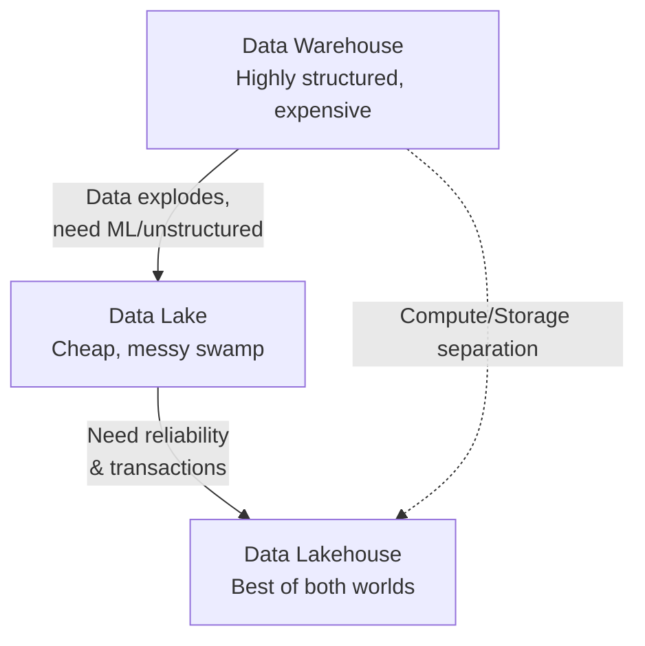
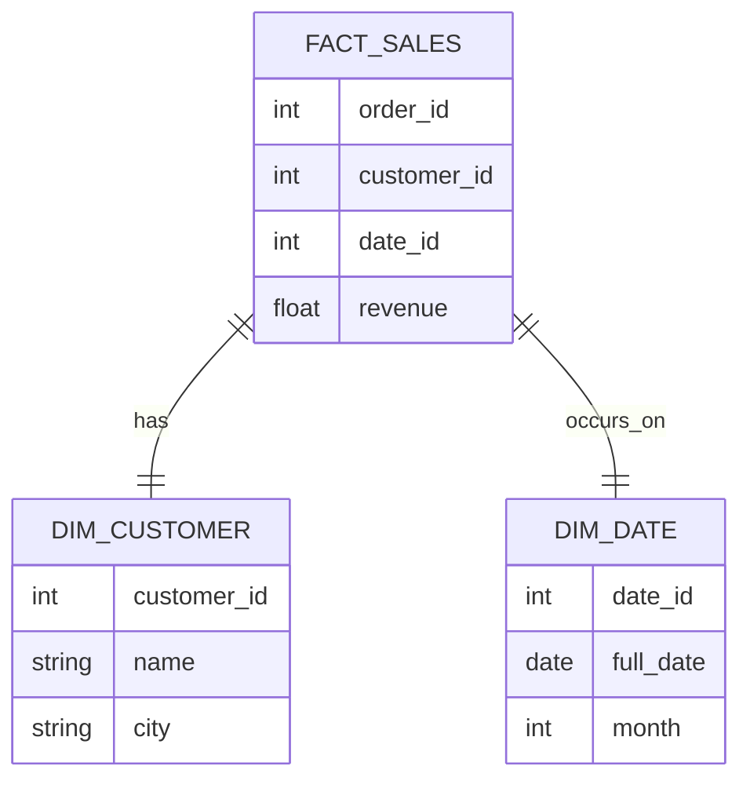

# Warehouses, Lakes, and the Modern Data Stack

[< Back](./data-pipelines.md) | [Index](./README.md) | [Next: Streaming at Scale >](./streaming-at-scale.md)

---

Where does all this data go once the pipelines move it? The storage layer has evolved massively over the last two decades. Let's trace the evolution from rigid warehouses to chaotic lakes, and finally to the pragmatic lakehouse.

## The Evolution of Storage

| Concept | Data Warehouse (e.g., Snowflake, Redshift) | Data Lake (e.g., S3, GCS + Hadoop) | Data Lakehouse (e.g., Databricks, open tables) |
|---------|--------------------------------------------|------------------------------------|------------------------------------------------|
| **Data Type** | Structured (relational) | Unstructured, semi-structured, structured | All types |
| **Compute/Storage** | Often coupled (historically) | Completely decoupled | Completely decoupled |
| **Governance** | Strict schemas, ACID transactions | Schema-on-read, often chaotic (data swamps) | ACID transactions on cheap object storage |
| **Best for** | BI, dashboards, business reporting | ML, deep learning, data exploration | Both BI and ML workloads |

## Columnar vs Row Storage: Why Analytics is Different

Relational databases (Postgres, MySQL) store data in **rows**. This is great for transactional workloads (OLTP) where you need to insert or fetch a whole user profile at once. 
Analytical workloads (OLAP) are different. You usually want to sum a single column (e.g., `revenue`) across millions of records. 

If you use row storage, the database has to read *every single field* of every row from disk just to get the revenue.
**Columnar storage** (like Parquet format) stores data by column. To sum the revenue, it only reads the revenue blocks from disk. This is orders of magnitude faster for analytics.

> Columnar storage is the secret sauce of every modern data warehouse. It also compresses incredibly well since data in the same column is highly uniform.

## Schemas: Star vs Snowflake

When modeling data in a warehouse, we organize it into **Fact** tables (events, metrics) and **Dimension** tables (attributes, context).

**Star Schema**: Denormalized. One central fact table, surrounded by dimension tables. Fast queries, simple to understand, some data duplication.
**Snowflake Schema**: Normalized. Dimension tables are split into sub-dimensions. Less data duplication, but queries require complex, slow joins. 

*A simple Star Schema.* 

## Partitioning and Clustering

To make queries fast on petabyte-scale tables, you cannot scan everything.
- **Partitioning**: Splitting a table into separate physical directories based on a column (usually `date`). Querying `WHERE date = '2023-01-01'` only scans that specific directory.
- **Clustering**: Sorting the data *within* those partitions based on frequently filtered columns (like `customer_id`), allowing the engine to skip blocks of irrelevant data.

## Query Engines & The Modern Data Stack

The modern approach separates the storage from the engine doing the math.
- **Storage**: Amazon S3, Google Cloud Storage.
- **Query Engines**: 
  - *Apache Spark*: The workhorse for massive distributed processing.
  - *Presto/Trino*: Blazing fast interactive SQL over data lakes.
  - *BigQuery / Snowflake*: Fully managed, serverless warehouses that handle the compute/storage separation for you.

## Open Table Formats

If you just dump Parquet files in S3, you have a data lake. But what if two jobs try to write to it at once? What if a job fails halfway through?
We need database-like features (ACID transactions, time travel, schema evolution) directly on top of object storage. This is what open table formats provide:

- **Apache Iceberg**: The current industry darling, originally from Netflix. Incredible performance and engine-agnostic.
- **Delta Lake**: Driven by Databricks, highly optimized for Spark.
- **Apache Hudi**: Originated at Uber, heavily focused on streaming upserts and mutations.

These formats are what turn a Data Lake into a Data Lakehouse.

## Data Catalogs & Discovery

When you have 10,000 tables, finding data is impossible. Data catalogs (like Atlan, Alation, or Amundsen) sit on top of everything. They provide search, data dictionary, lineage tracking, and governance. They are the Google Search for your internal data.

## Takeaways

- Data Lakehouses combine the cheap storage of lakes with the ACID transactions and performance of warehouses using Open Table Formats (Iceberg/Delta).
- Columnar storage (Parquet) is mandatory for analytical workloads to minimize disk I/O.
- Partition and cluster your large tables; full table scans will bankrupt you in cloud costs.
- Model with Star Schemas for fast, understandable analytical queries.

---

[< Back](./data-pipelines.md) | [Index](./README.md) | [Next: Streaming at Scale >](./streaming-at-scale.md)
