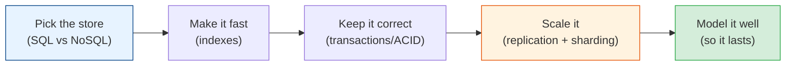

# Databases & Data Modeling

The database is where most systems live or die. It's usually the first bottleneck, the
hardest thing to scale, and the component you can least afford to get wrong (data outlives
code). This module takes you from "what's an index" to "how do I run a database across three
continents."

## Contents

| # | Topic | File | Level |
|---|-------|------|-------|
| 0 | The map (this file) | *(here)* | L1 · Beginner |
| 1 | SQL vs NoSQL (and when to use which) | [sql-vs-nosql.md](./sql-vs-nosql.md) | L1 · Beginner |
| 2 | Indexing & query performance | [indexing.md](./indexing.md) | L3 · Intermediate |
| 3 | Transactions, ACID & isolation levels | [transactions-acid.md](./transactions-acid.md) | L3 · Intermediate |
| 4 | Replication & partitioning (sharding) | [replication-sharding.md](./replication-sharding.md) | L4 · Advanced |
| 5 | Data modeling wisdom (normalization, access patterns) | [data-modeling.md](./data-modeling.md) | L4 · Advanced |

---

## How to read this module

- **Just starting?** Read chapters 1 → 2 → 3. That covers 90% of day-to-day app-dev database
  work: pick the right store, make it fast, keep it correct.
- **Building at scale?** Chapters 4 → 5 are the senior material: how databases survive machine
  failure and grow beyond one box, and how to model data so it stays fast for years.

## The one rule

> **Model your data for how you *read* it.** Writes are flexible; read patterns are what kill
> you at scale. Know your queries before you pick your schema — or your store.

Start with [sql-vs-nosql.md](./sql-vs-nosql.md). **Next >**
