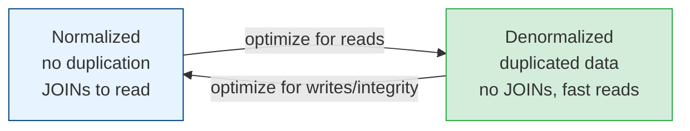

# Data Modeling Wisdom

[< Back](./replication-sharding.md) | [Index](./README.md)

---

Schemas outlive code. You'll rewrite your services many times; the data — and the decisions
you baked into its shape — will haunt or bless you for a decade. This is the hard-won stuff.

## Normalization vs denormalization

**Normalization** = organize data to eliminate redundancy (each fact lives in exactly one
place). **Denormalization** = deliberately duplicate data to make reads faster.

| | Normalized | Denormalized |
|-|-----------|--------------|
| **Writes** | Simple, one place to update | Must update every copy (risk of drift) |
| **Reads** | JOINs (slower at scale) | Fast, self-contained |
| **Storage** | Minimal | More (duplicated) |
| **Integrity** | Strong (single source of truth) | Weaker (copies can diverge) |
| **Best for** | Transactional systems (OLTP) | Read-heavy, analytics, NoSQL, feeds |

> **The pattern:** start **normalized** for correctness. Denormalize **specific hot read
> paths** later, when profiling proves the JOINs hurt — and accept that you now own keeping
> the copies in sync (usually via events).

## Model for your access patterns (the golden rule)

The #1 mistake is modeling data the way it looks in your head instead of the way you'll
**query** it. In SQL you have some freedom (ad-hoc queries + indexes). In NoSQL it's
non-negotiable: **you design the schema around the exact queries you'll run**, because there's
no flexible JOIN engine to save you.

- Write down every read query *before* designing the schema.
- In DynamoDB/Cassandra, the partition key must match your most common lookup.
- If a new access pattern appears later, you often need a new table or a
  **secondary index** — plan for it.

## OLTP vs OLAP (two different worlds)

| | OLTP (transactional) | OLAP (analytical) |
|-|----------------------|-------------------|
| **Purpose** | Run the business (orders, users) | Understand the business (reports, BI) |
| **Queries** | Small, frequent, point reads/writes | Large scans, aggregations |
| **Model** | Normalized, row-oriented | Star/snowflake schema, column-oriented |
| **Systems** | Postgres, MySQL | Snowflake, BigQuery, Redshift |

> Don't run heavy analytics on your production OLTP database — it'll starve your users. Pipe
> data to a warehouse (ETL/ELT) and analyze there. Mixing the two is a classic outage cause.

## Schema evolution & migrations (the scary deploys)

Data changes shape over time. Migrations are the riskiest deploys you'll do because they can't
easily roll back and they touch live data.

**Rules for safe migrations:**

1. **Backward compatible, always.** New code must work with the old schema and vice versa
   during the rollout.
2. **Expand, then contract.** Add the new column/table (expand), migrate reads/writes over,
   *then* remove the old one (contract) — across multiple deploys, never one.
3. **Never rename or drop in a single step.** Add new → dual-write → backfill → switch reads →
   remove old.
4. **Backfill in batches.** Don't `UPDATE` ten million rows in one transaction; you'll lock the
   table and page the on-call.
5. **Always have a rollback plan.** For data, that often means keeping the old column until
   you're certain.

## The choices you can't easily undo

Get these right up front — retrofitting is agony:

- **Primary key type** — natural key vs surrogate; integer vs UUID. (UUIDs are great for
  distributed ID generation but hurt index locality; consider ULIDs/UUIDv7 for sortability.)
- **Shard key** — see [replication & sharding](./replication-sharding.md); near-permanent.
- **Timestamps and time zones** — store UTC, always. Store `created_at`/`updated_at` on
  everything; you'll want them.
- **Soft vs hard deletes** — a `deleted_at` column vs actually removing rows. Soft deletes
  preserve history and enable undo, but complicate every query and uniqueness constraint.
- **Money as integers (cents), never floats.** Floating point + money = lost pennies and
  angry auditors.

## The hard-won takeaways

1. **Model for reads; write flexibility is cheap, read patterns kill you.**
2. **Normalize first, denormalize deliberately** where profiling demands it.
3. **Migrations are expand-then-contract, backward-compatible, and reversible** — or they're
   an outage.
4. **Separate OLTP from OLAP.** Don't analyze on the box that serves customers.
5. **Some decisions (PK, shard key, money type) are effectively permanent** — think in years,
   not sprints.
6. **Store UTC, store timestamps, store money as integers.** These three save endless pain.

---

[< Back](./replication-sharding.md) | [Index](./README.md)
