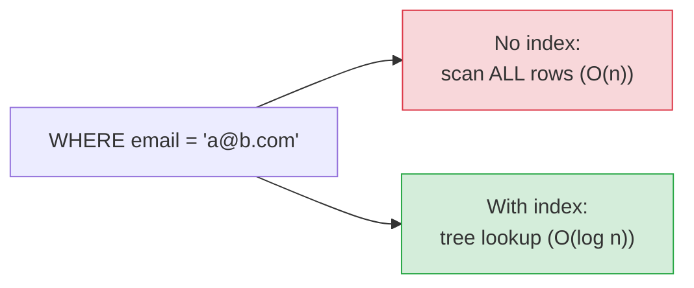

# Indexing & Query Performance

[< Back](./sql-vs-nosql.md) | [Index](./README.md) | [Next: Transactions & ACID >](./transactions-acid.md)

---

An index is the single highest-leverage database skill. A missing index turns a 1 ms query
into a 10-second table scan. Understanding indexes is the difference between "the DB is slow"
and "the *query* is slow."

## What an index actually is

An index is a **separate, sorted data structure** that maps column values to row locations —
like the index at the back of a book. Instead of scanning every page (row), you jump straight
to the entry.



The trade-off, always: **indexes make reads faster but writes slower** (every insert/update
must also update the index) and **cost storage.** You don't index everything — you index what
you *query*.

## The data structures

| Structure | Used by | Great for | Weak at |
|-----------|---------|-----------|---------|
| **B-tree / B+tree** | Default in most SQL DBs | Equality **and** range (`>`, `<`, `BETWEEN`, `ORDER BY`) | — (the workhorse) |
| **Hash index** | Some engines, memory DBs | Exact-match equality only | No range queries |
| **LSM-tree** | Cassandra, RocksDB, LevelDB | Write-heavy workloads | Read amplification |
| **Inverted index** | Elasticsearch, Lucene | Full-text search | Not for exact row lookups |

Most of the time you're using a **B+tree**. It stays balanced (`O(log n)`) and handles both
point and range queries, which is why it's the default.

## Types of indexes you must know

- **Primary index** — on the primary key; usually the physical row order (clustered).
- **Secondary index** — on any other column(s) you filter/sort by.
- **Composite (multi-column) index** — on `(a, b, c)`. Order matters! It helps queries
  filtering on `a`, or `a,b`, or `a,b,c` — the **leftmost-prefix rule**. It does *not* help a
  query filtering only on `b`.
- **Covering index** — includes every column a query needs, so the DB answers from the index
  alone without touching the table ("index-only scan"). Very fast.
- **Unique index** — enforces uniqueness *and* speeds lookups.
- **Partial index** — indexes only rows matching a condition (e.g., `WHERE status='active'`),
  saving space.

## The composite-index rule (the thing people get wrong)

For an index on `(user_id, created_at)`:

```sql
WHERE user_id = 5                          -- uses index
WHERE user_id = 5 AND created_at > '...'    -- uses index (both columns)
WHERE created_at > '...'                    -- does NOT use it (skips leftmost)
```

> **Order your composite index by how you query:** equality columns first, then the range/sort
> column last. Get the order wrong and the index sits there useless.

## Reading the query plan (your #1 debugging tool)

Never guess whether an index is used — **ask the database.**

```sql
EXPLAIN ANALYZE SELECT * FROM orders WHERE user_id = 42 ORDER BY created_at DESC LIMIT 20;
```

What to look for:
- **`Seq Scan` / full table scan** on a big table = a missing index (usually bad).
- **`Index Scan` / `Index Only Scan`** = good, the index is doing its job.
- **Rows estimated vs actual** wildly off = stale statistics (run `ANALYZE`).
- High **cost** or a slow node = your bottleneck.

## When indexes DON'T help (or hurt)

1. **Low-cardinality columns** — a boolean or `gender` column: the index is barely more
   selective than a scan. Often not worth it.
2. **Small tables** — a scan is fine; the planner may ignore the index anyway.
3. **Write-heavy tables** — each index taxes every write. Too many indexes = slow inserts.
4. **Functions on the column** — `WHERE LOWER(email) = ...` skips the plain index (use a
   functional/expression index instead).
5. **Leading wildcards** — `LIKE '%foo'` can't use a normal B-tree index.

## The performance playbook (in order)

1. **Find the slow query** — slow-query log, APM, `pg_stat_statements`. Don't optimize blind.
2. **`EXPLAIN ANALYZE` it** — see what the DB actually does.
3. **Add the right index** — usually a composite matching the `WHERE` + `ORDER BY`.
4. **Select only what you need** — avoid `SELECT *`; enable covering indexes.
5. **Fix N+1 queries** — one query in a loop is death; batch or join instead.
6. **Then** consider caching, read replicas, denormalization, and finally sharding.

> **Rule:** most "the database is slow" incidents are actually **one missing index** or **one
> N+1 query**. Check those before you reach for a bigger box or a new datastore.

---

[< Back](./sql-vs-nosql.md) | [Index](./README.md) | [Next: Transactions & ACID >](./transactions-acid.md)
