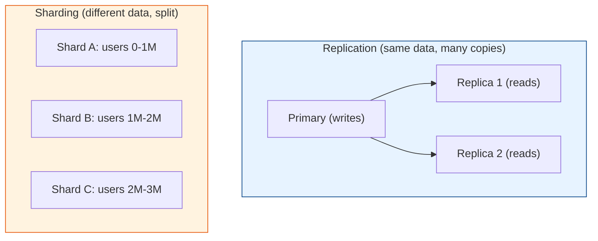
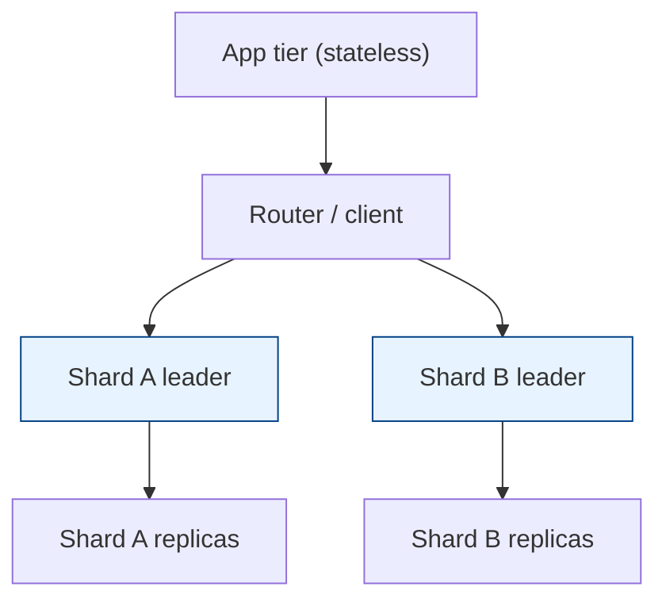

# Replication & Partitioning (Sharding)

[< Back](./transactions-acid.md) | [Index](./README.md) | [Next: Data Modeling >](./data-modeling.md)

---

Two independent techniques for scaling and surviving failure. People confuse them constantly:

- **Replication** = **copies** of the *same* data on multiple nodes (for HA + read scaling).
- **Partitioning (sharding)** = **splitting** *different* data across nodes (for write + storage scaling).

Real systems use **both** — shard the data, then replicate each shard.

---

## Replication

### Leader-follower (primary-replica) — the common one

One **leader** takes all writes; **followers** replicate the changes and serve reads.

- **Pro:** scales reads, provides HA (promote a follower if the leader dies).
- **Con:** **replication lag** — followers can be milliseconds-to-seconds behind, so a read
  right after a write may return stale data ("I updated my profile but it still shows the old
  name").

**Sync vs async replication:**

| Mode | Behavior | Trade-off |
|------|----------|-----------|
| **Synchronous** | Leader waits for replica to confirm before ack | No data loss, but slower writes; a slow replica blocks you |
| **Asynchronous** | Leader acks immediately, replicates in background | Fast writes, but a leader crash can lose recent writes |
| **Semi-sync** | Wait for *one* replica, not all | Common middle ground |

> **The read-your-writes problem:** after a user writes, route *their* reads to the leader (or
> a synced replica) for a short window, so they always see their own change. Otherwise
> replication lag makes your app look broken.

### Multi-leader & leaderless

- **Multi-leader** — multiple nodes accept writes (e.g., one per region). Great for
  multi-region write latency, but you must resolve **write conflicts** (two regions edit the
  same row). Conflict resolution: last-write-wins (lossy), CRDTs, or app-level merge.
- **Leaderless (Dynamo-style)** — any node takes writes; use **quorums** (`W + R > N`) to stay
  consistent. Cassandra and DynamoDB work this way. Tunable consistency per query.

**Quorum math:** with `N` replicas, if writes go to `W` and reads from `R`, then `W + R > N`
guarantees a read overlaps the latest write. Example: `N=3, W=2, R=2` → strong-ish reads while
tolerating one node down.

---

## Partitioning (Sharding)

Splitting one logical dataset across many physical databases, so no single node holds
everything. Unlocks scaling **writes** and **storage** past one machine.

### Choosing a shard key (the most important decision)

The shard key determines which node holds each row. A bad key = **hot shards** and painful
cross-shard queries. A good key spreads load **evenly** and keeps related data together.

| Strategy | How | Pro | Con |
|----------|-----|-----|-----|
| **Range** | `id 0-1M → A`, `1M-2M → B` | Efficient range scans | Hot shards from skew (sequential IDs, dates) |
| **Hash** | `hash(key) % N` | Even distribution | Range queries hit all shards; resharding painful |
| **Consistent hashing** | keys on a ring | Adding a node moves few keys | Slightly more complex |
| **Directory / lookup** | a service maps key → shard | Flexible, easy rebalance | Extra hop; lookup is a SPOF |

### The hard parts of sharding (why it's a last resort)

1. **Cross-shard queries** — a query spanning shards must scatter-gather and merge. `JOIN`s
   across shards are painful or impossible.
2. **Cross-shard transactions** — ACID across shards needs 2PC or sagas. Ugly.
3. **Rebalancing** — adding a shard means moving data. Consistent hashing minimizes this;
   modulo hashing forces a near-total reshuffle.
4. **Hot shards** — a celebrity user or viral item hammers one shard. Mitigate with a compound
   key, sub-sharding the hot key, or a cache.
5. **Operational weight** — backups, migrations, and monitoring multiply by shard count.

> **Shard as late as possible.** Exhaust vertical scaling, read replicas, and caching first.
> Sharding is a one-way door: easy to enter, brutal to reverse. Pick the shard key like your
> next three years depend on it — because they do.

---

## Putting it together (the standard large-scale pattern)

Shard for scale, replicate each shard for HA + read scaling. This is how the big systems run.

## The takeaways

1. **Replication ≠ sharding.** Copies vs splits. You'll usually want both, in that order of adoption.
2. **Replication lag is real** — design read paths around it (read-your-writes, sticky reads).
3. **The shard key is a near-irreversible decision** — spend time on it.
4. **Managed databases** (Aurora, Spanner, CockroachDB, DynamoDB) handle much of this for you.
   At most companies, use them before building your own sharding layer.

---

[< Back](./transactions-acid.md) | [Index](./README.md) | [Next: Data Modeling >](./data-modeling.md)
