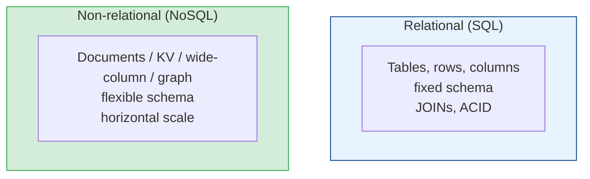

# SQL vs NoSQL

[Index](./README.md) | [Next: Indexing >](./indexing.md)

---

The most over-debated question in engineering, usually argued by people who haven't defined
their requirements. Here's how to actually decide.

## The two families

### SQL (relational): Postgres, MySQL, SQL Server, Oracle
- **Structured schema** enforced by the DB (columns, types, constraints).
- **Relationships** via foreign keys; combine data with **JOINs**.
- **ACID transactions** — strong correctness guarantees.
- **SQL** — a powerful, declarative, ad-hoc query language.
- Traditionally scales **vertically**; horizontal scaling (sharding) is possible but manual.

### NoSQL: an umbrella of four different things

| Type | Model | Examples | Good for |
|------|-------|----------|----------|
| **Key-value** | `key → blob` | Redis, DynamoDB | Caching, sessions, simple fast lookups |
| **Document** | JSON-ish documents | MongoDB, Couchbase | Flexible/nested data, content, catalogs |
| **Wide-column** | rows with dynamic columns | Cassandra, HBase, Bigtable | Massive write throughput, time-series |
| **Graph** | nodes + edges | Neo4j, Neptune | Relationships-first (social, fraud, recs) |

## The honest comparison

| Dimension | SQL | NoSQL |
|-----------|-----|-------|
| **Schema** | Rigid, enforced | Flexible / schema-on-read |
| **Scaling** | Vertical (sharding is work) | Horizontal by design |
| **Transactions** | Strong ACID | Often limited / eventual (improving) |
| **Queries** | Rich, ad-hoc, JOINs | Optimized for known access patterns |
| **Consistency** | Strong by default | Tunable, often eventual |
| **Best when** | Relations & correctness matter | Scale & flexibility matter |

## How to actually choose

Ask these, in order:

1. **Is my data highly relational, and do I need transactions?** (payments, orders,
   inventory) → **SQL.** Don't be clever here.
2. **Do I know my access patterns and need massive scale/throughput?** (feeds, telemetry,
   IoT) → **NoSQL** (wide-column or document).
3. **Is it relationships-first?** (who-follows-whom, fraud rings) → **graph.**
4. **Is it ephemeral, hot, simple lookups?** (sessions, cache, counters) → **key-value.**

> **Default to SQL (Postgres).** It's boring, battle-tested, does JSON when you need
> flexibility, and scales further than most people ever need. Reach for NoSQL when you have a
> *specific* reason SQL can't meet — not because it's trendy.

## The myths to kill

- **"NoSQL is faster."** No — it's faster *for specific access patterns*. A bad NoSQL model is
  slower than a good SQL one.
- **"SQL doesn't scale."** It does — Postgres and MySQL run enormous workloads. Sharding is
  work, but so is operating a distributed NoSQL cluster correctly.
- **"NoSQL means no schema."** There's always a schema — it just moved from the database into
  your application code, where it's less enforced and easier to break.
- **"Pick one."** Real systems are **polyglot**: Postgres for orders, Redis for cache,
  Elasticsearch for search, S3 for blobs. Use the right store per job.

## Rule of thumb

> Start with **one** relational database. Add specialized stores only when a concrete need
> (scale, search, cache, graph) proves the relational store can't do that job well. Every
> extra datastore is an operational tax — pay it deliberately.

---

[Index](./README.md) | [Next: Indexing >](./indexing.md)
