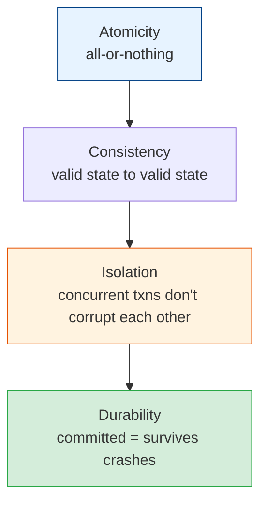
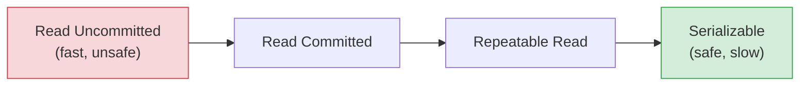

# Transactions, ACID & Isolation Levels

[< Back](./indexing.md) | [Index](./README.md) | [Next: Replication & Sharding >](./replication-sharding.md)

---

Transactions are how databases keep your data correct when many things happen at once. Get
this wrong and you get double-charged customers, oversold inventory, and money that vanishes.

## ACID: the four guarantees



- **Atomicity** — a transaction is all-or-nothing. Transfer $100: both the debit and credit
  happen, or neither does. No half-transfers.
- **Consistency** — the DB moves from one valid state to another; constraints/invariants hold
  (note: this is *not* the same "consistency" as in CAP).
- **Isolation** — concurrent transactions don't step on each other; the result is as if they
  ran in some serial order.
- **Durability** — once committed, it survives crashes (written to disk / replicated).

The classic example — a money transfer — needs all four:

```sql
BEGIN;
UPDATE accounts SET balance = balance - 100 WHERE id = 'alice';
UPDATE accounts SET balance = balance + 100 WHERE id = 'bob';
COMMIT;   -- both succeed, or ROLLBACK and neither does
```

## The isolation problem: read phenomena

Isolation is a **spectrum**, not a switch. Weaker isolation = more concurrency (faster) but
allows anomalies. Here are the anomalies, weakest guarantees first:

| Phenomenon | What happens |
|------------|--------------|
| **Dirty read** | You read another transaction's *uncommitted* change (which may roll back) |
| **Non-repeatable read** | You read a row twice in one txn and get different values (someone updated it) |
| **Phantom read** | You run the same query twice and new rows *appear* (someone inserted) |
| **Lost update** | Two txns read-modify-write the same row; one overwrites the other |

## Isolation levels (the trade-off dial)

| Level | Prevents | Allows | Cost |
|-------|----------|--------|------|
| **Read Uncommitted** | (nothing) | dirty, non-repeatable, phantom | Cheapest, dangerous |
| **Read Committed** | dirty reads | non-repeatable, phantom | Default in Postgres/Oracle |
| **Repeatable Read** | dirty + non-repeatable | phantom (mostly) | Default in MySQL/InnoDB |
| **Serializable** | everything | (nothing) | Correct, slowest |



> **Practical default:** most apps run at **Read Committed** and handle the rest with explicit
> locking or optimistic concurrency where it matters. Bump to Serializable only for the truly
> critical paths (money, inventory) — it's correct but it costs throughput and can cause
> serialization failures you must retry.

## Optimistic vs pessimistic concurrency

Two philosophies for handling contention:

- **Pessimistic locking** — assume conflict; lock the row before editing (`SELECT ... FOR
  UPDATE`). Safe, but locks reduce concurrency and risk **deadlocks**.
- **Optimistic locking** — assume no conflict; read a version number, and on write check it
  hasn't changed (`WHERE version = 7`). If it did, retry. Great for low-contention,
  read-heavy workloads.

```sql
-- Optimistic: only updates if nobody else touched the row
UPDATE items SET stock = stock - 1, version = version + 1
WHERE id = 42 AND version = 7;   -- 0 rows affected => someone beat you, retry
```

## Distributed transactions (here be dragons)

When a transaction spans multiple services or databases, ACID gets *hard*.

- **Two-Phase Commit (2PC)** — a coordinator asks all participants to "prepare," then
  "commit." Correct but **blocking** — if the coordinator dies mid-commit, participants are
  stuck holding locks. Slow and fragile at scale.
- **Sagas** — break the distributed transaction into local transactions, each with a
  **compensating action** to undo it. Eventually consistent, no global lock. The modern
  microservices answer. (See [microservices module](../microservices/README.md).)

## The senior takeaways

1. **Use transactions for anything that must be all-or-nothing** — especially money and
   inventory. Don't roll your own with app code.
2. **Know your DB's default isolation level** — Postgres (Read Committed) and MySQL
   (Repeatable Read) differ, and it *will* bite you.
3. **Idempotency + optimistic locking** beats heavy locking in most high-throughput systems.
4. **Avoid distributed transactions if you can.** Prefer a single DB, or sagas + eventual
   consistency. 2PC is a last resort.
5. **Deadlocks happen** — always be ready to catch and retry.

---

[< Back](./indexing.md) | [Index](./README.md) | [Next: Replication & Sharding >](./replication-sharding.md)
