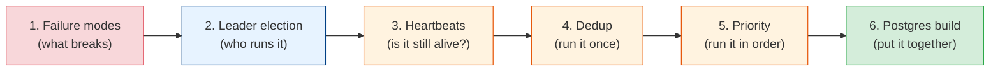

# Distributed Job Scheduler

A cron line on one box is a job scheduler. It works right up until that box reboots during your
nightly billing run, or you add a second box "for redundancy" and every invoice goes out twice.
A **distributed** job scheduler is what you build when jobs must run **reliably**, **exactly the
right number of times**, and **across many machines** — even as those machines crash, pause, and
partition from each other.

This module is a tour of the hard parts. Not "how to call `cron`," but the four questions that
actually keep scheduler authors up at night:

- **Who is allowed to run this job right now?** (leader election, leases)
- **How do we notice a node died — and recover its work?** (heartbeats, reaping)
- **How do we stop the same job running twice?** (deduplication, idempotency)
- **When we can't run everything at once, what runs first?** (priority, fairness)

We finish by building a complete, production-shaped scheduler on nothing but **PostgreSQL** —
proof that you rarely need exotic infrastructure to get this right.

## Contents

| # | Chapter | Level | What you'll learn |
|---|---------|-------|-------------------|
| 1 | [Failure Modes: Dead Schedulers, Overlapping Runs & Lost Jobs](./failure-modes.md) | Basic → Intermediate | The three canonical failures, delivery semantics, why "exactly once" is a trap |
| 2 | [Leader Election](./leader-election.md) | Intermediate → Advanced | Leases & TTLs, fencing tokens, split-brain, advisory locks, etcd/ZooKeeper/k8s |
| 3 | [Heartbeats & Failure Recovery](./heartbeats-and-recovery.md) | Intermediate → Advanced | Heartbeat tuning, job leases/visibility timeout, reapers, false-positive death |
| 4 | [Job Deduplication & Idempotency](./job-deduplication.md) | Advanced | Enqueue vs execution dedup, unique keys, idempotency keys, dedup windows |
| 5 | [Priority Queues & Fairness](./priority-queues.md) | Intermediate → Advanced | Priority buckets vs ordered columns vs sorted sets, starvation, aging, delays |
| 6 | [A Postgres-Backed Distributed Scheduler](./postgres-backed-scheduler.md) | Advanced | `SKIP LOCKED`, schema, reaper, recurring ticker, transactional enqueue, retries |

## How to read this module

- **Chapter 1** names the enemy: the specific ways a scheduler breaks. Read it first — every
  later chapter is a defense against one of these failures.
- **Chapters 2–5** are the toolkit: one core mechanism each (single-writer control, liveness
  detection, correctness under duplicates, and ordering).
- **Chapter 6** assembles the toolkit into one real system you can actually run.

## Related modules

This module is applied [distributed-systems](../distributed-systems/README.md): it leans hard on
**consensus** (leader election), **idempotency** (dedup), and the **failure-handling** toolkit
(timeouts, retries, backoff). It overlaps with
[messaging-and-streaming](../messaging-and-streaming/README.md) — a job queue *is* a message
queue with delivery guarantees — and with [databases](../databases/README.md) for the storage
mechanics (locking, indexing, transactions). The transactional-enqueue pattern in Chapter 6 is
the [microservices](../microservices/README.md) **outbox** pattern.

## The one truth

> **You cannot get "exactly once."** Networks drop acknowledgements, processes pause mid-write,
> and clocks lie. What you *can* build is **at-least-once delivery + idempotent execution**,
> which together look exactly-once to the outside world. Every technique in this module is in
> service of that one idea: run the job at least once, make running it twice harmless.

Start with [failure-modes.md](./failure-modes.md). **Next >**
