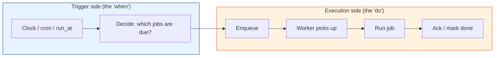
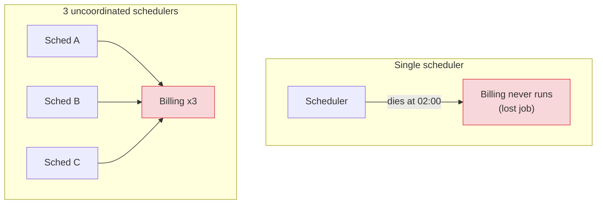
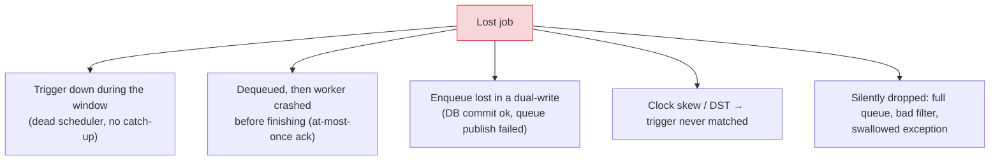

# Failure Modes: Dead Schedulers, Overlapping Runs & Lost Jobs

[< Back](./README.md) | [Index](./README.md) | [Next: Leader Election >](./leader-election.md)

---

Before you can design a reliable scheduler, you have to be able to *name* the ways an unreliable
one fails. On a single machine, `cron` hides all of these — one clock, one process, one disk. The
moment you go distributed, three failure modes appear, and almost every design decision in the
rest of this module exists to defend against one of them:

1. **Dead scheduler** — the thing that fires jobs is gone; jobs stop (or worse, duplicate).
2. **Overlapping runs** — a job is still running when its next tick fires; two copies collide.
3. **Lost jobs** — a job that should have run simply didn't, and nobody noticed.

## First, a mental model: what a scheduler actually does

A scheduler has two jobs, and they fail differently:



- If the **trigger side** duplicates, you fire the same logical job twice → duplicates.
- If the **trigger side** dies, jobs never get enqueued → lost jobs.
- If the **execution side** loses a job after dequeue but before ack → lost job.
- If the **execution side** retries after a crash → duplicate execution.

Every failure below is one of these boxes breaking.

## The delivery-semantics triangle (read this first)

You will constantly hear "at-least-once," "at-most-once," "exactly-once." They describe *when you
acknowledge* a job relative to *when you run* it.

| Semantic | How you get it | Failure you accept |
|----------|----------------|--------------------|
| **At-most-once** | Ack/mark-done **before** running | **Lost jobs** — crash after ack, work never happens |
| **At-least-once** | Ack/mark-done **after** running succeeds | **Duplicates** — crash after work, before ack → runs again |
| **"Exactly-once"** | Not achievable as delivery | — |

> There is no third option. If you ack before you run, you lose jobs on crash. If you ack after
> you run, you re-run on crash. **You must pick which failure you can tolerate**, and for almost
> every real system the answer is: prefer at-least-once (never lose work) and make re-running
> harmless via [idempotency](./job-deduplication.md). "Exactly-once *processing*" is at-least-once
> delivery + deduplicated effects — not a delivery guarantee you can buy.

---

## Failure 1: The dead scheduler

The process that decides "job X is due, enqueue it" crashes, is OOM-killed, gets cordoned during
a deploy, or its node loses power.

### The two ways it hurts

- **Single scheduler → single point of failure.** One process fires all triggers. It dies at
  02:00, the nightly billing run never enqueues, and you find out from an angry customer at 09:00.
  This is a **lost job** caused by a dead trigger.
- **Naive redundancy → duplication.** "Let's run three schedulers so one can't take us down." Now
  all three wake at 02:00, all three see billing is due, all three enqueue it → customers charged
  three times. This is the reason [leader election](./leader-election.md) exists: run many
  schedulers for availability, but only **one** is allowed to fire triggers at a time.



### The fix

- **Detect death fast** with [heartbeats/leases](./heartbeats-and-recovery.md) so a standby can
  take over within seconds, not hours.
- **Coordinate who fires** with [leader election](./leader-election.md) so redundancy doesn't
  become duplication.
- **Catch up on missed triggers.** When a scheduler recovers, it must ask "what should have fired
  while I was down?" This is the **misfire policy** (below).

### Misfire policies (what to do about triggers you slept through)

If a job was due at 02:00 and the scheduler was down until 02:30, what now? Quartz (the classic
Java scheduler) formalizes this, and the choices generalize everywhere:

| Policy | Behavior | Use when |
|--------|----------|----------|
| **Fire now** | Run the missed execution immediately | The work still matters (a report, a cleanup) |
| **Fire once, drop the rest** | If 6 hourly runs were missed, run one, skip 5 | Only the latest matters (a cache refresh) |
| **Skip / wait for next** | Do nothing; run at the next scheduled time | Stale runs are useless or harmful |

The dangerous default is *"replay every missed tick"* — recover after a 6-hour outage and suddenly
fire 360 minute-jobs in a burst, stampeding your own system.

---

## Failure 2: Overlapping (slow-job) runs

A job is scheduled "every 5 minutes." One day it takes 7 minutes (a big input, a slow dependency).
At minute 5 the scheduler fires it again — now **two copies run at once**.

```mermaid
gantt
    title "Every-5-min job that sometimes takes 7 min"
    dateFormat  mm
    axisFormat %M
    section Run A
    A (ok, 3 min)      :00, 3m
    section Run B (slow)
    B (7 min!)         :05, 7m
    section Run C
    C overlaps B       :10, 3m
```



At minute 10, run C starts while run B (started at 05) is still going. Overlap.

### Why overlap is dangerous

- **Double processing** — both runs read the same "unprocessed" rows and process them twice.
- **Resource contention** — two heavy runs compete for CPU/DB/locks; both get slower, making the
  overlap *worse* (a feedback loop that can pile up dozens of copies).
- **Corrupted state** — two runs writing the same aggregate without locking → lost updates.
- **Deadlocks** — the two copies grab locks in different orders.

### The fixes

**Option A — Prevent overlap with a per-job mutex (most common).** Before running, the job takes a
lock keyed by its identity. If it can't get the lock, another copy is running: skip, or wait.

```python
# "Only one instance of this job runs at a time" using a Postgres advisory lock.
# pg_try_advisory_lock returns immediately: True if acquired, False if held elsewhere.
def run_singleton(conn, job_key: int, work):
    got = conn.execute(
        "SELECT pg_try_advisory_lock(%s)", (job_key,)
    ).scalar()
    if not got:
        log.info("job %s already running elsewhere — skipping this tick", job_key)
        return
    try:
        work()
    finally:
        conn.execute("SELECT pg_advisory_unlock(%s)", (job_key,))
```

**Option B — Decide the overlap policy explicitly.** Frameworks like Quartz call this
`@DisallowConcurrentExecution`. Your choices:

| Policy | Meaning | Example |
|--------|---------|---------|
| **Skip** | Next tick sees a run in progress → do nothing | Idempotent syncs where a later tick catches up |
| **Queue / serialize** | Next tick waits, runs after the current one finishes | Order matters; you can't drop runs |
| **Allow (concurrent)** | Explicitly permit N copies | Sharded work where copies process disjoint inputs |

> "Allow overlap" is a valid choice — **but only if you made it on purpose.** The bugs come from
> accidental overlap: nobody decided, so the default (fire again regardless) silently double-runs.

**Option C — Make the run idempotent** so overlap is harmless even if it happens (claim rows with
`FOR UPDATE SKIP LOCKED`, use unique keys). See [deduplication](./job-deduplication.md).

---

## Failure 3: Lost jobs

The quietest, nastiest failure: a job that should have run, didn't, and threw no error. There's no
stack trace for something that never happened — you find out from downstream damage.

### The common causes



### Cause spotlight: the dual-write problem

You commit an order to your DB, then publish an "email receipt" job to a queue. Between the two,
your process crashes. The order exists; the job doesn't. **Lost job.** You can't wrap two
different systems in one atomic transaction.

The fix is the **transactional outbox**: write the job into the *same database, same transaction*
as the business change. A separate relay moves it to the queue. If the transaction commits, the
job exists; if it rolls back, neither does. This is exactly why a
[Postgres-backed scheduler](./postgres-backed-scheduler.md) is so appealing — enqueue *is* just
another row in the same transaction.

```python
# Lost-job-proof enqueue: business write + job insert in ONE transaction.
with conn.begin():                       # atomic
    conn.execute("INSERT INTO orders (...) VALUES (...)")
    conn.execute(
        "INSERT INTO jobs (type, payload, run_at) VALUES ('send_receipt', %s, now())",
        (payload,),
    )
# Either both rows exist, or neither does. No window to lose the job.
```

### Defenses against lost jobs

- **Durable job store** — jobs survive a restart because they're on disk (a DB table, a durable
  queue), not in an in-memory list.
- **At-least-once + ack-after-success** — never mark a job done until its work is committed. A
  crash mid-run leaves it claimable again. (See [heartbeats & recovery](./heartbeats-and-recovery.md).)
- **Transactional enqueue / outbox** — kill the dual-write window.
- **Detect the absence** — a "dead man's switch": a monitor that alerts if the nightly job *hasn't*
  reported success by 03:00. You can't rely on error alerts for work that never started.

> Lost jobs are uniquely dangerous because they are **silent**. Duplicates announce themselves
> (two emails, an angry customer). A lost job just quietly doesn't happen. Invest in *detecting*
> absence, not just catching errors.

---

## The whole picture

| Failure | Root cause | Primary defense | Chapter |
|---------|-----------|-----------------|---------|
| Dead scheduler (lost trigger) | Single point of failure | Standby + fast failover | [Heartbeats](./heartbeats-and-recovery.md) |
| Dead scheduler (duplicate trigger) | Uncoordinated redundancy | Single active leader | [Leader election](./leader-election.md) |
| Overlapping runs | Job slower than its interval | Per-job mutex / overlap policy | This chapter + [dedup](./job-deduplication.md) |
| Lost job (crash mid-run) | Ack-before-run | At-least-once + reaping | [Heartbeats](./heartbeats-and-recovery.md) |
| Lost job (dual write) | Two systems, no atomicity | Transactional outbox | [Postgres build](./postgres-backed-scheduler.md) |
| Duplicate execution (from all the above) | At-least-once retries | Idempotency / dedup | [Dedup](./job-deduplication.md) |

Notice the tension: nearly every defense against **lost jobs** (retry, requeue, at-least-once)
*creates* the risk of **duplicates**. That's not a flaw in your design — it's fundamental. You
choose at-least-once on purpose and then spend Chapter 4 making duplicates harmless.

## Takeaways

- A scheduler has a **trigger side** and an **execution side**; each fails into duplicates (fire
  twice) or losses (fire zero times).
- **Exactly-once delivery is impossible.** Pick at-least-once, then make re-runs idempotent.
- **Dead scheduler:** one process = single point of failure; many uncoordinated = duplication.
  Solve with failover *and* leader election.
- **Overlapping runs** happen when a job outlives its interval. Choose skip / queue / allow *on
  purpose*, and guard with a per-job lock.
- **Lost jobs are silent.** Use a durable store, ack-after-success, the transactional outbox, and
  a dead-man's-switch that alerts on *absence*.

---

[< Back](./README.md) | [Index](./README.md) | [Next: Leader Election >](./leader-election.md)
