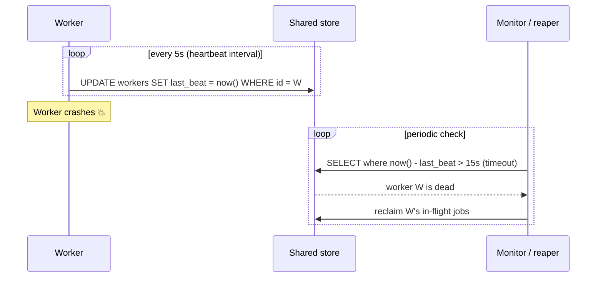
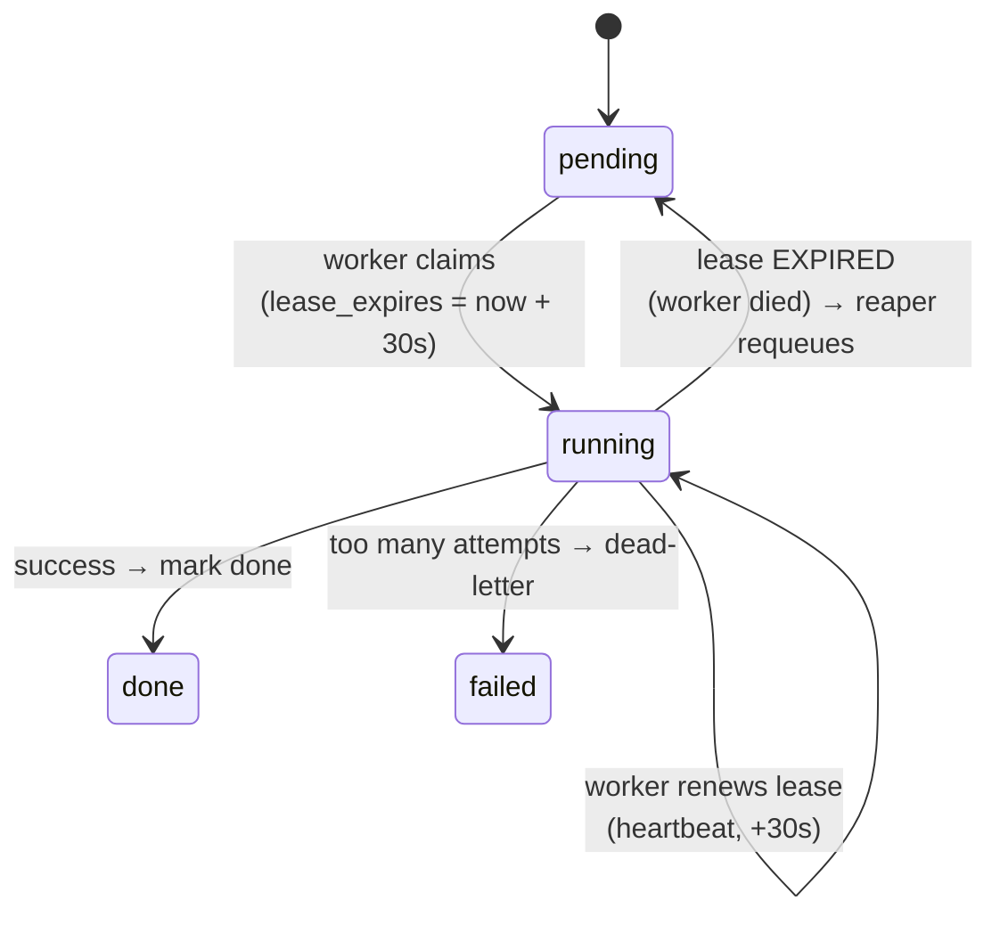
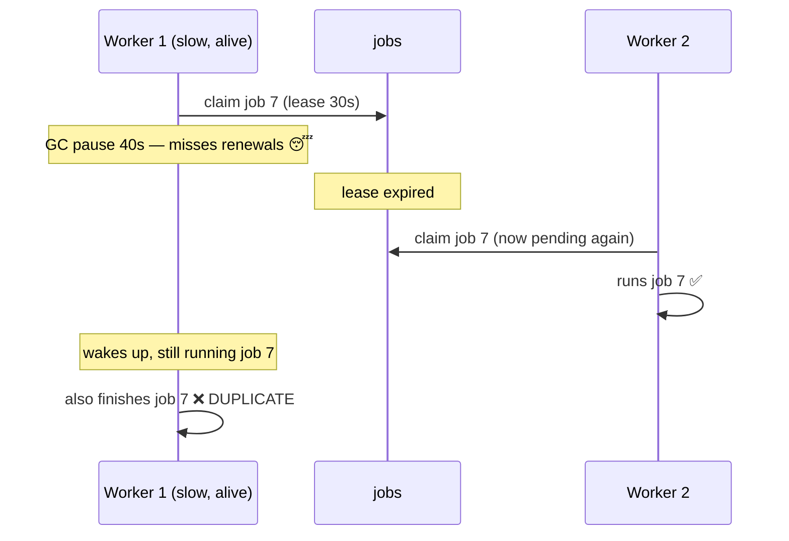

# Heartbeats & Failure Recovery

[< Back](./leader-election.md) | [Index](./README.md) | [Next: Job Deduplication & Idempotency >](./job-deduplication.md)

---

[Leader election](./leader-election.md) answered "who's in charge?" — but it depends on a deeper
question: **how does anyone know a node is dead?** In a distributed system you can never *ask* a
dead node "are you dead?" (it can't answer, and a slow node also can't answer). The universal
answer is the **heartbeat**: alive nodes periodically say "still here," and everyone else infers
death from *silence*.

This chapter is about turning that silence into safe recovery — detecting dead schedulers, dead
workers, and stuck jobs, then reclaiming their work **without losing it and without running it
twice**.

## Heartbeats: liveness by periodic proof

A heartbeat is a timestamped "I'm alive" written somewhere shared (a DB row, a Redis key, a
gossip message). A monitor declares a node dead when the last heartbeat is older than a **timeout**.



### The two knobs: interval and timeout

- **Heartbeat interval** — how often the "I'm alive" is sent (e.g., 5s).
- **Timeout** — how long of silence means "dead" (e.g., 15s).

**Rule of thumb: `timeout ≈ 2–3 × interval`.** One dropped heartbeat (a GC pause, a packet loss)
must not be enough to declare death — that causes false positives. Requiring 2–3 consecutive
misses tolerates a blip. The trade-off is exactly the one from leader election:

| Timeout | Detection speed | False positives |
|---------|-----------------|-----------------|
| Short (e.g. 2× interval) | Fast — reclaim work quickly | More — a GC pause looks like death |
| Long (e.g. 5× interval) | Slow — jobs stall longer | Fewer — tolerant of hiccups |

> **Adaptive detection (advanced):** the **Phi Accrual failure detector** (used by Cassandra and
> Akka) doesn't use a fixed timeout. It models the *distribution* of past heartbeat arrival times
> and outputs a suspicion level φ that rises as silence grows. Under jittery networks this beats a
> hard cutoff — it demands more silence before suspecting a node that's normally bursty.

## Job leases: heartbeats applied to individual jobs

Detecting a dead *node* is coarse. The finer, more useful pattern is the **job lease** (a.k.a.
**visibility timeout**, the term SQS uses): when a worker claims a job, it gets an exclusive lease
for a bounded time. While working, it must **renew** the lease (a per-job heartbeat). If the worker
dies, the lease expires and the job becomes claimable again — automatic recovery.



This single mechanism covers three failure modes from [Chapter 1](./failure-modes.md) at once:

- **Dead worker mid-job** → lease expires → job requeued (no lost job).
- **Stuck/hung job** → lease not renewed → requeued (unstick).
- **Slow-but-alive job** → keeps renewing → *not* falsely reclaimed (no spurious duplicate).

### Claiming a job with a lease

```sql
-- Atomically claim one pending (or expired) job and stamp a lease on it.
UPDATE jobs
   SET status = 'running',
       locked_by = :worker_id,
       lease_expires_at = now() + interval '30 seconds',
       attempts = attempts + 1
 WHERE id = (
     SELECT id FROM jobs
      WHERE status = 'pending'
        AND run_at <= now()
      ORDER BY priority DESC, run_at
      FOR UPDATE SKIP LOCKED           -- see Chapter 6: lets N workers grab different rows
      LIMIT 1
 )
RETURNING id, type, payload;
```

### Renewing (the per-job heartbeat)

A worker running a long job must keep pushing the lease forward, or the reaper will assume it died:

```python
def run_with_lease(conn, job, work, lease_secs=30):
    stop = threading.Event()

    def heartbeat():
        while not stop.wait(lease_secs / 3):          # renew at 1/3 of the lease
            conn.execute(
                "UPDATE jobs SET lease_expires_at = now() + make_interval(secs => %s) "
                "WHERE id = %s AND locked_by = %s",   # only if WE still own it (fencing!)
                (lease_secs, job.id, WORKER_ID),
            )

    t = threading.Thread(target=heartbeat, daemon=True)
    t.start()
    try:
        work(job)                                     # the actual job
        conn.execute("UPDATE jobs SET status='done' WHERE id=%s", (job.id,))
    finally:
        stop.set(); t.join()
```

Note the `AND locked_by = WORKER_ID` guard — the renewal only succeeds if we *still* own the lease.
If a reaper already reclaimed the job (we were falsely declared dead), our renewal updates 0 rows
and we know to stop. That's a **fencing check** in disguise (see [leader election](./leader-election.md)).

## The reaper: turning detected death into recovery

A **reaper** (or "janitor") periodically scans for jobs whose lease has expired and returns them to
the pool. This is the piece that actually *recovers* lost work.

```sql
-- Reaper: reclaim jobs whose worker died (lease expired), unless they're out of attempts.
UPDATE jobs
   SET status = CASE WHEN attempts >= max_attempts THEN 'failed' ELSE 'pending' END,
       locked_by = NULL,
       run_at = now() + make_interval(secs => least(300, power(2, attempts)))  -- backoff
 WHERE status = 'running'
   AND lease_expires_at < now();
```

- Jobs still under their max attempts go back to `pending` (with a backoff delay).
- Jobs that have burned all attempts move to `failed` (a **dead-letter** state) so they don't loop
  forever. Alert on these.
- Run the reaper from the **leader** (or make it idempotent) so many instances don't fight.

## The unavoidable danger: false positives create duplicates

Here is the hard truth that ties this chapter to the next. **A slow worker is indistinguishable
from a dead one.** If your timeout is too aggressive, this happens:



Both workers ran job 7. You cannot fully prevent this with timeouts alone — tighten the timeout and
you get *more* false positives; loosen it and recovery slows. The real fix is to **make double
execution harmless**:

- **Idempotent jobs** — running twice produces the same effect as running once. This is
  [the entire next chapter](./job-deduplication.md).
- **Fencing on completion** — a worker may only mark a job `done` if it *still owns the lease*
  (`WHERE locked_by = me`). The false-dead worker's final `UPDATE` touches 0 rows and it aborts.

> **Heartbeats buy you at-least-once, not exactly-once.** They guarantee a job with a dead owner
> gets *re-run*; they cannot guarantee it isn't *double-run*. Every DB-backed queue, SQS, and
> Celery has this property. Design assuming a job can run more than once, and this whole failure
> mode becomes a non-event.

## Tuning cheat-sheet

| Parameter | Typical value | Consequence of too small | Consequence of too large |
|-----------|---------------|--------------------------|--------------------------|
| Heartbeat interval | 5–10s | Chatty; load on the store | Slow to notice death |
| Node/lease timeout | 2–3× interval | False deaths → duplicates | Dead work sits idle |
| Lease renewal | lease/3 | Chatty renewals | Risk lease lapses mid-job |
| Reaper scan period | 10–30s | DB churn | Recovery latency |
| Backoff on requeue | exp, capped | Retry storm | Slow recovery of transient fails |

## Takeaways

- You detect death by **silence**: heartbeats prove liveness; a missed **timeout** infers death.
  Set `timeout ≈ 2–3 × interval` so one blip isn't fatal.
- The **job lease / visibility timeout** applies heartbeats per-job: claim with an expiry, renew
  while working, and a crashed worker's job auto-requeues when the lease lapses.
- A **reaper** scans for expired leases and returns jobs to `pending` (with backoff) or dead-letters
  them past `max_attempts`.
- **False-positive death is inevitable** — a slow worker looks dead. So heartbeats give you
  at-least-once recovery, not exactly-once. Guard `done` transitions with an ownership/fencing
  check and make jobs **idempotent** ([next chapter](./job-deduplication.md)).

---

[< Back](./leader-election.md) | [Index](./README.md) | [Next: Job Deduplication & Idempotency >](./job-deduplication.md)
