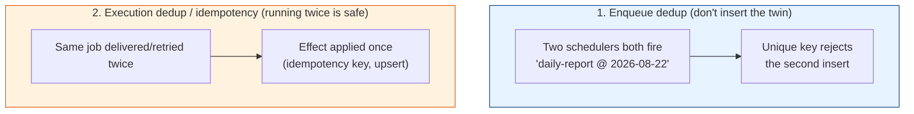
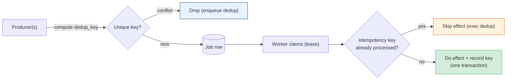

# Job Deduplication & Idempotency

[< Back](./heartbeats-and-recovery.md) | [Index](./README.md) | [Next: Priority Queues & Fairness >](./priority-queues.md)

---

Every chapter so far has been quietly handing you the same bill. To avoid **lost jobs**, you chose
[at-least-once](./failure-modes.md). To survive a **dead scheduler**, you added
[failover](./leader-election.md). To recover a **dead worker**, you added
[lease expiry + requeue](./heartbeats-and-recovery.md). All three *create duplicates*. This chapter
is where you pay the bill — and the currency is **deduplication** and **idempotency**.

> The mantra, one more time: **at-least-once delivery + idempotent execution = effectively-once.**
> You will not stop the job from *arriving* twice. You will stop it from *mattering* twice.

## Two very different dedup problems

People say "deduplication" to mean two things that need different solutions. Separate them first:



- **Enqueue dedup** — stop the *duplicate job row* from ever existing. Cheap, exact, and the first
  line of defense. Works when duplicates share a natural identity you can compute *before* running.
- **Execution dedup (idempotency)** — assume the job runs twice anyway (from retries, lease
  expiry, split-brain) and make the *side effects* happen once. The real safety net, because it
  covers duplicates you can't catch at enqueue time.

You want **both**: enqueue dedup catches the easy 95%, idempotency catches the rest.

## Enqueue dedup: a unique key + `ON CONFLICT`

The cleanest deduplication is a database **unique constraint**. Give each logical job a
**deduplication key** derived from its identity, and let the database reject twins atomically.

```sql
-- One row per (job type, logical instant). A second insert is silently ignored.
CREATE TABLE jobs (
    id          bigserial PRIMARY KEY,
    type        text NOT NULL,
    payload     jsonb NOT NULL,
    dedup_key   text UNIQUE,          -- e.g. 'daily-report:2026-08-22'
    run_at      timestamptz NOT NULL DEFAULT now(),
    status      text NOT NULL DEFAULT 'pending'
);

INSERT INTO jobs (type, payload, dedup_key)
VALUES ('daily_report', '{"date":"2026-08-22"}', 'daily-report:2026-08-22')
ON CONFLICT (dedup_key) DO NOTHING;    -- second scheduler's insert is a no-op
```

If three schedulers all wake at 02:00 and try to enqueue the daily report, the unique index means
**exactly one row exists** — no leader election required for *this* trigger, because the database
arbitrates. (You still want leader election to avoid three schedulers doing redundant *work*, but
correctness is guaranteed by the constraint.)

**Designing the dedup key** is the whole game. It must be identical for logical duplicates and
different for genuinely distinct jobs:

| Job | Good dedup key | Why |
|-----|----------------|-----|
| Daily report for Aug 22 | `report:2026-08-22` | The date *is* the identity; two triggers collapse |
| "Charge invoice 4471" | `charge:invoice-4471` | Retrying the charge must not double-bill |
| "Resize image on upload 9c2f" | `resize:upload-9c2f` | The upload id is the natural key |
| Per-user hourly digest | `digest:user-88:2026-08-22T14` | User + hour bucket |

> Use a **natural, deterministic** key from the *inputs* (entity id, time bucket), never a random
> UUID generated at enqueue time — a random id is *different* every time, so it deduplicates
> nothing. If the producer can't compute a stable key, hash the meaningful fields of the payload.

## Execution dedup: the idempotency key pattern

Enqueue dedup can't help when the duplicate is created *after* enqueue — a worker finishes the job,
then crashes before acking, so the [reaper](./heartbeats-and-recovery.md) requeues it. Now the job
runs a second time. The defense is to make the **work itself** idempotent.

The general pattern: record "I did this" **in the same transaction** as the effect, keyed by an
idempotency key. On a re-run, detect the record and skip (or return the cached result).

```python
def process_payment(conn, job):
    key = job.payload["idempotency_key"]          # stable per logical charge
    with conn.begin():                            # atomic: claim + effect together
        # Try to claim the key. If it already exists, this job already ran.
        row = conn.execute(
            "INSERT INTO processed_jobs (idempotency_key) VALUES (%s) "
            "ON CONFLICT (idempotency_key) DO NOTHING RETURNING idempotency_key",
            (key,),
        ).fetchone()
        if row is None:
            log.info("duplicate execution of %s — skipping side effect", key)
            return
        # First time: perform the real, non-idempotent side effect.
        charge_customer(job.payload["amount"])
        # Commit charge + processed_jobs row atomically. A crash here rolls back BOTH,
        # so the retry safely re-runs; a commit means the key blocks all future retries.
```

The atomicity is the crux: the "I did it" marker and the effect must commit **together**. If they
could commit separately, a crash between them would either lose the marker (→ duplicate effect) or
lose the effect (→ falsely marked done, a lost job). One transaction, or it doesn't work.

### Even better: make the effect *naturally* idempotent

The strongest jobs need no dedup table at all because repeating them is inherently harmless:

| Instead of... | Do... | Why it's idempotent |
|---------------|-------|---------------------|
| `INSERT` a row | `INSERT ... ON CONFLICT DO UPDATE` (upsert) | Second run updates instead of duplicating |
| `balance = balance + 10` | Set to an absolute value, or key the delta | Re-adding is safe only if keyed |
| "Send email" (external, not idempotent) | Send with a provider idempotency key / dedup on `(user, template, day)` | Provider or your table collapses the twin |
| Publish event | Include a dedup id consumers check | Downstream ignores the repeat |

> Prefer **natural idempotency** (upserts, absolute sets, PUT-not-POST semantics) over bolt-on
> dedup tables. The best way to make a duplicate harmless is for the operation to not care.
> See [distributed-systems/time-and-idempotency](../distributed-systems/time-and-idempotency.md).

## Dedup windows: when you can't keep keys forever

A `processed_jobs` table that never forgets grows without bound. For high-volume streams, use a
**time-bounded dedup window**: remember keys only for long enough to cover realistic
retry/redelivery delays (a few minutes), then let them expire. This is exactly what **SQS FIFO**
does — a **5-minute** deduplication window.

```python
# Redis dedup window: SET the key only if absent, expiring in 5 minutes.
# Returns True the FIRST time a key is seen within the window, False for a duplicate.
def first_time_seen(redis, dedup_key, window_secs=300) -> bool:
    return bool(redis.set(f"dedup:{dedup_key}", "1", nx=True, ex=window_secs))

if first_time_seen(redis, job.dedup_key):
    handle(job)
else:
    log.info("duplicate within window — dropping %s", job.dedup_key)
```

**The trade-off is explicit:** a duplicate that arrives *after* the window expires will **not** be
caught. Size the window to your worst-case redelivery gap (lease timeout + backoff + retries). A
window is a probabilistic guard, not a proof — for money-movement, back it with a *durable* unique
key, not just a TTL'd one.

| Approach | Guarantee | Cost | Use for |
|----------|-----------|------|---------|
| Unique constraint (durable) | Exact, forever | Storage grows; needs archiving | Correctness-critical (payments) |
| Dedup table + idempotency key | Exact within retention | A table to prune | General side-effecting jobs |
| Dedup window (Redis TTL / SQS FIFO) | Best-effort within window | Cheap, bounded | High-volume, tolerant of rare late dupes |

## Where dedup sits in the whole pipeline



Two independent gates: one before the job exists, one before its effect lands. A duplicate has to
beat *both* to cause harm — and if it does, natural idempotency makes even that a no-op.

## Takeaways

- Every reliability choice upstream **creates duplicates** on purpose. Dedup is how you make them
  harmless, achieving **effectively-once**.
- Separate **enqueue dedup** (a **unique dedup_key** + `ON CONFLICT DO NOTHING` stops the twin row)
  from **execution dedup** (idempotency makes running twice safe). Use both.
- The **idempotency-key pattern** records "I did this" in the **same transaction** as the effect;
  atomicity is non-negotiable. Better still: use **naturally idempotent** ops (upserts, absolute
  sets).
- Build dedup keys from **deterministic inputs** (entity id + time bucket), never a fresh random id.
- **Dedup windows** (Redis TTL, SQS FIFO's 5 min) bound storage but miss late duplicates — back
  money-critical paths with a durable unique key.

---

[< Back](./heartbeats-and-recovery.md) | [Index](./README.md) | [Next: Priority Queues & Fairness >](./priority-queues.md)
